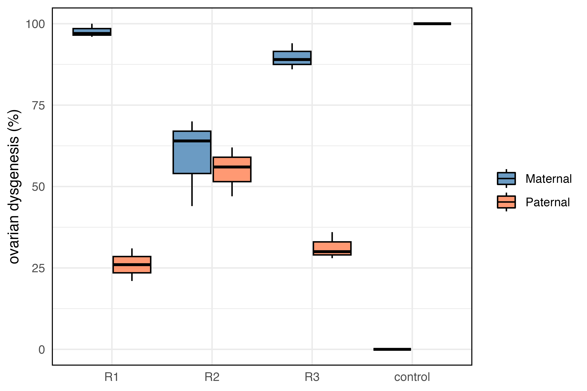

```{bash, eval=FALSE}
knitr::opts_chunk$set(echo = TRUE)
```

We wanted to assess the dysgenic inducibility of the different invaded replicates. To do so, we set up reciprocal crosses of each replicate with the original P-element naive strain, DM68. We also used a reciprocal cross between DM68 and the Harwich strain, known to carry the P-element, as a control.

```{bash}
less hybrid_dysgenesis/dmel_HDassay.tsv

```

```{r}
library(ggplot2)

data <- read.table("hybrid_dysgenesis/dmel_HDassay.tsv", header = TRUE)

data$group <- NA  
data$replicate <- NA  

data$group[data$line %in% c("68xR1", "68xR2", "68xR3", "68xHar")] <- "Maternal"
data$group[data$line %in% c("R1x68", "R2x68", "R3x68", "Harx68")] <- "Paternal"

data$replicate[data$line %in% c("68xR1", "R1x68")] <- "R1"
data$replicate[data$line %in% c("68xR2", "R2x68")] <- "R2"
data$replicate[data$line %in% c("68xR3", "R3x68")] <- "R3"
data$replicate[data$line %in% c("Harx68", "68xHar")] <- "control"

# Order of replicates
replicate_order <- c("R1", "R2", "R3", "control")

# Order of groups
#group_order <- c("Maternal", "Paternal")

# Create a grouped boxplot with manually nudged points
HD <- ggplot(data, aes(x = replicate, y = percentage_dysgenic, fill = group)) +
        geom_boxplot(position = position_dodge(width = 0.8), alpha = 0.8, color = "black") +
        #geom_jitter(position = position_nudge(x = 0.2), size = 2, alpha = 0.7) +
        labs(y = "ovarian dysgenesis (%)", x = NULL) +
        scale_fill_manual(values = c("Maternal" = "steelblue", "Paternal" = "coral")) +
        theme_minimal() +
        theme(legend.position = "right",
              legend.title = element_blank(),
              panel.border = element_rect(color = "black", fill = NA, size = 0.7)) +
        ylim(0, 100) +
        scale_x_discrete(limits = replicate_order)

ggsave("figs/HD.png", HD, width = 6, height = 4, dpi = 600)



```

