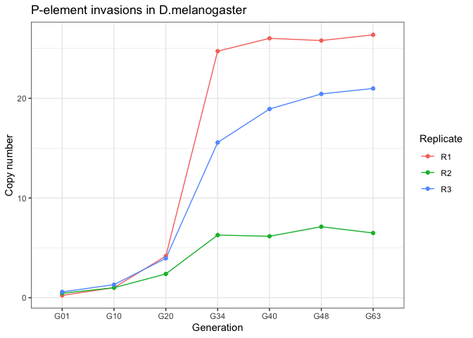

D.mel P-element invasions
================
Matthew Beaumont
2023-03-30

``` bash
knitr::opts_chunk$set(echo = TRUE)
```

# Read trimming

All fq.gz read files were trimmed to the minimum read length of the
shortest reads from all files (100) for uniformity.

``` bash
nohup bash scripts/trim.sh > trim.log &
```

``` bash
for i in fastq/*.fq.gz
        do 
                date
                j=`basename $i`
                j=${j%.fq.gz}
                zless $i | awk '{print substr($1,1,100)}' | gzip -9 > fastq/trimmed/${j}_trimmed.fq.gz
                date
        done
```

# TE Mapping

TEMiner was used to generate .bam files of the trimmed .fq.gz read
files. The fast-miner.sh script was altered to accommodate the altered
file name for the trimmed read files.

``` bash
nohup zsh fastq-miner-trimmed.sh mel /Volumes/Data/Projects/DmelR2_P-ele/fastq/trimmed > /Volumes/Data/Projects/DmelR2_P-ele/logs/mel.log &
```

``` bash
if [ $# -lt 2 ]
  # "$#" is number of parameters- here we test
   then
   echo "Usage $0 sampleid inputdir"
exit 2
fi

set -o shwordsplit

source ~/.zshrc

# Files and folders
sampleid=$1
inputdir=$2
outputdir=$2
outabu="../results/$sampleid/rpm"
outbamall="../results/$sampleid/bam"
tmpdir="../tmp"

## the REFERENCE 
refg="../refg/Dmel_tes_3scg/teseqs-3scg.fasta"
hier="../refg/Dmel_tes_3scg/teseqs.hier"

# software
samtools="../bin/samtools"
bwa="../bin/bwa"
popte2="../bin/popte2.jar"
readtorpm="../bin/readstat2rpm_all.py"

mkdir -p $outabu
mkdir -p $outbamall
# paths
for read1 in $inputdir/*_1_trimmed.fq.gz
do
    # variables defined to store the sra ids of the files from the input directory
        
    read2=${read1%_1_trimmed.fq.gz}
    read2=${read2}_2_trimmed.fq.gz
    tmp=`basename $read1`
        readid=${tmp%_1.fq.gz}

    tmpfile=$tmpdir/${readid}.fq.gz
    
    gzip -cd $read1 $read2 | paste - - - - |awk '{print "@" NR,$2,"+" NR,$4}'|tr " " "\n" |gzip -c > $tmpfile
    #gzip -cd $read1 $read2 |gzip -c > $tmpfile
 
        # mapping
    bamfile="$tmpdir/$readid.sort.bam"
    command="$bwa bwasw -t 8 -M $refg $tmpfile | $samtools view -Sb - | $samtools sort -T $sraid.nnnn.bam -O bam -m 4G > $bamfile"
    echo "executing mapping $command"
    eval $command
 
    # TE bam
    allbamfile="$outbamall/$readid.allte.sort.bam"
    samtools view -b -F 0x004 $bamfile > $allbamfile
    
    # PopoolationTE2
    opteabu="$outabu/$readid.rawabu"
    opterpm="$outabu/$readid.rpm"
    echo "Writting raw abundance to $opteabu"
    java -jar $popte2 stat-reads --bam $bamfile --map-qual 10 --hier $hier --output $opteabu
    echo "Writting rpm to $opterpm"
    python $readtorpm --rs $opteabu > $opterpm 

    # Cleanup tmp
        rm $bamfile
    rm $tmpfile
done 
```

# P-element copy number estimates

The deviate-family.sh script was run on the resulting .bam and .rpm
files, to assess and visualise P-element presence, using the family ID
“PPI251”.

``` bash
nohup zsh deviate-family.sh mel PPI251 > /Volumes/Data/Projects/DmelR2_P-ele/logs/deviate_mel &
```

``` bash

if [ $# -lt 2 ]
  # "$#" is number of parameters- here we test
   then
   echo "Usage $0 sampleid family"
exit 2
fi

set -o shwordsplit

# Files and folders
sampleid=$1
tefamily=$2
output="../results/$sampleid/deviate/$tefamily"
inputbam="../results/$sampleid/bam"
# scgold="Dmel_rpl32,Dmel_piwi,Dmel_Act5C"
scg="Dmel_rhi,Dmel_rpl32,Dmel_tj"

## the REFERENCE 
refg="../refg/Dmel_tes_3scg/teseqs-3scg.fasta"
anno="../refg/Dmel_tes_3scg/teseqs.gff"
hier="../refg/Dmel_tes_3scg/teseqs.hier"


# software
samtools="../bin/samtools"
bwa="../bin/bwa"

mkdir -p $output

# paths
for bam in $inputbam/*.allte.sort.bam
do
    
    n=`basename $bam` 
    sampleid=${n%.allte.sort.bam}
    echo $sampleid


    com="deviate --input_bam $bam --library $refg --annotation $anno --single_copy_genes $scg --families $tefamily --minID 1"
    echo $com
    eval $com
    mv ${bam}.${tefamily} $output/$sampleid.$tefamily
    mv ${bam}.${tefamily}.pdf  $output/${sampleid}.${tefamily}.pdf
    mv ${bam}.${tefamily}.raw $output/${sampleid}.${tefamily}.raw
    rm ${bam}.fused.sort.bam
    rm ${bam}.fused.sort.bam.bai

    
done 
```

From the resulting .fq.gz.PPI251 files, we extracted and assembled the
P-element copy number values into a single file.

``` bash

for i in *.PPI251; do echo $i | cut -f1 -d "." | cut -f2 -d "_"  >> mel_pcopies.txt; grep "or " $i | cut -f5 -d " "  | cut -b 1-8 >> mel_pcopies.txt; done

 mel_pcopies.txt |grep  '^R' -A2 | xargs -n3 > mel_pcopies_aligned.txt

done
```

# Visualisation

The copy number data was then visualised using ggplot2.

``` r
library (ggplot2)
theme_set(theme_bw())

d = read.table("mel_pcopies_aligned.txt")

names(d)<-c ("Replicate", "Generation", "Copy number")

print(d)
```

    ##    Replicate Generation Copy number
    ## 1         R1        G01    0.229964
    ## 2         R1        G10    1.007938
    ## 3         R1        G20    4.177100
    ## 4         R1        G34   24.724080
    ## 5         R1        G40   26.013780
    ## 6         R1        G48   25.789190
    ## 7         R1        G63   26.365490
    ## 8         R2        G01    0.446720
    ## 9         R2        G10    0.999447
    ## 10        R2        G20    2.383754
    ## 11        R2        G34    6.281913
    ## 12        R2        G40    6.159023
    ## 13        R2        G48    7.119456
    ## 14        R2        G63    6.490166
    ## 15        R3        G01    0.581259
    ## 16        R3        G10    1.307322
    ## 17        R3        G20    3.947311
    ## 18        R3        G34   15.565970
    ## 19        R3        G40   18.922240
    ## 20        R3        G48   20.435890
    ## 21        R3        G63   20.984870

``` r
ggplot(d, aes(x = Generation, y = `Copy number`, group= Replicate)) + 
  geom_line(aes(color=Replicate)) +
  geom_point(aes(color=Replicate)) +
  ggtitle("P-element invasions in D.melanogaster")
```

<!-- -->

END.
