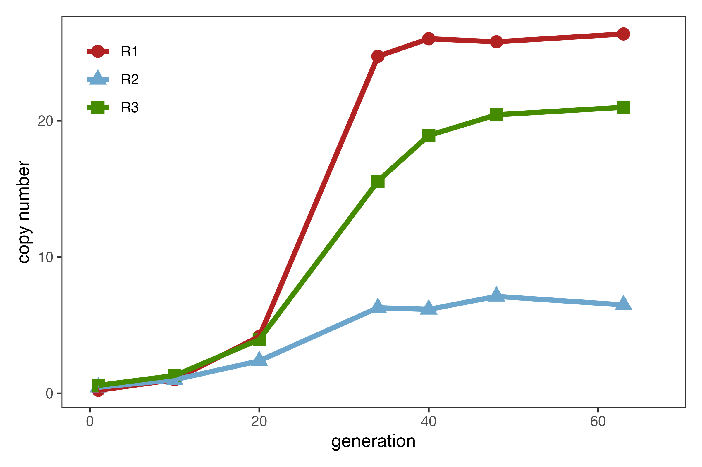

```{bash, eval=FALSE}
knitr::opts_chunk$set(echo = TRUE)
```

# Read trimming

All of the following .fq.gz read files were trimmed to the minimum read length of the shortest reads from all files (100) for uniformity.

```{bash}
cd /Volumes/Data/Projects/DmelR2_P-ele/dna/fastq/raw 
ls
```

```{bash, eval=FALSE}
nohup bash scripts/trim.sh > trim.log &
```

```{bash, eval=FALSE}
for i in fastq/*.fq.gz
        do 
                date
                j=`basename $i`
                j=${j%.fq.gz}
                zless $i | awk '{print substr($1,1,100)}' | gzip -9 > fastq/trimmed/${j}_trimmed.fq.gz
                date
        done
```

The following trimmed .fq.gz files were generated.

```{bash}
cd /Volumes/Data/Projects/DmelR2_P-ele/dna/fastq/trimmed
ls
```

# TE Mapping

The fast-miner.sh script was altered to accommodate the altered file name for the trimmed read files.

```{bash, eval=FALSE}
nohup zsh fastq-miner-trimmed.sh mel /Volumes/Data/Projects/DmelR2_P-ele/fastq/trimmed > /Volumes/Data/Projects/DmelR2_P-ele/logs/mel.log &
```

```{bash, eval=FALSE}
if [ $# -lt 2 ]
  # "$#" is number of parameters- here we test
   then
   echo "Usage $0 sampleid inputdir"
exit 2
fi

set -o shwordsplit

source ~/.zshrc

# Files and folders
sampleid=$1
inputdir=$2
outputdir=$2
outabu="../results/$sampleid/rpm"
outbamall="../results/$sampleid/bam"
tmpdir="../tmp"

## the REFERENCE 
refg="../refg/Dmel_tes_3scg/teseqs-3scg.fasta"
hier="../refg/Dmel_tes_3scg/teseqs.hier"

# software
samtools="../bin/samtools"
bwa="../bin/bwa"
popte2="../bin/popte2.jar"
readtorpm="../bin/readstat2rpm_all.py"

mkdir -p $outabu
mkdir -p $outbamall
# paths
for read1 in $inputdir/*_1_trimmed.fq.gz
do
	# variables defined to store the sra ids of the files from the input directory
        
	read2=${read1%_1_trimmed.fq.gz}
	read2=${read2}_2_trimmed.fq.gz
	tmp=`basename $read1`
        readid=${tmp%_1.fq.gz}

	tmpfile=$tmpdir/${readid}.fq.gz
	
	gzip -cd $read1 $read2 | paste - - - - |awk '{print "@" NR,$2,"+" NR,$4}'|tr " " "\n" |gzip -c > $tmpfile
	#gzip -cd $read1 $read2 |gzip -c > $tmpfile
 
        # mapping
	bamfile="$tmpdir/$readid.sort.bam"
	command="$bwa bwasw -t 8 -M $refg $tmpfile | $samtools view -Sb - | $samtools sort -T $sraid.nnnn.bam -O bam -m 4G > $bamfile"
	echo "executing mapping $command"
	eval $command
 
	# TE bam
	allbamfile="$outbamall/$readid.allte.sort.bam"
	samtools view -b -F 0x004 $bamfile > $allbamfile
	
	# PopoolationTE2
	opteabu="$outabu/$readid.rawabu"
	opterpm="$outabu/$readid.rpm"
	echo "Writting raw abundance to $opteabu"
	java -jar $popte2 stat-reads --bam $bamfile --map-qual 10 --hier $hier --output $opteabu
	echo "Writting rpm to $opterpm"
	python $readtorpm --rs $opteabu > $opterpm 

	# Cleanup tmp
        rm $bamfile
	rm $tmpfile
done 
```

This altered fast-miner.sh TEMiner script was then used to generate the following .bam and .rpm files from the trimmed .fq.gz read files.

```{bash}
cd /Volumes/Data/Projects/DmelR2_P-ele/software/teminer-code-r10/results/mel/bam
ls

cd /Volumes/Data/Projects/DmelR2_P-ele/software/teminer-code-r10/results/mel/rpm
ls 
```

# P-element copy number estimates

The deviate-family.sh script was run on the resulting .bam and .rpm files, to assess and visualise P-element presence, using the family ID "PPI251".

```{bash, eval=FALSE}
nohup zsh deviate-family.sh mel PPI251 > /Volumes/Data/Projects/DmelR2_P-ele/logs/deviate_mel &
```

```{bash, eval=FALSE}

if [ $# -lt 2 ]
  # "$#" is number of parameters- here we test
   then
   echo "Usage $0 sampleid family"
exit 2
fi

set -o shwordsplit

# Files and folders
sampleid=$1
tefamily=$2
output="../results/$sampleid/deviate/$tefamily"
inputbam="../results/$sampleid/bam"
# scgold="Dmel_rpl32,Dmel_piwi,Dmel_Act5C"
scg="Dmel_rhi,Dmel_rpl32,Dmel_tj"

## the REFERENCE 
refg="../refg/Dmel_tes_3scg/teseqs-3scg.fasta"
anno="../refg/Dmel_tes_3scg/teseqs.gff"
hier="../refg/Dmel_tes_3scg/teseqs.hier"


# software
samtools="../bin/samtools"
bwa="../bin/bwa"

mkdir -p $output

# paths
for bam in $inputbam/*.allte.sort.bam
do
	
	n=`basename $bam` 
	sampleid=${n%.allte.sort.bam}
	echo $sampleid


	com="deviate --input_bam $bam --library $refg --annotation $anno --single_copy_genes $scg --families $tefamily --minID 1"
	echo $com
	eval $com
	mv ${bam}.${tefamily} $output/$sampleid.$tefamily
	mv ${bam}.${tefamily}.pdf  $output/${sampleid}.${tefamily}.pdf
	mv ${bam}.${tefamily}.raw $output/${sampleid}.${tefamily}.raw
	rm ${bam}.fused.sort.bam
	rm ${bam}.fused.sort.bam.bai

	
done 
```

Generating the following .fq.gz.PPI251 files.

```{bash}
cd /Volumes/Data/Projects/DmelR2_P-ele/software/teminer-code-r10/results/mel/deviate/PPI251
ls *fq.gz.*
```

From the resulting .fq.gz.PPI251 files, we extracted and assembled the P-element copy number values into a single file, then removed the "G" from the generation column to aid visualisation.

```{bash, eval=FALSE}

for i in *.PPI251; do echo $i | cut -f1 -d "." | cut -f2 -d "_"  >> mel_pcopies.txt; grep "or " $i | cut -f5 -d " "  | cut -b 1-8 >> mel_pcopies.txt; done

 mel_pcopies.txt |grep  '^R' -A2 | xargs -n3 > mel_pcopies_aligned.txt

done
```

```{bash}
cd /Volumes/Data/Projects/DmelR2_P-ele/software/teminer-code-r10/results/mel/deviate/PPI251
ls *pcopies*
```

# Visualisation

## P-element copy number

The copy number data was then visualised using ggplot2.

```{r}
# Load required libraries
library(ggplot2)

# Define colors for replicates
tresrep <- c("firebrick", "skyblue3", "chartreuse4")

# Read the data
d <- read.table("mel_pcopies_values.txt")
names(d) <- c("replicate", "generation", "copy number")

pele_dna_2 <- ggplot(d, aes(x = generation, y = `copy number`, group = replicate, shape = replicate)) + 
  geom_point(aes(colour = replicate), size = 3.5) +
  geom_path(aes(colour = replicate), linewidth = 1.5) +
  scale_colour_manual(values = tresrep) +
  scale_size(guide = "none") +  
  xlim(0, 67) +  # Extend x-axis to 100
  theme_bw() +
  theme(
    panel.grid = element_blank(),
    plot.margin = margin(10, 10, 10, 10, "pt"),
    legend.position = c(0.08, 0.85),
    legend.box.background = element_rect(fill = NULL, colour = NULL, size = 0)
  ) +
  guides(color = guide_legend(title = NULL), shape = guide_legend(title = NULL))

          
# Add guides to the second plot
pele_dna_sl <- pele_dna_2 + guides(color = guide_legend(title = NULL))

# Save the second plot as PNG and SVG
ggsave("figs/pele_dna_l.png", pele_dna_sl, width = 6, height = 4, dpi = 400)
ggsave("figs/pele_dna_l.svg", pele_dna_sl, width = 6, height = 4)

# Include the second PNG in the report


```

## DeviaTE

We also generated DeviaTE plots for each replicate for each measured generation time-point.

```{R}
knitr::include_graphics("figs/pele_coverage.png")
knitr::include_graphics("figs/pele_coverage_s.png")
knitr::include_graphics("figs/pele_coverage_xs.png")

```

## Single flies:


```{R}
library(ggplot2)
library(tidyr)
library(dplyr)
library(ggsignif)
library(broom)

# Read data
data <- read.table("/Volumes/Data/Tools/teminer-code/results/sf_mel/deviate/PPI251/sf_mel_pcopies.txt", header = FALSE)
data$id <- rep(1:(nrow(data)/2), each = 2)

# Prepare data
paired_data <- data %>%
  group_by(id) %>%
  mutate(rep = rep(1:2, n() / 2)) %>%
  spread(key = rep, value = V1)

paired_data <- paired_data %>%
  rename(group = `1`, value = `2`)

# Convert the value column to numeric
paired_data$value <- as.numeric(as.character(paired_data$value))

# Ensure 'group' is a factor with the correct levels
paired_data$group <- factor(paired_data$group, levels = c("R1", "R2", "R3"))

# Perform t-tests and get p-values
t_tests <- combn(levels(paired_data$group), 2, simplify = FALSE) %>%
  lapply(function(groups) {
    subset_data <- paired_data %>% filter(group %in% groups)
    t_test <- t.test(value ~ group, data = subset_data)
    tibble(
      comparison = paste(groups, collapse = " vs "),
      p_value = t_test$p.value
    )
  }) %>%
  bind_rows()

print(t_tests)

# Define custom colors
custom_colors <- c("R1" = "firebrick", "R2" = "skyblue3", "R3" = "chartreuse4")

# Create plot
plot <- ggplot(paired_data, aes(x = factor(id), y = value, fill = group)) +
  geom_bar(stat = "identity", position = "dodge", color = "black") +
  scale_fill_manual(values = custom_colors) +
  labs(y = "copy Number", fill = "replicate") +
  scale_x_discrete(expand = expansion(mult = c(0.04, 0.04))) +  # Add space on the X-axis
  scale_y_continuous(expand = expansion(mult = c(0, 0.3))) +  # Add space on the Y-axis
  theme_minimal() +
  theme(
    axis.title.x = element_blank(),  # Remove the X-axis label
    axis.text.x = element_blank(),  # Remove the X-axis labels
    panel.grid.major = element_blank(),  # Remove major gridlines
    panel.grid.minor = element_blank(),  # Remove minor gridlines
    panel.border = element_rect(colour = "black", fill = NA, size = 1),  # Add an outline
    plot.background = element_rect(fill = "white", color = NA),  # Set plot background to white
    panel.background = element_rect(fill = "white", color = NA)  # Set panel background to white
  ) +
  geom_signif(
    comparisons = list(c("R1", "R2"), c("R2", "R3"), c("R1", "R3")),
    map_signif_level = TRUE
  ) +
  geom_text(
    data = t_tests,
    aes(x = 1.5, y = max(paired_data$value) * 1.1, label = sprintf("p = %.3f", p_value)),
    color = "black",
    size = 4
  )

# Save the plot
ggsave("figs/sf_copy_number.png", plot, width = 14, height = 6, dpi = 400)
ggsave("figs/sf_copy_number.svg", plot, width = 14, height = 6)


```

### SF Deviate - attempt

```{R}
library(dplyr)
library(tidyr)
library(ggplot2)

# Define column names
column_names <- c(
  "TEfam", "sample_id", "pos", "refbase", "A", "C", "G", "T", "cov", "phys_cov", 
  "hq_cov", "snp", "refsnp", "int_del", "int_del_freq", "trunc_left", "trunc_right", 
  "ins", "delet", "annotation"
)

# Load data
data <- read.table(
  "/Volumes/Data/Tools/teminer-code/results/sf_mel/deviate/PPI251/all_sf_merged.PPI251",
  header = FALSE, 
  sep = " ", 
  stringsAsFactors = FALSE, 
  col.names = column_names, 
  fill = TRUE,
  comment.char = "#" # Ignore lines starting with '#'
)

# Add sample_name column
data <- data %>%
  mutate(sample_name = gsub(".*/(.*)\\.allte\\.sort\\.bam", "\\1", sample_id))

# Filter the data by replicate (R1, R2, R3)
data_r1 <- data %>%
  filter(grepl("R1", sample_name))

data_r2 <- data %>%
  filter(grepl("R2", sample_name))

data_r3 <- data %>%
  filter(grepl("R3", sample_name))

# Combine datasets by replicate (R1, R2, R3)
combined_data <- bind_rows(
  data_r1 %>% mutate(replicate = "R1"),
  data_r2 %>% mutate(replicate = "R2"),
  data_r3 %>% mutate(replicate = "R3")
)

# Add truncation column and remove extreme positions
combined_data <- combined_data %>%
  mutate(truncation = case_when(
    !is.na(trunc_left) ~ "trunc_left",
    !is.na(trunc_right) ~ "trunc_right",
    TRUE ~ NA_character_
  )) %>%
  filter(!(pos == min(pos) | pos == max(pos)))

# Identify truncation pairs
truncation_pairs <- combined_data %>%
  filter(!is.na(truncation)) %>%
  group_by(TEfam, replicate) %>%
  summarise(
    trunc_pairs = list({
      # Separate truncation points
      left_truncs <- pos[truncation == "trunc_left"]
      right_truncs <- pos[truncation == "trunc_right"]
      
      # Ensure balanced pairing
      num_pairs <- min(length(left_truncs), length(right_truncs))
      tibble(
        trunc_start = left_truncs[1:num_pairs],
        trunc_end = right_truncs[1:num_pairs]
      )
    }),
    .groups = "drop"
  ) %>%
  unnest(trunc_pairs)

if (nrow(merged_truncation_pairs) == 0) {
  message("No truncation pairs found for some replicates.")
}

# Sort truncation pairs by trunc_start position
truncation_pairs <- truncation_pairs %>%
  arrange(trunc_start)


merged_truncation_pairs <- merged_truncation_pairs %>%
  mutate(
    trunc_start = pmin(trunc_s, trunc_e),
    trunc_end = pmax(trunc_s, trunc_e)
  )

### Visualization ###
plot <- ggplot(combined_data, aes(x = pos, y = hq_cov)) +
  geom_line(size = 1, color = "black") +
  # Shade merged truncation windows
  geom_rect(
    data = merged_truncation_pairs,
    aes(
      xmin = trunc_start, 
      xmax = trunc_end, 
      ymin = -Inf, 
      ymax = Inf
    ),
    fill = "blue", 
    alpha = 0.1,
    inherit.aes = FALSE
  ) +
  labs(
    x = "Position", 
    y = "High-Quality Coverage", 
    shape = "Truncation"
  ) +
  facet_wrap(~ replicate, scales = "fixed") + # Set the same y-axis for all facets
  theme_minimal() +
  theme(
    panel.grid.major = element_blank(), # Remove major gridlines
    panel.grid.minor = element_blank(), # Remove minor gridlines
    panel.border = element_rect(color = "black", fill = NA, size = 1), # Add border around each plot
    strip.background = element_rect(fill = "grey80", color = "black"), # Shaded grey box for facet titles
    strip.text = element_text(size = 10),
    panel.spacing = unit(0.4, "lines"), # Reduce space between plots
    legend.position = "bottom", # Move legend to the bottom
    legend.direction = "horizontal" # Make the legend horizontal
  )

# Save plot
ggsave("figs/dmel_deviate.png", plot, width = 26, height = 5, dpi = 400)
ggsave("figs/dmel_deviate.svg", plot, width = 26, height = 5)

# Display plot
print(plot)

### Coverage Calculation ###

combined_data_with_truncs <- combined_data %>%
  left_join(merged_truncation_pairs, by = "replicate") %>%
  mutate(
    # Mark positions that are within the truncation window
    in_trunc_window = pos >= trunc_start & pos <= trunc_end
  ) 

# Rename 'TEfam.x' to 'TEfam' explicitly
combined_data_with_truncs <- combined_data_with_truncs %>%
  rename(TEfam = TEfam.x)

# Filter out rows that are not within any truncation window
combined_data_in_truncs <- combined_data_with_truncs %>%
  filter(in_trunc_window)

# Calculate the average hq_cov for each truncation window
average_hq_cov_per_trunc_window <- combined_data_with_truncs %>%
  filter(pos >= trunc_start & pos <= trunc_end) %>%
  group_by(TEfam, replicate, trunc_start, trunc_end) %>%
  summarise(
    average_hq_cov = mean(hq_cov, na.rm = TRUE),
    .groups = "drop"
  )

# Calculate the average hq_cov for regions outside of truncation windows
average_hq_cov_outside_truncs <- combined_data_with_truncs %>%
  filter(pos < trunc_start | pos > trunc_end) %>%
  group_by(TEfam, replicate) %>%
  summarise(
    average_hq_cov_outside_truncs = mean(hq_cov, na.rm = TRUE),
    .groups = "drop"
  )

# Merge both datasets by TEfam and replicate
combined_avg_hq_cov <- left_join(
  average_hq_cov_per_trunc_window, 
  average_hq_cov_outside_truncs, 
  by = c("TEfam", "replicate")
)

# Add a column for coverage ratio
combined_avg_hq_cov <- combined_avg_hq_cov %>%
  mutate(
    coverage_ratio = ((average_hq_cov / average_hq_cov_outside_truncs) * -100) + 100
  )

# Write the updated table to the output file
write.table(combined_avg_hq_cov, 
            "figs/combined_avg_hq_cov.txt", 
            sep = "\t", 
            row.names = FALSE, 
            quote = FALSE)

# Print the updated table
print(combined_avg_hq_cov)

```


```{R}
library(Biostrings)

fasta_file <- "/Volumes/Data/Projects/dmelR2_p-ele/R/dna/data/pele_fasta/PPI251.fasta"
fasta <- readDNAStringSet(fasta_file)

sequence <- as.character(fasta[[1]])
header <- names(fasta)[1]

remove_start <- 808  # start position
remove_end <- 2560    # end position

remaining_sequence <- paste0(
  substr(sequence, 1, remove_start - 1),
  substr(sequence, remove_end + 1, nchar(sequence))
)

output_fasta <- "/Volumes/Data/Projects/dmelR2_p-ele/R/dna/data/pele_fasta/PPI251_807-2561_KP.fasta"
writeLines(c(paste0(">", header), remaining_sequence), con = output_fasta)
cat("New FASTA file saved to:", output_fasta, "\n")
```
