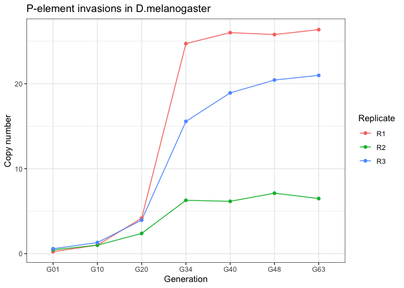

DNA analysis
================
Matthew Beaumont
2023-06-27

``` bash
knitr::opts_chunk$set(echo = TRUE)
```

# Read trimming

All of the following .fq.gz read files were trimmed to the minimum read
length of the shortest reads from all files (100) for uniformity.

``` bash
cd /Volumes/Data/Projects/DmelR2_P-ele/fastq/raw 
ls -lh
```

    ## bash: line 0: cd: /Volumes/Data/Projects/DmelR2_P-ele/fastq/raw: No such file or directory
    ## total 96
    ## -rw-r--r--  1 mbeaumont  staff   6.0K Jun 27 11:34 D.mel_P-element_invasions_DNA.Rmd
    ## -rw-r--r--  1 mbeaumont  staff    27K Apr 14 11:10 D.mel_P-element_invasions_DNA.md
    ## drwxr-xr-x  4 mbeaumont  staff   136B Apr 13 15:00 D.mel_P-element_invasions_DNA_files
    ## drwxr-xr-x  6 mbeaumont  staff   204B Jun 27 11:28 figs
    ## -rw-r--r--  1 mbeaumont  staff   336B Apr 13 15:11 mel_pcopies_aligned.txt
    ## drwxr-xr-x  9 mbeaumont  staff   306B Jun  5 10:41 validations

``` bash
nohup bash scripts/trim.sh > trim.log &
```

``` bash
for i in fastq/*.fq.gz
        do 
                date
                j=`basename $i`
                j=${j%.fq.gz}
                zless $i | awk '{print substr($1,1,100)}' | gzip -9 > fastq/trimmed/${j}_trimmed.fq.gz
                date
        done
```

The following trimmed .fq.gz files were generated.

``` bash
cd /Volumes/Data/Projects/DmelR2_P-ele/fastq/trimmed
ls -lh
```

    ## bash: line 0: cd: /Volumes/Data/Projects/DmelR2_P-ele/fastq/trimmed: No such file or directory
    ## total 96
    ## -rw-r--r--  1 mbeaumont  staff   6.0K Jun 27 11:34 D.mel_P-element_invasions_DNA.Rmd
    ## -rw-r--r--  1 mbeaumont  staff    27K Apr 14 11:10 D.mel_P-element_invasions_DNA.md
    ## drwxr-xr-x  4 mbeaumont  staff   136B Apr 13 15:00 D.mel_P-element_invasions_DNA_files
    ## drwxr-xr-x  6 mbeaumont  staff   204B Jun 27 11:28 figs
    ## -rw-r--r--  1 mbeaumont  staff   336B Apr 13 15:11 mel_pcopies_aligned.txt
    ## drwxr-xr-x  9 mbeaumont  staff   306B Jun  5 10:41 validations

# TE Mapping

The fast-miner.sh script was altered to accommodate the altered file
name for the trimmed read files.

``` bash
nohup zsh fastq-miner-trimmed.sh mel /Volumes/Data/Projects/DmelR2_P-ele/fastq/trimmed > /Volumes/Data/Projects/DmelR2_P-ele/logs/mel.log &
```

``` bash
if [ $# -lt 2 ]
  # "$#" is number of parameters- here we test
   then
   echo "Usage $0 sampleid inputdir"
exit 2
fi

set -o shwordsplit

source ~/.zshrc

# Files and folders
sampleid=$1
inputdir=$2
outputdir=$2
outabu="../results/$sampleid/rpm"
outbamall="../results/$sampleid/bam"
tmpdir="../tmp"

## the REFERENCE 
refg="../refg/Dmel_tes_3scg/teseqs-3scg.fasta"
hier="../refg/Dmel_tes_3scg/teseqs.hier"

# software
samtools="../bin/samtools"
bwa="../bin/bwa"
popte2="../bin/popte2.jar"
readtorpm="../bin/readstat2rpm_all.py"

mkdir -p $outabu
mkdir -p $outbamall
# paths
for read1 in $inputdir/*_1_trimmed.fq.gz
do
    # variables defined to store the sra ids of the files from the input directory
        
    read2=${read1%_1_trimmed.fq.gz}
    read2=${read2}_2_trimmed.fq.gz
    tmp=`basename $read1`
        readid=${tmp%_1.fq.gz}

    tmpfile=$tmpdir/${readid}.fq.gz
    
    gzip -cd $read1 $read2 | paste - - - - |awk '{print "@" NR,$2,"+" NR,$4}'|tr " " "\n" |gzip -c > $tmpfile
    #gzip -cd $read1 $read2 |gzip -c > $tmpfile
 
        # mapping
    bamfile="$tmpdir/$readid.sort.bam"
    command="$bwa bwasw -t 8 -M $refg $tmpfile | $samtools view -Sb - | $samtools sort -T $sraid.nnnn.bam -O bam -m 4G > $bamfile"
    echo "executing mapping $command"
    eval $command
 
    # TE bam
    allbamfile="$outbamall/$readid.allte.sort.bam"
    samtools view -b -F 0x004 $bamfile > $allbamfile
    
    # PopoolationTE2
    opteabu="$outabu/$readid.rawabu"
    opterpm="$outabu/$readid.rpm"
    echo "Writting raw abundance to $opteabu"
    java -jar $popte2 stat-reads --bam $bamfile --map-qual 10 --hier $hier --output $opteabu
    echo "Writting rpm to $opterpm"
    python $readtorpm --rs $opteabu > $opterpm 

    # Cleanup tmp
        rm $bamfile
    rm $tmpfile
done 
```

This altered fast-miner.sh TEMiner script was then used to generate the
following .bam and .rpm files from the trimmed .fq.gz read files.

``` bash
cd /Volumes/Data/Projects/DmelR2_P-ele/software/teminer-code-r10/results/mel/bam
ls -lh

cd /Volumes/Data/Projects/DmelR2_P-ele/software/teminer-code-r10/results/mel/rpm
ls -lh
```

    ## total 7729728
    ## -rw-r--r--  1 mbeaumont  staff   102M Mar 28 18:35 dmel_naive_CATTTT_1_trimmed.fq.gz.allte.sort.bam
    ## -rw-r--r--  1 mbeaumont  staff   169M Mar 28 19:41 mel_R1G01_CGATGT_1_trimmed.fq.gz.allte.sort.bam
    ## -rw-r--r--  1 mbeaumont  staff   170M Mar 28 20:50 mel_R1G10_ACAGTG_1_trimmed.fq.gz.allte.sort.bam
    ## -rw-r--r--  1 mbeaumont  staff   194M Mar 28 22:07 mel_R1G20_ACTTGA_1_trimmed.fq.gz.allte.sort.bam
    ## -rw-r--r--  1 mbeaumont  staff   142M Mar 28 23:03 mel_R1G34_GTAGAG_1_trimmed.fq.gz.allte.sort.bam
    ## -rw-r--r--  1 mbeaumont  staff   168M Mar 29 00:11 mel_R1G40_GTAGAG_1_trimmed.fq.gz.allte.sort.bam
    ## -rw-r--r--  1 mbeaumont  staff   156M Mar 29 01:14 mel_R1G48_GTAGAG_1_trimmed.fq.gz.allte.sort.bam
    ## -rw-r--r--  1 mbeaumont  staff   180M Mar 29 02:40 mel_R1G63_ATCACG_1_trimmed.fq.gz.allte.sort.bam
    ## -rw-r--r--  1 mbeaumont  staff   185M Mar 29 03:54 mel_R2G01_TTAGGC_1_trimmed.fq.gz.allte.sort.bam
    ## -rw-r--r--  1 mbeaumont  staff   174M Mar 29 05:02 mel_R2G10_GCCAAT_1_trimmed.fq.gz.allte.sort.bam
    ## -rw-r--r--  1 mbeaumont  staff   185M Mar 29 06:13 mel_R2G20_GGCTAC_1_trimmed.fq.gz.allte.sort.bam
    ## -rw-r--r--  1 mbeaumont  staff   125M Mar 29 07:03 mel_R2G34_GGTAGC_1_trimmed.fq.gz.allte.sort.bam
    ## -rw-r--r--  1 mbeaumont  staff   177M Mar 29 08:09 mel_R2G40_GGTAGC_1_trimmed.fq.gz.allte.sort.bam
    ## -rw-r--r--  1 mbeaumont  staff   156M Mar 29 09:12 mel_R2G48_GGTAGC_1_trimmed.fq.gz.allte.sort.bam
    ## -rw-r--r--  1 mbeaumont  staff   220M Mar 29 11:03 mel_R2G63_CGATGT_1_trimmed.fq.gz.allte.sort.bam
    ## -rw-r--r--  1 mbeaumont  staff   182M Mar 29 12:17 mel_R3G01_TGACCA_1_trimmed.fq.gz.allte.sort.bam
    ## -rw-r--r--  1 mbeaumont  staff   187M Mar 29 13:33 mel_R3G10_CAGATC_1_trimmed.fq.gz.allte.sort.bam
    ## -rw-r--r--  1 mbeaumont  staff   162M Mar 29 14:34 mel_R3G20_CTTGTA_1_trimmed.fq.gz.allte.sort.bam
    ## -rw-r--r--  1 mbeaumont  staff   149M Mar 29 15:33 mel_R3G34_ATGAGC_1_trimmed.fq.gz.allte.sort.bam
    ## -rw-r--r--  1 mbeaumont  staff   240M Mar 29 17:08 mel_R3G40_ATGAGC_1_trimmed.fq.gz.allte.sort.bam
    ## -rw-r--r--  1 mbeaumont  staff   151M Mar 29 18:08 mel_R3G48_ATGAGC_1_trimmed.fq.gz.allte.sort.bam
    ## -rw-r--r--  1 mbeaumont  staff   200M Mar 29 19:41 mel_R3G63_TTAGGC_1_trimmed.fq.gz.allte.sort.bam
    ## total 704
    ## -rw-r--r--  1 mbeaumont  staff   2.3K Mar 28 18:36 dmel_naive_CATTTT_1_trimmed.fq.gz.rawabu
    ## -rw-r--r--  1 mbeaumont  staff   4.9K Mar 28 18:36 dmel_naive_CATTTT_1_trimmed.fq.gz.rpm
    ## -rw-r--r--  1 mbeaumont  staff   2.3K Mar 28 19:43 mel_R1G01_CGATGT_1_trimmed.fq.gz.rawabu
    ## -rw-r--r--  1 mbeaumont  staff   4.9K Mar 28 19:43 mel_R1G01_CGATGT_1_trimmed.fq.gz.rpm
    ## -rw-r--r--  1 mbeaumont  staff   2.3K Mar 28 20:51 mel_R1G10_ACAGTG_1_trimmed.fq.gz.rawabu
    ## -rw-r--r--  1 mbeaumont  staff   4.9K Mar 28 20:51 mel_R1G10_ACAGTG_1_trimmed.fq.gz.rpm
    ## -rw-r--r--  1 mbeaumont  staff   2.4K Mar 28 22:08 mel_R1G20_ACTTGA_1_trimmed.fq.gz.rawabu
    ## -rw-r--r--  1 mbeaumont  staff   4.9K Mar 28 22:08 mel_R1G20_ACTTGA_1_trimmed.fq.gz.rpm
    ## -rw-r--r--  1 mbeaumont  staff   2.4K Mar 28 23:04 mel_R1G34_GTAGAG_1_trimmed.fq.gz.rawabu
    ## -rw-r--r--  1 mbeaumont  staff   5.0K Mar 28 23:04 mel_R1G34_GTAGAG_1_trimmed.fq.gz.rpm
    ## -rw-r--r--  1 mbeaumont  staff   2.4K Mar 29 00:12 mel_R1G40_GTAGAG_1_trimmed.fq.gz.rawabu
    ## -rw-r--r--  1 mbeaumont  staff   4.9K Mar 29 00:12 mel_R1G40_GTAGAG_1_trimmed.fq.gz.rpm
    ## -rw-r--r--  1 mbeaumont  staff   2.4K Mar 29 01:16 mel_R1G48_GTAGAG_1_trimmed.fq.gz.rawabu
    ## -rw-r--r--  1 mbeaumont  staff   5.0K Mar 29 01:16 mel_R1G48_GTAGAG_1_trimmed.fq.gz.rpm
    ## -rw-r--r--  1 mbeaumont  staff   2.4K Mar 29 02:41 mel_R1G63_ATCACG_1_trimmed.fq.gz.rawabu
    ## -rw-r--r--  1 mbeaumont  staff   4.9K Mar 29 02:41 mel_R1G63_ATCACG_1_trimmed.fq.gz.rpm
    ## -rw-r--r--  1 mbeaumont  staff   2.3K Mar 29 03:55 mel_R2G01_TTAGGC_1_trimmed.fq.gz.rawabu
    ## -rw-r--r--  1 mbeaumont  staff   4.9K Mar 29 03:55 mel_R2G01_TTAGGC_1_trimmed.fq.gz.rpm
    ## -rw-r--r--  1 mbeaumont  staff   2.4K Mar 29 05:03 mel_R2G10_GCCAAT_1_trimmed.fq.gz.rawabu
    ## -rw-r--r--  1 mbeaumont  staff   5.0K Mar 29 05:03 mel_R2G10_GCCAAT_1_trimmed.fq.gz.rpm
    ## -rw-r--r--  1 mbeaumont  staff   2.3K Mar 29 06:14 mel_R2G20_GGCTAC_1_trimmed.fq.gz.rawabu
    ## -rw-r--r--  1 mbeaumont  staff   4.9K Mar 29 06:14 mel_R2G20_GGCTAC_1_trimmed.fq.gz.rpm
    ## -rw-r--r--  1 mbeaumont  staff   2.4K Mar 29 07:04 mel_R2G34_GGTAGC_1_trimmed.fq.gz.rawabu
    ## -rw-r--r--  1 mbeaumont  staff   4.9K Mar 29 07:04 mel_R2G34_GGTAGC_1_trimmed.fq.gz.rpm
    ## -rw-r--r--  1 mbeaumont  staff   2.4K Mar 29 08:11 mel_R2G40_GGTAGC_1_trimmed.fq.gz.rawabu
    ## -rw-r--r--  1 mbeaumont  staff   5.0K Mar 29 08:11 mel_R2G40_GGTAGC_1_trimmed.fq.gz.rpm
    ## -rw-r--r--  1 mbeaumont  staff   2.4K Mar 29 09:13 mel_R2G48_GGTAGC_1_trimmed.fq.gz.rawabu
    ## -rw-r--r--  1 mbeaumont  staff   4.9K Mar 29 09:13 mel_R2G48_GGTAGC_1_trimmed.fq.gz.rpm
    ## -rw-r--r--  1 mbeaumont  staff   2.4K Mar 29 11:05 mel_R2G63_CGATGT_1_trimmed.fq.gz.rawabu
    ## -rw-r--r--  1 mbeaumont  staff   5.0K Mar 29 11:05 mel_R2G63_CGATGT_1_trimmed.fq.gz.rpm
    ## -rw-r--r--  1 mbeaumont  staff   2.4K Mar 29 12:18 mel_R3G01_TGACCA_1_trimmed.fq.gz.rawabu
    ## -rw-r--r--  1 mbeaumont  staff   4.9K Mar 29 12:18 mel_R3G01_TGACCA_1_trimmed.fq.gz.rpm
    ## -rw-r--r--  1 mbeaumont  staff   2.4K Mar 29 13:34 mel_R3G10_CAGATC_1_trimmed.fq.gz.rawabu
    ## -rw-r--r--  1 mbeaumont  staff   4.9K Mar 29 13:34 mel_R3G10_CAGATC_1_trimmed.fq.gz.rpm
    ## -rw-r--r--  1 mbeaumont  staff   2.4K Mar 29 14:35 mel_R3G20_CTTGTA_1_trimmed.fq.gz.rawabu
    ## -rw-r--r--  1 mbeaumont  staff   4.9K Mar 29 14:35 mel_R3G20_CTTGTA_1_trimmed.fq.gz.rpm
    ## -rw-r--r--  1 mbeaumont  staff   2.3K Mar 29 15:34 mel_R3G34_ATGAGC_1_trimmed.fq.gz.rawabu
    ## -rw-r--r--  1 mbeaumont  staff   4.9K Mar 29 15:34 mel_R3G34_ATGAGC_1_trimmed.fq.gz.rpm
    ## -rw-r--r--  1 mbeaumont  staff   2.4K Mar 29 17:09 mel_R3G40_ATGAGC_1_trimmed.fq.gz.rawabu
    ## -rw-r--r--  1 mbeaumont  staff   5.0K Mar 29 17:09 mel_R3G40_ATGAGC_1_trimmed.fq.gz.rpm
    ## -rw-r--r--  1 mbeaumont  staff   2.4K Mar 29 18:09 mel_R3G48_ATGAGC_1_trimmed.fq.gz.rawabu
    ## -rw-r--r--  1 mbeaumont  staff   5.0K Mar 29 18:09 mel_R3G48_ATGAGC_1_trimmed.fq.gz.rpm
    ## -rw-r--r--  1 mbeaumont  staff   2.4K Mar 29 19:43 mel_R3G63_TTAGGC_1_trimmed.fq.gz.rawabu
    ## -rw-r--r--  1 mbeaumont  staff   5.0K Mar 29 19:43 mel_R3G63_TTAGGC_1_trimmed.fq.gz.rpm

# P-element copy number estimates

The deviate-family.sh script was run on the resulting .bam and .rpm
files, to assess and visualise P-element presence, using the family ID
“PPI251”.

``` bash
nohup zsh deviate-family.sh mel PPI251 > /Volumes/Data/Projects/DmelR2_P-ele/logs/deviate_mel &
```

``` bash

if [ $# -lt 2 ]
  # "$#" is number of parameters- here we test
   then
   echo "Usage $0 sampleid family"
exit 2
fi

set -o shwordsplit

# Files and folders
sampleid=$1
tefamily=$2
output="../results/$sampleid/deviate/$tefamily"
inputbam="../results/$sampleid/bam"
# scgold="Dmel_rpl32,Dmel_piwi,Dmel_Act5C"
scg="Dmel_rhi,Dmel_rpl32,Dmel_tj"

## the REFERENCE 
refg="../refg/Dmel_tes_3scg/teseqs-3scg.fasta"
anno="../refg/Dmel_tes_3scg/teseqs.gff"
hier="../refg/Dmel_tes_3scg/teseqs.hier"


# software
samtools="../bin/samtools"
bwa="../bin/bwa"

mkdir -p $output

# paths
for bam in $inputbam/*.allte.sort.bam
do
    
    n=`basename $bam` 
    sampleid=${n%.allte.sort.bam}
    echo $sampleid


    com="deviate --input_bam $bam --library $refg --annotation $anno --single_copy_genes $scg --families $tefamily --minID 1"
    echo $com
    eval $com
    mv ${bam}.${tefamily} $output/$sampleid.$tefamily
    mv ${bam}.${tefamily}.pdf  $output/${sampleid}.${tefamily}.pdf
    mv ${bam}.${tefamily}.raw $output/${sampleid}.${tefamily}.raw
    rm ${bam}.fused.sort.bam
    rm ${bam}.fused.sort.bam.bai

    
done 
```

Generating the following .fq.gz.PPI251 files.

``` bash
cd /Volumes/Data/Projects/DmelR2_P-ele/software/teminer-code-r10/results/mel/deviate/PPI251
ls -lh *fq.gz.*
```

    ## -rw-r--r--@ 1 mbeaumont  staff   407K Mar 30 11:42 dmel_naive_CATTTT_1_trimmed.fq.gz.PPI251
    ## -rw-r--r--@ 1 mbeaumont  staff    40K Mar 30 11:42 dmel_naive_CATTTT_1_trimmed.fq.gz.PPI251.pdf
    ## -rw-r--r--  1 mbeaumont  staff   366K Mar 30 11:42 dmel_naive_CATTTT_1_trimmed.fq.gz.PPI251.raw
    ## -rw-r--r--@ 1 mbeaumont  staff   420K Mar 30 11:47 mel_R1G01_CGATGT_1_trimmed.fq.gz.PPI251
    ## -rw-r--r--@ 1 mbeaumont  staff    44K Mar 30 11:47 mel_R1G01_CGATGT_1_trimmed.fq.gz.PPI251.pdf
    ## -rw-r--r--  1 mbeaumont  staff   365K Mar 30 11:47 mel_R1G01_CGATGT_1_trimmed.fq.gz.PPI251.raw
    ## -rw-r--r--  1 mbeaumont  staff   422K Mar 30 11:52 mel_R1G10_ACAGTG_1_trimmed.fq.gz.PPI251
    ## -rw-r--r--@ 1 mbeaumont  staff    47K Mar 30 11:52 mel_R1G10_ACAGTG_1_trimmed.fq.gz.PPI251.pdf
    ## -rw-r--r--  1 mbeaumont  staff   377K Mar 30 11:52 mel_R1G10_ACAGTG_1_trimmed.fq.gz.PPI251.raw
    ## -rw-r--r--  1 mbeaumont  staff   425K Mar 30 11:58 mel_R1G20_ACTTGA_1_trimmed.fq.gz.PPI251
    ## -rw-r--r--  1 mbeaumont  staff    60K Mar 30 11:58 mel_R1G20_ACTTGA_1_trimmed.fq.gz.PPI251.pdf
    ## -rw-r--r--  1 mbeaumont  staff   387K Mar 30 11:58 mel_R1G20_ACTTGA_1_trimmed.fq.gz.PPI251.raw
    ## -rw-r--r--  1 mbeaumont  staff   436K Mar 30 12:02 mel_R1G34_GTAGAG_1_trimmed.fq.gz.PPI251
    ## -rw-r--r--  1 mbeaumont  staff    90K Mar 30 12:02 mel_R1G34_GTAGAG_1_trimmed.fq.gz.PPI251.pdf
    ## -rw-r--r--  1 mbeaumont  staff   391K Mar 30 12:02 mel_R1G34_GTAGAG_1_trimmed.fq.gz.PPI251.raw
    ## -rw-r--r--  1 mbeaumont  staff   438K Mar 30 12:07 mel_R1G40_GTAGAG_1_trimmed.fq.gz.PPI251
    ## -rw-r--r--  1 mbeaumont  staff   107K Mar 30 12:07 mel_R1G40_GTAGAG_1_trimmed.fq.gz.PPI251.pdf
    ## -rw-r--r--  1 mbeaumont  staff   394K Mar 30 12:07 mel_R1G40_GTAGAG_1_trimmed.fq.gz.PPI251.raw
    ## -rw-r--r--  1 mbeaumont  staff   436K Mar 30 12:12 mel_R1G48_GTAGAG_1_trimmed.fq.gz.PPI251
    ## -rw-r--r--@ 1 mbeaumont  staff    88K Mar 30 12:12 mel_R1G48_GTAGAG_1_trimmed.fq.gz.PPI251.pdf
    ## -rw-r--r--  1 mbeaumont  staff   391K Mar 30 12:12 mel_R1G48_GTAGAG_1_trimmed.fq.gz.PPI251.raw
    ## -rw-r--r--  1 mbeaumont  staff   434K Mar 30 12:18 mel_R1G63_ATCACG_1_trimmed.fq.gz.PPI251
    ## -rw-r--r--@ 1 mbeaumont  staff    83K Mar 30 12:18 mel_R1G63_ATCACG_1_trimmed.fq.gz.PPI251.pdf
    ## -rw-r--r--  1 mbeaumont  staff   395K Mar 30 12:18 mel_R1G63_ATCACG_1_trimmed.fq.gz.PPI251.raw
    ## -rw-r--r--  1 mbeaumont  staff   418K Mar 30 12:24 mel_R2G01_TTAGGC_1_trimmed.fq.gz.PPI251
    ## -rw-r--r--@ 1 mbeaumont  staff    44K Mar 30 12:24 mel_R2G01_TTAGGC_1_trimmed.fq.gz.PPI251.pdf
    ## -rw-r--r--  1 mbeaumont  staff   371K Mar 30 12:24 mel_R2G01_TTAGGC_1_trimmed.fq.gz.PPI251.raw
    ## -rw-r--r--  1 mbeaumont  staff   424K Mar 30 12:28 mel_R2G10_GCCAAT_1_trimmed.fq.gz.PPI251
    ## -rw-r--r--  1 mbeaumont  staff    51K Mar 30 12:28 mel_R2G10_GCCAAT_1_trimmed.fq.gz.PPI251.pdf
    ## -rw-r--r--  1 mbeaumont  staff   377K Mar 30 12:28 mel_R2G10_GCCAAT_1_trimmed.fq.gz.PPI251.raw
    ## -rw-r--r--  1 mbeaumont  staff   423K Mar 30 12:34 mel_R2G20_GGCTAC_1_trimmed.fq.gz.PPI251
    ## -rw-r--r--  1 mbeaumont  staff    53K Mar 30 12:34 mel_R2G20_GGCTAC_1_trimmed.fq.gz.PPI251.pdf
    ## -rw-r--r--  1 mbeaumont  staff   381K Mar 30 12:34 mel_R2G20_GGCTAC_1_trimmed.fq.gz.PPI251.raw
    ## -rw-r--r--  1 mbeaumont  staff   425K Mar 30 12:37 mel_R2G34_GGTAGC_1_trimmed.fq.gz.PPI251
    ## -rw-r--r--  1 mbeaumont  staff    62K Mar 30 12:37 mel_R2G34_GGTAGC_1_trimmed.fq.gz.PPI251.pdf
    ## -rw-r--r--  1 mbeaumont  staff   384K Mar 30 12:37 mel_R2G34_GGTAGC_1_trimmed.fq.gz.PPI251.raw
    ## -rw-r--r--  1 mbeaumont  staff   425K Mar 30 12:42 mel_R2G40_GGTAGC_1_trimmed.fq.gz.PPI251
    ## -rw-r--r--  1 mbeaumont  staff    64K Mar 30 12:42 mel_R2G40_GGTAGC_1_trimmed.fq.gz.PPI251.pdf
    ## -rw-r--r--  1 mbeaumont  staff   386K Mar 30 12:42 mel_R2G40_GGTAGC_1_trimmed.fq.gz.PPI251.raw
    ## -rw-r--r--  1 mbeaumont  staff   427K Mar 30 12:47 mel_R2G48_GGTAGC_1_trimmed.fq.gz.PPI251
    ## -rw-r--r--@ 1 mbeaumont  staff    63K Mar 30 12:47 mel_R2G48_GGTAGC_1_trimmed.fq.gz.PPI251.pdf
    ## -rw-r--r--  1 mbeaumont  staff   386K Mar 30 12:47 mel_R2G48_GGTAGC_1_trimmed.fq.gz.PPI251.raw
    ## -rw-r--r--  1 mbeaumont  staff   425K Mar 30 12:54 mel_R2G63_CGATGT_1_trimmed.fq.gz.PPI251
    ## -rw-r--r--@ 1 mbeaumont  staff    73K Mar 30 12:54 mel_R2G63_CGATGT_1_trimmed.fq.gz.PPI251.pdf
    ## -rw-r--r--@ 1 mbeaumont  staff   388K Mar 30 12:54 mel_R2G63_CGATGT_1_trimmed.fq.gz.PPI251.raw
    ## -rw-r--r--  1 mbeaumont  staff   419K Mar 30 12:59 mel_R3G01_TGACCA_1_trimmed.fq.gz.PPI251
    ## -rw-r--r--@ 1 mbeaumont  staff    44K Mar 30 12:59 mel_R3G01_TGACCA_1_trimmed.fq.gz.PPI251.pdf
    ## -rw-r--r--  1 mbeaumont  staff   371K Mar 30 12:59 mel_R3G01_TGACCA_1_trimmed.fq.gz.PPI251.raw
    ## -rw-r--r--  1 mbeaumont  staff   420K Mar 30 13:04 mel_R3G10_CAGATC_1_trimmed.fq.gz.PPI251
    ## -rw-r--r--@ 1 mbeaumont  staff    47K Mar 30 13:04 mel_R3G10_CAGATC_1_trimmed.fq.gz.PPI251.pdf
    ## -rw-r--r--  1 mbeaumont  staff   377K Mar 30 13:04 mel_R3G10_CAGATC_1_trimmed.fq.gz.PPI251.raw
    ## -rw-r--r--  1 mbeaumont  staff   423K Mar 30 13:09 mel_R3G20_CTTGTA_1_trimmed.fq.gz.PPI251
    ## -rw-r--r--@ 1 mbeaumont  staff    54K Mar 30 13:09 mel_R3G20_CTTGTA_1_trimmed.fq.gz.PPI251.pdf
    ## -rw-r--r--  1 mbeaumont  staff   384K Mar 30 13:09 mel_R3G20_CTTGTA_1_trimmed.fq.gz.PPI251.raw
    ## -rw-r--r--  1 mbeaumont  staff   435K Mar 30 13:14 mel_R3G34_ATGAGC_1_trimmed.fq.gz.PPI251
    ## -rw-r--r--@ 1 mbeaumont  staff    92K Mar 30 13:14 mel_R3G34_ATGAGC_1_trimmed.fq.gz.PPI251.pdf
    ## -rw-r--r--  1 mbeaumont  staff   389K Mar 30 13:14 mel_R3G34_ATGAGC_1_trimmed.fq.gz.PPI251.raw
    ## -rw-r--r--  1 mbeaumont  staff   438K Mar 30 13:21 mel_R3G40_ATGAGC_1_trimmed.fq.gz.PPI251
    ## -rw-r--r--@ 1 mbeaumont  staff   118K Mar 30 13:21 mel_R3G40_ATGAGC_1_trimmed.fq.gz.PPI251.pdf
    ## -rw-r--r--  1 mbeaumont  staff   393K Mar 30 13:21 mel_R3G40_ATGAGC_1_trimmed.fq.gz.PPI251.raw
    ## -rw-r--r--  1 mbeaumont  staff   436K Mar 30 13:25 mel_R3G48_ATGAGC_1_trimmed.fq.gz.PPI251
    ## -rw-r--r--  1 mbeaumont  staff    96K Mar 30 13:26 mel_R3G48_ATGAGC_1_trimmed.fq.gz.PPI251.pdf
    ## -rw-r--r--  1 mbeaumont  staff   391K Mar 30 13:25 mel_R3G48_ATGAGC_1_trimmed.fq.gz.PPI251.raw
    ## -rw-r--r--@ 1 mbeaumont  staff   435K Mar 30 13:32 mel_R3G63_TTAGGC_1_trimmed.fq.gz.PPI251
    ## -rw-r--r--@ 1 mbeaumont  staff   102K Mar 30 13:32 mel_R3G63_TTAGGC_1_trimmed.fq.gz.PPI251.pdf
    ## -rw-r--r--  1 mbeaumont  staff   394K Mar 30 13:32 mel_R3G63_TTAGGC_1_trimmed.fq.gz.PPI251.raw

From the resulting .fq.gz.PPI251 files, we extracted and assembled the
P-element copy number values into a single file.

``` bash

for i in *.PPI251; do echo $i | cut -f1 -d "." | cut -f2 -d "_"  >> mel_pcopies.txt; grep "or " $i | cut -f5 -d " "  | cut -b 1-8 >> mel_pcopies.txt; done

 mel_pcopies.txt |grep  '^R' -A2 | xargs -n3 > mel_pcopies_aligned.txt

done
```

``` bash
cd /Volumes/Data/Projects/DmelR2_P-ele/software/teminer-code-r10/results/mel/deviate/PPI251
ls -lh *pcopies*
```

    ## -rw-r--r--@ 1 mbeaumont  staff   330B Mar 30 16:25 mel_pcopies.txt
    ## -rw-r--r--  1 mbeaumont  staff   336B Mar 31 11:21 mel_pcopies_aligned.tps
    ## -rw-r--r--@ 1 mbeaumont  staff   336B Mar 30 16:26 mel_pcopies_aligned.txt

# Visualisation

## P-element copy number

The copy number data was then visualised using ggplot2.

``` r
library (ggplot2)
theme_set(theme_bw())
tresrep<-c("#e41a1c", "#377eb8", "#4daf4a")
  
d = read.table("mel_pcopies_aligned.txt")

names(d)<-c ("replicate", "generation", "copy number")

print(d)
```

    ##    replicate generation copy number
    ## 1         R1        G01    0.229964
    ## 2         R1        G10    1.007938
    ## 3         R1        G20    4.177100
    ## 4         R1        G34   24.724080
    ## 5         R1        G40   26.013780
    ## 6         R1        G48   25.789190
    ## 7         R1        G63   26.365490
    ## 8         R2        G01    0.446720
    ## 9         R2        G10    0.999447
    ## 10        R2        G20    2.383754
    ## 11        R2        G34    6.281913
    ## 12        R2        G40    6.159023
    ## 13        R2        G48    7.119456
    ## 14        R2        G63    6.490166
    ## 15        R3        G01    0.581259
    ## 16        R3        G10    1.307322
    ## 17        R3        G20    3.947311
    ## 18        R3        G34   15.565970
    ## 19        R3        G40   18.922240
    ## 20        R3        G48   20.435890
    ## 21        R3        G63   20.984870

``` r
ggplot(d, aes(x = generation, y = `copy number`, group= replicate)) + 
  geom_line(aes(color=replicate),linewidth=1) +
  geom_point(aes(color=replicate)) +
  ggtitle("P-element invasions in D. melanogaster") +
  scale_colour_manual(values=tresrep)
```

<!-- -->

``` r
ggsave("figs/pele_invasions_dmel.png", width = 8, height = 5, dpi = 600)

knitr::include_graphics("figs/pele_invasions_dmel.png")
```


## DeviaTE

We also generated DeviaTE plots for each replicate for each measured
generation time-point.

``` r
knitr::include_graphics("figs/pele_coverage.png")
```


END.
