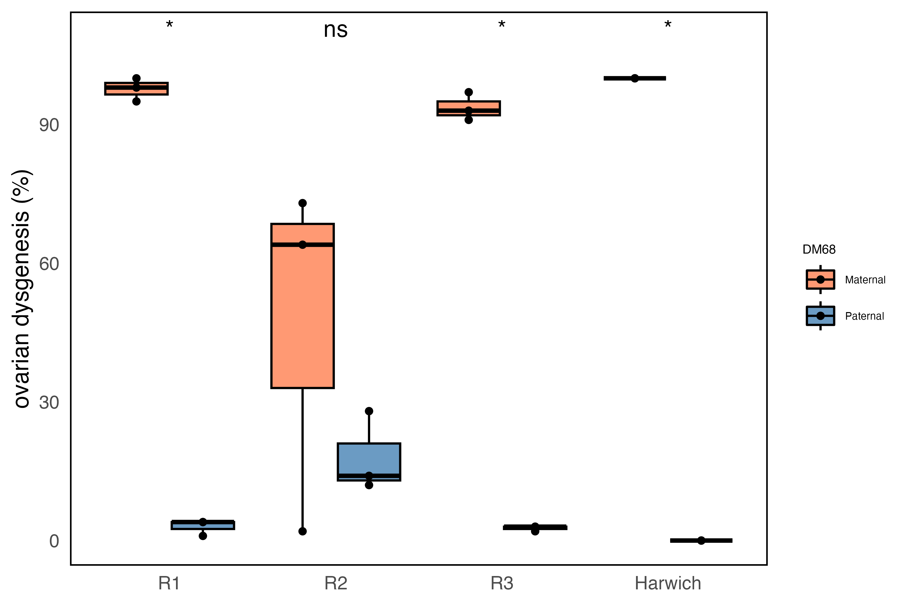
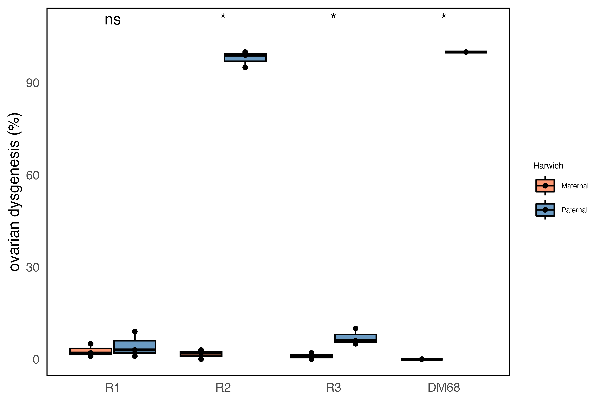

```{bash, eval=FALSE}
knitr::opts_chunk$set(echo = TRUE)
```

We wanted to assess the dysgenic inducibility of the different invaded replicates. To do so, we set up reciprocal crosses of each replicate with the original P-element naive strain, DM68. We also used a reciprocal cross between DM68 and the Harwich strain, known to carry the P-element, as a control.

```{bash}
less hybrid_dysgenesis/dmel_HDassay_2.tsv

```

```{r}
library(ggplot2)
library(ggpubr)
library(dplyr)
library(ggsignif)

data <- read.table("hybrid_dysgenesis/dmel_HDassay_2.tsv", header = TRUE)

data$group <- NA  
data$replicate <- NA  

data$group[data$line %in% c("68xR1", "68xR2", "68xR3", "68xHar")] <- "Maternal"
data$group[data$line %in% c("R1x68", "R2x68", "R3x68", "Harx68")] <- "Paternal"

data$replicate[data$line %in% c("68xR1", "R1x68")] <- "R1"
data$replicate[data$line %in% c("68xR2", "R2x68")] <- "R2"
data$replicate[data$line %in% c("68xR3", "R3x68")] <- "R3"
data$replicate[data$line %in% c("68xHar", "Harx68")] <- "Harwich"

data$replicate <- as.factor(data$replicate)
data$line <- as.factor(data$line)

data$replicate <- factor(data$replicate, levels = c("R1", "R2", "R3", "Harwich"))
data$line <- factor(data$line, levels = c("68xR1", "R1x68", "68xR2", "R2x68", "68xR3", "R3x68", "68xHar", "Harx68"))

replicate_order <- c("R1", "R2", "R3", "control")

HD1 <- ggplot(data, aes(x = replicate, y = percentage_dysgenic, fill = group)) +
          geom_boxplot(position = position_dodge(width = 0.8), alpha = 0.8, color = "black") +
          geom_jitter(position = position_dodge(width = 0.8), size = 1.2, alpha = 1) +
          labs(y = "ovarian dysgenesis (%)", x = NULL, fill = "DM68") +
          scale_fill_manual(values = c("Paternal" = "steelblue", "Maternal" = "coral")) +
          theme_minimal() +
          theme(
            panel.grid = element_blank(),
            legend.position = "right",
            legend.title = element_text(size = 6),
            legend.text = element_text(size = 5), 
            panel.border = element_rect(color = "black", fill = NA, size = 0.7)) +
          ylim(0, 109)

HD <- HD1 + stat_compare_means(aes(group = line), paired = TRUE, label = "p.signif", label.y.npc = "top")

ggsave("figs/HD_DM68.png", HD, width = 6, height = 4, dpi = 600)
ggsave("figs/HD_DM68.svg", HD, width = 6, height = 4)



```

```{bash}
less hybrid_dysgenesis/dmel_HDassay_Har.tsv

```

```{r}
library(ggplot2)
library(ggpubr)
library(dplyr)
library(ggsignif)

data <- read.table("/Volumes/Data/Projects/dmelR2_p-ele/R/gonadal_dysgenesis_assays/dmel_HDassay_Har.tsv", header = TRUE)

data$group <- NA  
data$replicate <- NA  

data$group[data$line %in% c("HarxR1", "HarxR2", "HarxR3", "Harx68")] <- "Maternal"
data$group[data$line %in% c("R1xHar", "R2xHar", "R3xHar", "68xHar")] <- "Paternal"

data$replicate[data$line %in% c("HarxR1", "R1xHar")] <- "R1"
data$replicate[data$line %in% c("HarxR2", "R2xHar")] <- "R2"
data$replicate[data$line %in% c("HarxR3", "R3xHar")] <- "R3"
data$replicate[data$line %in% c("68xHar", "Harx68")] <- "DM68"

data$replicate <- as.factor(data$replicate)
data$line <- as.factor(data$line)

data$replicate <- factor(data$replicate, levels = c("R1", "R2", "R3", "DM68"))
data$line <- factor(data$line, levels = c("HarxR1", "R1xHar", "HarxR2", "R2xHar", "HarxR3", "R3xHar", "68xHar", "Harx68"))

replicate_order <- c("R1", "R2", "R3", "DM68")

HD1 <- ggplot(data, aes(x = replicate, y = percentage_dysgenic, fill = group)) +
          geom_boxplot(position = position_dodge(width = 0.8), alpha = 0.8, color = "black") +
          geom_jitter(position = position_dodge(width = 0.8), size = 1.2, alpha = 1) +
          labs(y = "ovarian dysgenesis (%)", x = NULL, fill = "Harwich") +
          scale_fill_manual(values = c( "Maternal" = "coral", "Paternal" = "steelblue")) +
          theme_minimal() +
          theme(
            panel.grid = element_blank(),
            legend.position = "right",
            legend.title = element_text(size = 6),
            legend.text = element_text(size = 5), 
            panel.border = element_rect(color = "black", fill = NA, size = 0.7)) +
          ylim(0, 109)

HD <- HD1 + stat_compare_means(aes(group = line), paired = TRUE, label = "p.signif", label.y.npc = "top")

ggsave("figs/HD_Har.png", HD, width = 6, height = 4, dpi = 600)
ggsave("figs/HD_Har.svg", HD, width = 6, height = 4)



```

```{bash}
less hybrid_dysgenesis/dmel_HDassay_BG.tsv

```

```{r}
library(ggplot2)
library(ggpubr)
library(dplyr)
library(ggsignif)

data <- read.table("hybrid_dysgenesis/dmel_HDassay_BG.tsv", header = TRUE)

data$group <- NA  
data$replicate <- NA  

data$replicate <- as.factor(data$replicate)
data$line <- as.factor(data$line)

data$line <- factor(data$line, levels = c("R1", "R2", "R3", "68xHar", "Harx68"))

HD <- ggplot(data, aes(x = line, y = percentage_dysgenic, fill = group)) +
          geom_boxplot(position = position_dodge(width = 0.8), alpha = 0.8, color = "black") +
          geom_jitter(position = position_dodge(width = 0.8), size = 1.2, alpha = 1) +
          labs(y = "ovarian dysgenesis (%)", x = NULL, fill = NULL) +
          scale_fill_manual(values = c("group" = "steelblue")) +
          theme_minimal() +
          theme(
            panel.grid = element_blank(),
            legend.position = "right",
            legend.title = element_text(size = 6),
            legend.text = element_text(size = 5), 
            panel.border = element_rect(color = "black", fill = NA, size = 0.7)) +
          ylim(0, 109)

ggsave("figs/HD_BG.png", HD, width = 3, height = 4, dpi = 600)
ggsave("figs/HD_BG.svg", HD, width = 3, height = 4)

knitr::include_graphics("figs/HD_BG.png")

```

# Testing for significance - R2 reciprocal vs Intra-population

```{R}
# R2xDM68 vs Intra-pop dysgen %s
group1 <- c(4, 9, 8)
group2 <- c(28, 14, 12)

# Perform Welch's t-test (default in t.test)
t_test_result <- t.test(group1, group2)
print(t_test_result)


wilcox.test(group1, group2, alternative = "two.sided")

```

```{R}
library(ggplot2)
theme_set(theme_bw())

dys_dm=read.table("/Volumes/Data/Projects/dmelR2_p-ele/R/gonadal_dysgenesis_assays/Dmel_3R_3TP.tsv",header=TRUE)
print(dys_dm)

dys_dmel=data.frame(dys_dm$Replicate, dys_dm$Generation,dys_dm$Dys_percentile)
names(dys_dmel)[1]<-"replicate"
names(dys_dmel)[2]<-"generation"
names(dys_dmel)[3]<-"dys_percent"
dys_dmel$dys_percent=as.numeric(gsub("%", "", dys_dmel$dys_percent))
dys_dmel$generation=as.numeric(gsub("G", "", dys_dmel$generation))

p1=ggplot(dys_dmel,aes(x = generation,y = dys_percent, shape = replicate)) +
    geom_point(aes(colour = replicate), size = 3.5) +
    geom_path(aes(colour = replicate), linewidth = 1.5) +
    scale_size(guide = "none") +  
    xlim(0, 50) +
    theme_bw() +
    theme(
      panel.grid = element_blank(),
      plot.margin = margin(10, 10, 10, 10, "pt"),
      legend.position = c(0.08, 0.85),
      legend.box.background = element_rect(fill = NULL, colour = NULL, size = 0)
    ) +
    guides(color = guide_legend(title = NULL), shape = guide_legend(title = NULL)) +
  
    xlab("generation") +
    ylab("ovarian dysgenesis (%)") +
    scale_color_manual(values=c("firebrick", "skyblue3", "chartreuse4")) +
    theme(
      plot.title = element_blank(),       
      panel.grid.major = element_blank(),
      panel.grid.minor = element_blank()
    )

ggsave("figs/HD_over_time.png", p1, width = 8, height = 4, dpi = 600)
ggsave("figs/HD_over_time.svg", p1, width = 8, height = 4)


```
