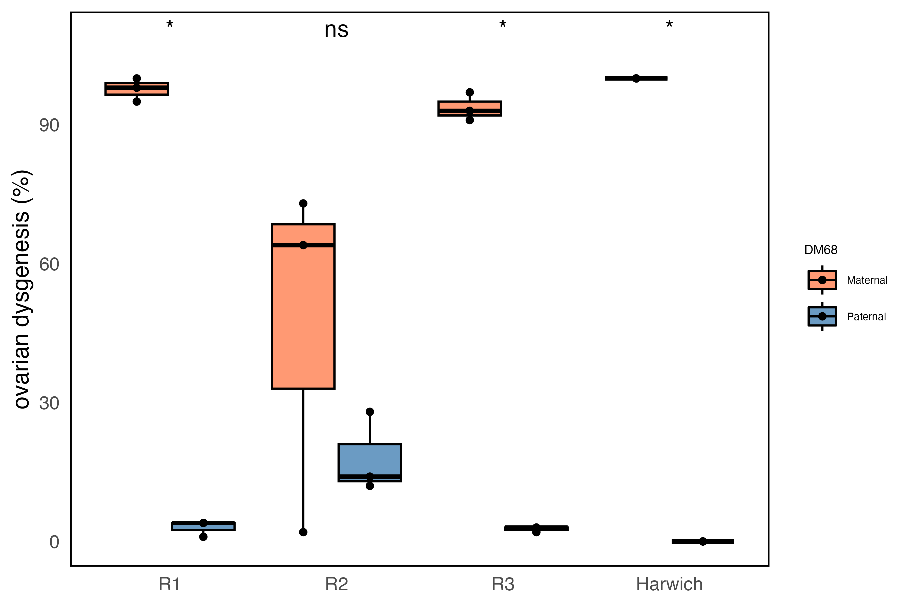
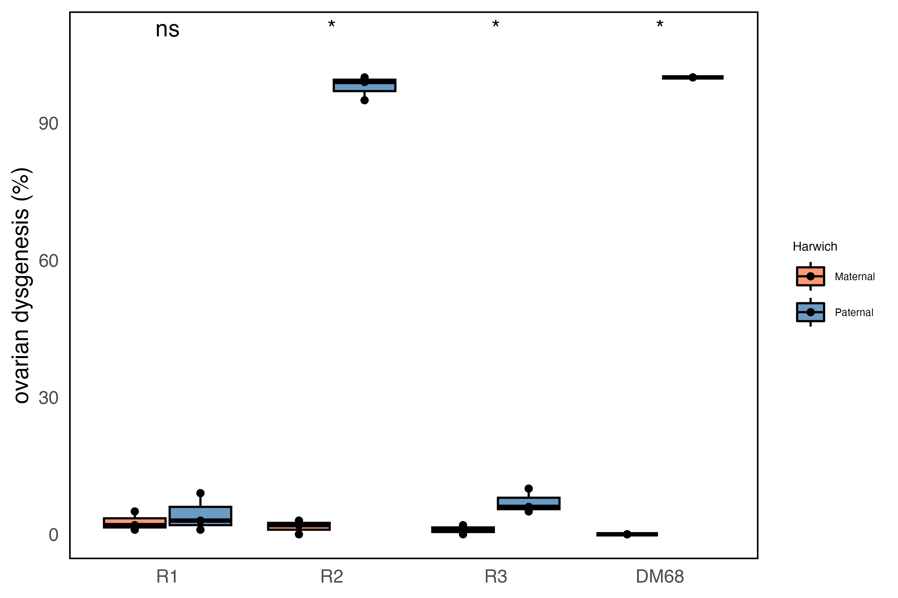
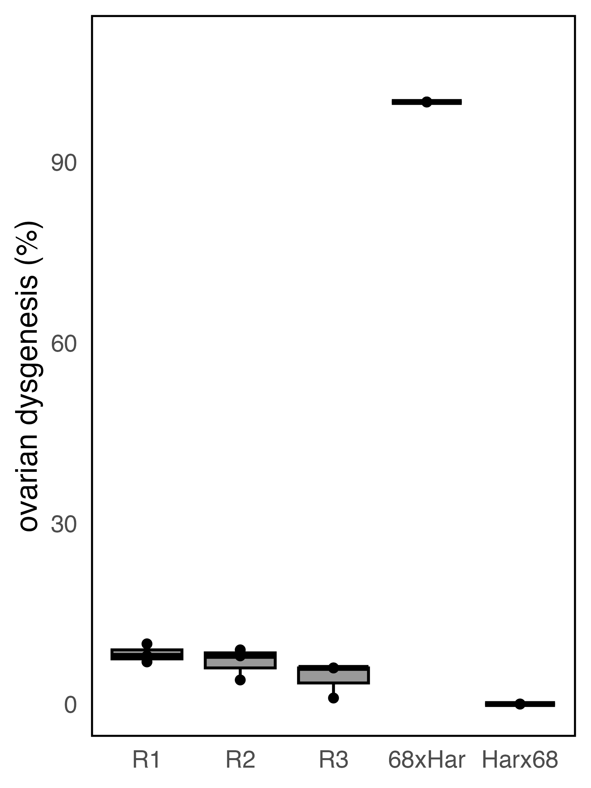

6 - Hybrid dysgenesis
================
Matthew Beaumont
2024-12-13

``` bash
knitr::opts_chunk$set(echo = TRUE)
```

We wanted to assess the dysgenic inducibility of the different invaded
replicates. To do so, we set up reciprocal crosses of each replicate
with the original P-element naive strain, DM68. We also used a
reciprocal cross between DM68 and the Harwich strain, known to carry the
P-element, as a control.

``` bash
less hybrid_dysgenesis/dmel_HDassay_2.tsv
```

    ## line replicate   dysgenic    intermediate    non-dysgenic    total_ovaries   percentage_dysgenic
    ## R1x68    1   0   4   46  100 4
    ## R1x68    2   0   1   49  100 1
    ## R1x68    3   1   2   47  100 4
    ## R2x68    1   12  4   34  100 28
    ## R2x68    2   3   8   39  100 14
    ## R2x68    3   2   8   40  100 12
    ## R3x68    1   0   2   48  100 2
    ## R3x68    2   0   3   47  100 3
    ## R3x68    3   1   1   48  100 3
    ## 68xR1    1   48  2   0   100 98
    ## 68xR1    2   50  0   0   100 100
    ## 68xR1    3   46  3   1   100 95
    ## 68xR2    1   33  7   10  100 73
    ## 68xR2    2   25  14  11  100 64
    ## 68xR2    3   0   2   48  100 2
    ## 68xR3    1   45  1   4   100 91
    ## 68xR3    2   47  3   0   100 97
    ## 68xR3    3   44  5   1   100 93
    ## Harx68   1   0   0   50  100 0
    ## Harx68   2   0   0   50  100 0
    ## Harx68   3   0   0   50  100 0
    ## 68xHar   1   50  0   0   100 100
    ## 68xHar   2   50  0   0   100 100
    ## 68xHar   3   50  0   0   100 100

``` r
library(ggplot2)
library(ggpubr)
library(dplyr)
```

    ## 
    ## Attaching package: 'dplyr'

    ## The following objects are masked from 'package:stats':
    ## 
    ##     filter, lag

    ## The following objects are masked from 'package:base':
    ## 
    ##     intersect, setdiff, setequal, union

``` r
library(ggsignif)

data <- read.table("hybrid_dysgenesis/dmel_HDassay_2.tsv", header = TRUE)

data$group <- NA  
data$replicate <- NA  

data$group[data$line %in% c("68xR1", "68xR2", "68xR3", "68xHar")] <- "Maternal"
data$group[data$line %in% c("R1x68", "R2x68", "R3x68", "Harx68")] <- "Paternal"

data$replicate[data$line %in% c("68xR1", "R1x68")] <- "R1"
data$replicate[data$line %in% c("68xR2", "R2x68")] <- "R2"
data$replicate[data$line %in% c("68xR3", "R3x68")] <- "R3"
data$replicate[data$line %in% c("68xHar", "Harx68")] <- "Harwich"

data$replicate <- as.factor(data$replicate)
data$line <- as.factor(data$line)

data$replicate <- factor(data$replicate, levels = c("R1", "R2", "R3", "Harwich"))
data$line <- factor(data$line, levels = c("68xR1", "R1x68", "68xR2", "R2x68", "68xR3", "R3x68", "68xHar", "Harx68"))

replicate_order <- c("R1", "R2", "R3", "control")

HD1 <- ggplot(data, aes(x = replicate, y = percentage_dysgenic, fill = group)) +
          geom_boxplot(position = position_dodge(width = 0.8), alpha = 0.8, color = "black") +
          geom_jitter(position = position_dodge(width = 0.8), size = 1.2, alpha = 1) +
          labs(y = "ovarian dysgenesis (%)", x = NULL, fill = "DM68") +
          scale_fill_manual(values = c("Paternal" = "steelblue", "Maternal" = "coral")) +
          theme_minimal() +
          theme(
            panel.grid = element_blank(),
            legend.position = "right",
            legend.title = element_text(size = 6),
            legend.text = element_text(size = 5), 
            panel.border = element_rect(color = "black", fill = NA, size = 0.7)) +
          ylim(0, 109)
```

    ## Warning: The `size` argument of `element_rect()` is deprecated as of ggplot2 3.4.0.
    ## ℹ Please use the `linewidth` argument instead.
    ## This warning is displayed once every 8 hours.
    ## Call `lifecycle::last_lifecycle_warnings()` to see where this warning was
    ## generated.

``` r
HD <- HD1 + stat_compare_means(aes(group = line), paired = TRUE, label = "p.signif", label.y.npc = "top")

ggsave("figs/HD_DM68.png", HD, width = 6, height = 4, dpi = 600)
ggsave("figs/HD_DM68.svg", HD, width = 6, height = 4)


```


``` bash
less hybrid_dysgenesis/dmel_HDassay_Har.tsv
```

    ## line replicate   dysgenic    intermediate    non-dysgenic    total_ovaries   percentage_dysgenic
    ## R1xHar   1   0   1   49  100 1
    ## R1xHar   2   0   3   47  100 3
    ## R1xHar   3   2   5   43  100 9
    ## R2xHar   1   49  1   0   100 99
    ## R2xHar   2   45  5   0   100 95
    ## R2xHar   3   50  0   0   100 100
    ## R3xHar   1   1   4   45  100 6
    ## R3xHar   2   2   6   42  100 10
    ## R3xHar   3   0   5   45  100 5
    ## HarxR1   1   0   1   49  100 1
    ## HarxR1   2   0   5   45  100 5
    ## HarxR1   3   0   2   48  100 2
    ## HarxR2   1   0   3   47  100 3
    ## HarxR2   2   0   0   50  100 0
    ## HarxR2   3   0   2   48  100 2
    ## HarxR3   1   0   1   49  100 1
    ## HarxR3   2   0   0   50  100 0
    ## HarxR3   3   0   2   48  100 2
    ## Harx68   1   0   0   50  100 0
    ## Harx68   2   0   0   50  100 0
    ## Harx68   3   0   0   50  100 0
    ## 68xHar   1   50  0   0   100 100
    ## 68xHar   2   50  0   0   100 100
    ## 68xHar   3   50  0   0   100 100

``` r
library(ggplot2)
library(ggpubr)
library(dplyr)
library(ggsignif)

data <- read.table("hybrid_dysgenesis/dmel_HDassay_Har.tsv", header = TRUE)

data$group <- NA  
data$replicate <- NA  

data$group[data$line %in% c("HarxR1", "HarxR2", "HarxR3", "Harx68")] <- "Maternal"
data$group[data$line %in% c("R1xHar", "R2xHar", "R3xHar", "68xHar")] <- "Paternal"

data$replicate[data$line %in% c("HarxR1", "R1xHar")] <- "R1"
data$replicate[data$line %in% c("HarxR2", "R2xHar")] <- "R2"
data$replicate[data$line %in% c("HarxR3", "R3xHar")] <- "R3"
data$replicate[data$line %in% c("68xHar", "Harx68")] <- "DM68"

data$replicate <- as.factor(data$replicate)
data$line <- as.factor(data$line)

data$replicate <- factor(data$replicate, levels = c("R1", "R2", "R3", "DM68"))
data$line <- factor(data$line, levels = c("HarxR1", "R1xHar", "HarxR2", "R2xHar", "HarxR3", "R3xHar", "68xHar", "Harx68"))

replicate_order <- c("R1", "R2", "R3", "DM68")

HD1 <- ggplot(data, aes(x = replicate, y = percentage_dysgenic, fill = group)) +
          geom_boxplot(position = position_dodge(width = 0.8), alpha = 0.8, color = "black") +
          geom_jitter(position = position_dodge(width = 0.8), size = 1.2, alpha = 1) +
          labs(y = "ovarian dysgenesis (%)", x = NULL, fill = "Harwich") +
          scale_fill_manual(values = c( "Maternal" = "coral", "Paternal" = "steelblue")) +
          theme_minimal() +
          theme(
            panel.grid = element_blank(),
            legend.position = "right",
            legend.title = element_text(size = 6),
            legend.text = element_text(size = 5), 
            panel.border = element_rect(color = "black", fill = NA, size = 0.7)) +
          ylim(0, 109)

HD <- HD1 + stat_compare_means(aes(group = line), paired = TRUE, label = "p.signif", label.y.npc = "top")

ggsave("figs/HD_Har.png", HD, width = 6, height = 4, dpi = 600)
ggsave("figs/HD_Har.svg", HD, width = 6, height = 4)


```


``` bash
less hybrid_dysgenesis/dmel_HDassay_BG.tsv
```

    ## line replicate   dysgenic    intermediate    non-dysgenic    total_ovaries   percentage_dysgenic
    ## R1   1   3   1   46  100 7
    ## R1   2   5   0   45  100 10
    ## R1   3   2   4   44  100 8
    ## R2   1   0   4   46  100 4
    ## R2   2   3   3   44  100 9
    ## R2   3   4   0   46  100 8
    ## R3   1   0   1   49  100 1
    ## R3   2   2   2   46  100 6
    ## R3   3   3   0   47  100 6
    ## Harx68   1   0   0   50  100 0
    ## Harx68   2   0   0   50  100 0
    ## Harx68   3   0   0   50  100 0
    ## 68xHar   1   50  0   0   100 100
    ## 68xHar   2   50  0   0   100 100
    ## 68xHar   3   50  0   0   100 100

``` r
library(ggplot2)
library(ggpubr)
library(dplyr)
library(ggsignif)

data <- read.table("hybrid_dysgenesis/dmel_HDassay_BG.tsv", header = TRUE)

data$group <- NA  
data$replicate <- NA  

data$replicate <- as.factor(data$replicate)
data$line <- as.factor(data$line)

data$line <- factor(data$line, levels = c("R1", "R2", "R3", "68xHar", "Harx68"))

HD <- ggplot(data, aes(x = line, y = percentage_dysgenic, fill = group)) +
          geom_boxplot(position = position_dodge(width = 0.8), alpha = 0.8, color = "black") +
          geom_jitter(position = position_dodge(width = 0.8), size = 1.2, alpha = 1) +
          labs(y = "ovarian dysgenesis (%)", x = NULL, fill = NULL) +
          scale_fill_manual(values = c("group" = "steelblue")) +
          theme_minimal() +
          theme(
            panel.grid = element_blank(),
            legend.position = "right",
            legend.title = element_text(size = 6),
            legend.text = element_text(size = 5), 
            panel.border = element_rect(color = "black", fill = NA, size = 0.7)) +
          ylim(0, 109)

ggsave("figs/HD_BG.png", HD, width = 3, height = 4, dpi = 600)
ggsave("figs/HD_BG.svg", HD, width = 3, height = 4)


```


# Testing for significance - R2 reciprocal vs Intra-population

``` r
# R2xDM68 vs Intra-pop dysgen %s
group1 <- c(4, 9, 8)
group2 <- c(28, 14, 12)

# Perform Welch's t-test (default in t.test)
t_test_result <- t.test(group1, group2)
print(t_test_result)
```

    ## 
    ##  Welch Two Sample t-test
    ## 
    ## data:  group1 and group2
    ## t = -2.0913, df = 2.3653, p-value = 0.1516
    ## alternative hypothesis: true difference in means is not equal to 0
    ## 95 percent confidence interval:
    ##  -30.590898   8.590898
    ## sample estimates:
    ## mean of x mean of y 
    ##         7        18

``` r
wilcox.test(group1, group2, alternative = "two.sided")
```

    ## 
    ##  Wilcoxon rank sum exact test
    ## 
    ## data:  group1 and group2
    ## W = 0, p-value = 0.1
    ## alternative hypothesis: true location shift is not equal to 0
