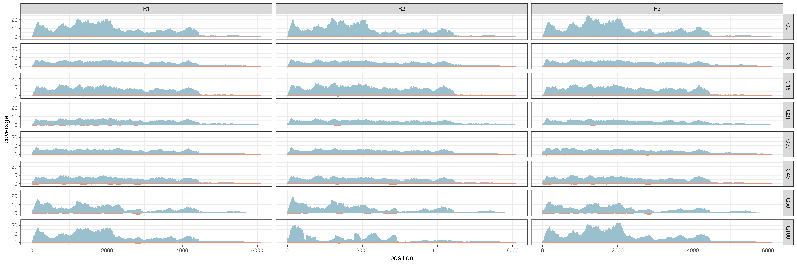
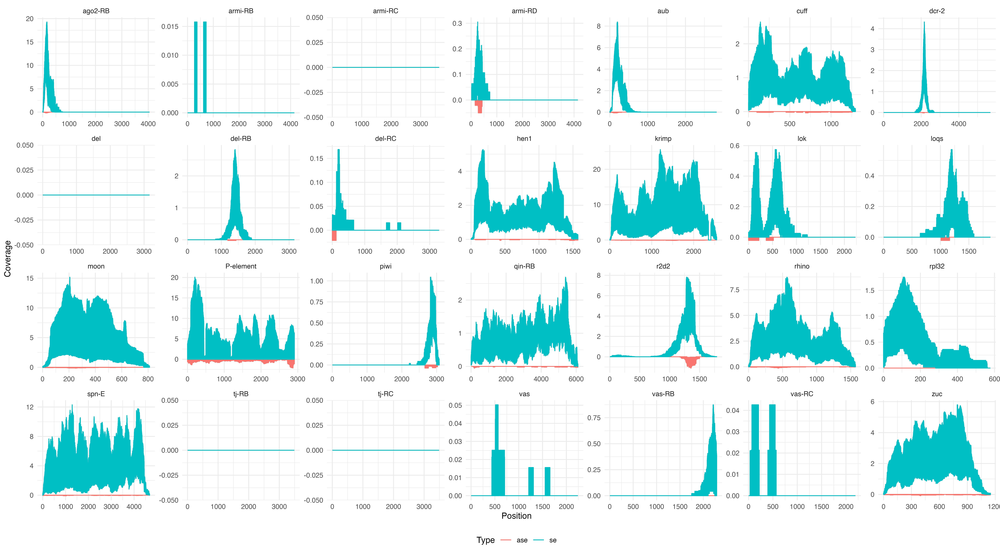

2 - Coverage
================
Matthew Beaumont
2023-09-07

``` bash
knitr::opts_chunk$set(echo = TRUE)
```

We ran the following script to assess coverage of selected gene
transcripts and the P-element.

``` bash
#!/bin/bash

fai="/Volumes/Data/Tools/RefGenomes/dmel/rna/dmel_TEs/dmel-transcriptome-r6.52-TEs.fasta.fai"
pyscript="/Volumes/Data/Projects/dmelR2_p-ele/scripts/mRNA-coverage-senseantisense.py"
input_dir="/Volumes/Data/Projects/dmelR2_p-ele/rna/run2/map-bwamem"
output_dir="/Volumes/Data/Projects/dmelR2_p-ele/rna/run2/splicing-expression/raw_expression"

seqs="PPI251,FBtr0083183_mRNA,FBtr0088034_mRNA,FBtr0086904_mRNA,FBtr0087984_mRNA,FBtr0087189_mRNA,FBtr0080497_mRNA,FBtr0079489_mRNA,FBtr0445185_mRNA,FBtr0080316_mRNA,FBtr0075559_mRNA,FBtr0100641_mRNA,FBtr0080165_mRNA,FBtr0081502_mRNA,FBtr0073637_mRNA,FBtr0080166_mRNA,FBtr0301669_mRNA,FBtr0086897_mRNA,FBtr0085594_mRNA,FBtr0329922_mRNA,FBtr0081328_mRNA"

# All transcripts are 'RA' variants unless stated otherwise.

samtools view $input_dir/dmel_R1G6_run2.sort.bam | python $pyscript --sam - --sample-id R1-G6-run2 --seqs $seqs --fai $fai > $output_dir/dmel_R1G6_run2.txt
samtools view $input_dir/dmel_R2G6_run2.sort.bam | python $pyscript --sam - --sample-id R2-G6-run2 --seqs $seqs --fai $fai > $output_dir/dmel_R2G6_run2.txt
samtools view $input_dir/dmel_R3G6_run2.sort.bam | python $pyscript --sam - --sample-id R3-G6-run2 --seqs $seqs --fai $fai > $output_dir/dmel_R3G6_run2.txt

samtools view $input_dir/dmel_R1G15_run2.sort.bam | python $pyscript --sam - --sample-id R1-G15-run2 --seqs $seqs --fai $fai > $output_dir/dmel_R1G15_run2.txt
samtools view $input_dir/dmel_R2G15_run2.sort.bam | python $pyscript --sam - --sample-id R2-G15-run2 --seqs $seqs --fai $fai > $output_dir/dmel_R2G15_run2.txt
samtools view $input_dir/dmel_R3G15_run2.sort.bam | python $pyscript --sam - --sample-id R3-G15-run2 --seqs $seqs --fai $fai > $output_dir/dmel_R3G15_run2.txt

samtools view $input_dir/dmel_R1G21_run2.sort.bam | python $pyscript --sam - --sample-id R1-G21-run2 --seqs $seqs --fai $fai > $output_dir/dmel_R1G21_run2.txt
samtools view $input_dir/dmel_R2G21_run2.sort.bam | python $pyscript --sam - --sample-id R2-G21-run2 --seqs $seqs --fai $fai > $output_dir/dmel_R2G21_run2.txt
samtools view $input_dir/dmel_R3G21_run2.sort.bam | python $pyscript --sam - --sample-id R3-G21-run2 --seqs $seqs --fai $fai > $output_dir/dmel_R3G21_run2.txt

samtools view $input_dir/dmel_R1G30_run2.sort.bam | python $pyscript --sam - --sample-id R1-G30-run2 --seqs $seqs --fai $fai > $output_dir/dmel_R1G30_run2.txt
samtools view $input_dir/dmel_R2G30_run2.sort.bam | python $pyscript --sam - --sample-id R2-G30-run2 --seqs $seqs --fai $fai > $output_dir/dmel_R2G30_run2.txt
samtools view $input_dir/dmel_R3G30_run2.sort.bam | python $pyscript --sam - --sample-id R3-G30-run2 --seqs $seqs --fai $fai > $output_dir/dmel_R3G30_run2.txt

samtools view $input_dir/dmel_R1G40_run2.sort.bam | python $pyscript --sam - --sample-id R1-G40-run2 --seqs $seqs --fai $fai > $output_dir/dmel_R1G40_run2.txt
samtools view $input_dir/dmel_R2G40_run2.sort.bam | python $pyscript --sam - --sample-id R2-G40-run2 --seqs $seqs --fai $fai > $output_dir/dmel_R2G40_run2.txt
samtools view $input_dir/dmel_R3G40_run2.sort.bam | python $pyscript --sam - --sample-id R3-G40-run2 --seqs $seqs --fai $fai > $output_dir/dmel_R3G40_run2.txt

# Combine outputs into single file, separating ID.
# cat *.txt| perl -pe 's/-/\t/'|perl -pe 's/-/\t/' > expr-spli.forr
```

``` bash
#!/bin/bash

fai="/Volumes/Data/Tools/RefGenomes/dmel/rna/dmel_TEs/dmel-transcriptome-r6.52-TEs.fasta.fai"
pyscript="/Volumes/Data/Projects/dmelR2_p-ele/scripts/mRNA-coverage-senseantisense.py"
input_dir="/Volumes/Data/Projects/dmelR2_p-ele/rna/run2/map-GSNAP/output"
output_dir="/Volumes/Data/Projects/dmelR2_p-ele/rna/run2/splicing-expression/raw_expression"

seqs="PPI251,FBtr0083183_mRNA,FBtr0088034_mRNA,FBtr0086904_mRNA,FBtr0087984_mRNA,FBtr0087189_mRNA,FBtr0080497_mRNA,FBtr0079489_mRNA,FBtr0445185_mRNA,FBtr0080316_mRNA,FBtr0075559_mRNA,FBtr0100641_mRNA,FBtr0080165_mRNA,FBtr0081502_mRNA,FBtr0073637_mRNA,FBtr0080166_mRNA,FBtr0301669_mRNA,FBtr0086897_mRNA,FBtr0085594_mRNA,FBtr0329922_mRNA,FBtr0081328_mRNA"

# All transcripts are 'RA' variants unless stated otherwise.

samtools view $input_dir/dmel_R1G6_run2.sort.bam | python $pyscript --sam - --sample-id R1-G6-run2 --seqs $seqs --fai $fai > $output_dir/dmel_R1G6_run2.txt
samtools view $input_dir/dmel_R2G6_run2.sort.bam | python $pyscript --sam - --sample-id R2-G6-run2 --seqs $seqs --fai $fai > $output_dir/dmel_R2G6_run2.txt
samtools view $input_dir/dmel_R3G6_run2.sort.bam | python $pyscript --sam - --sample-id R3-G6-run2 --seqs $seqs --fai $fai > $output_dir/dmel_R3G6_run2.txt

samtools view $input_dir/dmel_R1G15_run2.sort.bam | python $pyscript --sam - --sample-id R1-G15-run2 --seqs $seqs --fai $fai > $output_dir/dmel_R1G15_run2.txt
samtools view $input_dir/dmel_R2G15_run2.sort.bam | python $pyscript --sam - --sample-id R2-G15-run2 --seqs $seqs --fai $fai > $output_dir/dmel_R2G15_run2.txt
samtools view $input_dir/dmel_R3G15_run2.sort.bam | python $pyscript --sam - --sample-id R3-G15-run2 --seqs $seqs --fai $fai > $output_dir/dmel_R3G15_run2.txt

samtools view $input_dir/dmel_R1G21_run2.sort.bam | python $pyscript --sam - --sample-id R1-G21-run2 --seqs $seqs --fai $fai > $output_dir/dmel_R1G21_run2.txt
samtools view $input_dir/dmel_R2G21_run2.sort.bam | python $pyscript --sam - --sample-id R2-G21-run2 --seqs $seqs --fai $fai > $output_dir/dmel_R2G21_run2.txt
samtools view $input_dir/dmel_R3G21_run2.sort.bam | python $pyscript --sam - --sample-id R3-G21-run2 --seqs $seqs --fai $fai > $output_dir/dmel_R3G21_run2.txt

samtools view $input_dir/dmel_R1G30_run2.sort.bam | python $pyscript --sam - --sample-id R1-G30-run2 --seqs $seqs --fai $fai > $output_dir/dmel_R1G30_run2.txt
samtools view $input_dir/dmel_R2G30_run2.sort.bam | python $pyscript --sam - --sample-id R2-G30-run2 --seqs $seqs --fai $fai > $output_dir/dmel_R2G30_run2.txt
samtools view $input_dir/dmel_R3G30_run2.sort.bam | python $pyscript --sam - --sample-id R3-G30-run2 --seqs $seqs --fai $fai > $output_dir/dmel_R3G30_run2.txt

samtools view $input_dir/dmel_R1G40_run2.sort.bam | python $pyscript --sam - --sample-id R1-G40-run2 --seqs $seqs --fai $fai > $output_dir/dmel_R1G40_run2.txt
samtools view $input_dir/dmel_R2G40_run2.sort.bam | python $pyscript --sam - --sample-id R2-G40-run2 --seqs $seqs --fai $fai > $output_dir/dmel_R2G40_run2.txt
samtools view $input_dir/dmel_R3G40_run2.sort.bam | python $pyscript --sam - --sample-id R3-G40-run2 --seqs $seqs --fai $fai > $output_dir/dmel_R3G40_run2.txt

# Combine outputs into single file, separating ID.
# cat *.txt| perl -pe 's/-/\t/'|perl -pe 's/-/\t/' > expr-spli.forr
```

Then visualised it with ggplot2.

# Overall gene coverage

We assessed the coverage of all genes across each replicate at each
generation from the two used alignment tools.

``` r
library(ggplot2)
theme_set(theme_bw())

h<-read.table("/Volumes/Data/Projects/dmelR2_p-ele/rna/run2/splicing-expression/raw_expression/expr-spli.forr")        

names(h)<-c("rep","time","tissue","strand","gene","pos","cov")

{
  h$time <- factor(h$time, levels=c("G6", "G15", "G21", "G30","G40"))
  
  s<-subset(h,strand=="se")
  as<-subset(h,strand=="ase")
}
  
mRNA_plot_b <- ggplot() +
    geom_line(data=s,mapping=aes(x=pos, y=cov), color='lightblue3') +
    geom_line(data=as, aes(x=pos, y=-cov), color='darksalmon')+
    facet_grid(time~rep)+
    ylab("coverage")+
    xlab("position")

ggsave("figs/overall_mRNA_cov_bwa.png", mRNA_plot_b, width = 18, height = 6, dpi = 500)

knitr::include_graphics(file.path(getwd(), "figs", "overall_mRNA_cov_bwa.png"))
```



``` r
library(ggplot2)
theme_set(theme_bw())

h<-read.table("/Volumes/Data/Projects/dmelR2_p-ele/rna/run2/splicing-expression/raw_expression/GSNAP/expr-spli.forr")        

names(h)<-c("rep","time","tissue","strand","gene","pos","cov")

{
  h$time <- factor(h$time, levels=c("G6", "G15", "G21", "G30","G40"))
  
  s<-subset(h,strand=="se")
  as<-subset(h,strand=="ase")
}
  
mRNA_plot_g <- ggplot() +
    geom_line(data=s,mapping=aes(x=pos, y=cov), color='lightblue3') +
    geom_line(data=as, aes(x=pos, y=-cov), color='darksalmon')+
    facet_grid(time~rep)+
    ylab("coverage")+
    xlab("position")

ggsave("figs/overall_mRNA_cov_gsnap.png", mRNA_plot_g, width = 18, height = 6, dpi = 500)


```


We then moved on to only look at selected genes from each dataset.

``` r
library(ggplot2)
theme_set(theme_bw())

genes<-c("PPI251","FBtr0083183_mRNA","FBtr0088034_mRNA","FBtr0086904_mRNA","FBtr0087984_mRNA","FBtr0087189_mRNA","FBtr0080497_mRNA","FBtr0079489_mRNA","FBtr0445185_mRNA","FBtr0080316_mRNA","FBtr0075559_mRNA","FBtr0100641_mRNA","FBtr0080165_mRNA","FBtr0081502_mRNA","FBtr0073637_mRNA","FBtr0080166_mRNA","FBtr0301669_mRNA","FBtr0086897_mRNA","FBtr0085594_mRNA","FBtr0329922_mRNA","FBtr0081328_mRNA")
sc<-c("p-element","spnE","cuff","dcr-2","hen1","krimp","loqs","r2d2","vas",
      "zuc","ago2-RB","armi-RB","aub","del","moon","piwi","tj-RB","rhino","rpl32","qin-RB","lok")

h<-read.table("/Volumes/Data/Projects/dmelR2_p-ele/rna/run2/splicing-expression/raw_expression/expr-spli.forr")        

names(h)<-c("rep","time","tissue","strand","gene","pos","cov")

{
  target<-genes

  a<-subset(h,gene==target)
  a$time <- factor(a$time, levels=c("G6", "G15", "G21", "G30","G40"))
  
  s<-subset(a,strand=="se")
  as<-subset(a,strand=="ase")
}
```

    ## Warning in gene == target: longer object length is not a multiple of shorter
    ## object length

``` r
selgenes_b <- ggplot() +
    geom_line(data=s,mapping=aes(x=pos, y=cov), color='lightblue3') +
    geom_line(data=as, aes(x=pos, y=-cov), color='darksalmon')+
    facet_grid(time~rep)+
    ylab("coverage")+
    xlab("position")

ggsave("figs/mRNA_selgenes_bwa.png", selgenes_b, width = 18, height = 6, dpi = 500)


```


``` r
library(ggplot2)
theme_set(theme_bw())

genes<-c("PPI251","FBtr0083183_mRNA","FBtr0088034_mRNA","FBtr0086904_mRNA","FBtr0087984_mRNA","FBtr0087189_mRNA","FBtr0080497_mRNA","FBtr0079489_mRNA","FBtr0445185_mRNA","FBtr0080316_mRNA","FBtr0075559_mRNA","FBtr0100641_mRNA","FBtr0080165_mRNA","FBtr0081502_mRNA","FBtr0073637_mRNA","FBtr0080166_mRNA","FBtr0301669_mRNA","FBtr0086897_mRNA","FBtr0329922_mRNA","FBtr0081328_mRNA")

# "FBtr0085594_mRNA" = rpl32  highly expressed relative to other genes, skews distribution. 

h<-read.table("/Volumes/Data/Projects/dmelR2_p-ele/rna/run2/splicing-expression/raw_expression/GSNAP/expr-spli.forr")        

names(h)<-c("rep","time","tissue","strand","gene","pos","cov")

{
  target<-genes

  a<-subset(h,gene==target)
  a$time <- factor(a$time, levels=c("G6", "G15", "G21", "G30","G40"))
  
  s<-subset(a,strand=="se")
  as<-subset(a,strand=="ase")
}
  
selgenes_g <- ggplot() +
    geom_line(data=s,mapping=aes(x=pos, y=cov), color='lightblue3') +
    geom_line(data=as, aes(x=pos, y=-cov), color='darksalmon')+
    facet_grid(time~rep)+
    ylab("coverage")+
    xlab("position")

ggsave("figs/mRNA_selgenes_gsnap.png", selgenes_g, width = 18, height = 6, dpi = 500)


```


# Selected gene coverage

We looked at the coverage for selected genes from both alignment tool
coverage datasets.

## bwa

``` r
library(ggplot2)

transcript_to_gene <- c(
  "PPI251" = "P-element",
  "FBtr0083183_mRNA" = "spn-E",
  "FBtr0088034_mRNA" = "cuff",
  "FBtr0086904_mRNA" = "dcr-2",
  "FBtr0087984_mRNA" = "hen1",
  "FBtr0087189_mRNA" = "krimp",
  "FBtr0080497_mRNA" = "loqs",
  "FBtr0079489_mRNA" = "r2d2",
  "FBtr0445185_mRNA" = "vas",
  "FBtr0445186_mRNA" = "vas-RB",
  "FBtr0445187_mRNA" = "vas-RC",
  "FBtr0080316_mRNA" = "zuc",
  "FBtr0075559_mRNA" = "ago2-RB",
  "FBtr0100641_mRNA" = "armi-RB",
  "FBtr0309840_mRNA" = "armi-RC",
  "FBtr0309841_mRNA" = "armi-RD",
  "FBtr0080165_mRNA" = "aub",
  "FBtr0081502_mRNA" = "del",
  "FBtr0333084_mRNA" = "del-RB",
  "FBtr0333085_mRNA" = "del-RC",
  "FBtr0073637_mRNA" = "moon",
  "FBtr0080166_mRNA" = "piwi",
  "FBtr0301669_mRNA" = "tj-RB",
  "FBtr0329891_mRNA" = "tj-RC",
  "FBtr0086897_mRNA" = "rhino",
  "FBtr0085594_mRNA" = "rpl32",
  "FBtr0329922_mRNA" = "qin-RB",
  "FBtr0081328_mRNA" = "lok"
)

data <- read.table("/Volumes/Data/Projects/dmelR2_p-ele/rna/run2/splicing-expression/raw_expression/expr-spli.forr", header = FALSE, sep = "\t")
colnames(data) <- c("Sample", "Time", "Run", "Type", "ID", "Position", "Coverage")

# Invert Cov values for "ase"
data$Coverage[data$Type == "ase"] <- -data$Coverage[data$Type == "ase"]

data$Gene <- transcript_to_gene[data$ID]

cov_plot <- ggplot(data, aes(x = Position, y = Coverage, color = Type)) +
  geom_line() +
  facet_wrap(~ Gene, ncol = 7, scales = "free") +
  labs(x = "Position", y = "Coverage", color = "Type") +
  theme_minimal() +
  guides(color = guide_legend(title = "Type")) +
  theme(legend.position = "bottom")

ggsave("figs/mRNA_sa_bwa.png", cov_plot, width = 18, height = 10, bg = "white", dpi = 500)


```


## GSNAP

``` r
library(ggplot2)

# Mapping between transcript IDs and gene IDs
transcript_to_gene <- c(
  "PPI251" = "P-element",
  "FBtr0083183_mRNA" = "spn-E",
  "FBtr0088034_mRNA" = "cuff",
  "FBtr0086904_mRNA" = "dcr-2",
  "FBtr0087984_mRNA" = "hen1",
  "FBtr0087189_mRNA" = "krimp",
  "FBtr0080497_mRNA" = "loqs",
  "FBtr0079489_mRNA" = "r2d2",
  "FBtr0445185_mRNA" = "vas",
  "FBtr0445186_mRNA" = "vas-RB",
  "FBtr0445187_mRNA" = "vas-RC",
  "FBtr0080316_mRNA" = "zuc",
  "FBtr0075559_mRNA" = "ago2-RB",
  "FBtr0100641_mRNA" = "armi-RB",
  "FBtr0309840_mRNA" = "armi-RC",
  "FBtr0309841_mRNA" = "armi-RD",
  "FBtr0080165_mRNA" = "aub",
  "FBtr0081502_mRNA" = "del",
  "FBtr0333084_mRNA" = "del-RB",
  "FBtr0333085_mRNA" = "del-RC",
  "FBtr0073637_mRNA" = "moon",
  "FBtr0080166_mRNA" = "piwi",
  "FBtr0301669_mRNA" = "tj-RB",
  "FBtr0329891_mRNA" = "tj-RC",
  "FBtr0086897_mRNA" = "rhino",
  "FBtr0085594_mRNA" = "rpl32",
  "FBtr0329922_mRNA" = "qin-RB",
  "FBtr0081328_mRNA" = "lok"
)
data <- read.table("/Volumes/Data/Projects/dmelR2_p-ele/rna/run2/splicing-expression/raw_expression/GSNAP/expr-spli.forr", header = FALSE, sep = "\t")
colnames(data) <- c("Sample", "Time", "Run", "Type", "ID", "Position", "Coverage")

# Invert Coverage values for "ase" data points
data$Coverage[data$Type == "ase"] <- -data$Coverage[data$Type == "ase"]

# Replace ID with gene names in plot titles
data$Gene <- transcript_to_gene[data$ID]

# Calculate maximum values for each gene ID
max_values_g <- aggregate(Coverage ~ Gene, data, max)

# Create a function to extract the max value for each gene ID
get_max_value <- function(gene) {
  max_values_g$Coverage[max_values_g$Gene == gene]
}

cov_plot <- ggplot(data, aes(x = Position, y = Coverage, color = Type)) +
  geom_line() +  
  facet_wrap(~ Gene, ncol = 7, scales = "free") +
  labs(x = "Position", y = "Coverage", color = "Type") +
  theme_minimal() +
  guides(color = guide_legend(title = "Type")) +
  theme(legend.position = "bottom")

ggsave("figs/mRNA_sa_GSNAP.png", cov_plot, width = 18, height = 10, bg = "white", dpi = 300)


```


## Selected gene coverage - time-series

Then we did the same again, this time looking at the coverage of each of
the selected genes across each generation time-point for each replicate.

### bwa

``` r
library(ggplot2)
library(grid)
theme_set(theme_bw())

genes <- c("PPI251", "FBtr0083183_mRNA", "FBtr0088034_mRNA", "FBtr0086904_mRNA", "FBtr0087984_mRNA", "FBtr0087189_mRNA", "FBtr0080497_mRNA", "FBtr0079489_mRNA", "FBtr0445185_mRNA", "FBtr0080316_mRNA", "FBtr0075559_mRNA", "FBtr0100641_mRNA", "FBtr0080165_mRNA", "FBtr0081502_mRNA", "FBtr0073637_mRNA", "FBtr0080166_mRNA", "FBtr0301669_mRNA", "FBtr0086897_mRNA", "FBtr0085594_mRNA", "FBtr0329922_mRNA", "FBtr0081328_mRNA")
sc <- c("P-element", "spnE", "cuff", "dcr-2", "hen1", "krimp", "loqs", "r2d2", "vas", "zuc", "ago2-RB", "armi-RB", "aub", "del", "moon", "piwi", "tj-RB", "rhino", "rpl32", "qin-RB", "lok")

h <- read.table("/Volumes/Data/Projects/dmelR2_p-ele/rna/run2/splicing-expression/raw_expression/expr-spli.forr")
names(h) <- c("rep", "time", "tissue", "strand", "gene", "pos", "cov")

num_genes <- length(genes)

num_cols <- 5
num_rows <- ceiling(num_genes / num_cols)

plot_new <- function() {
  grid.newpage()
  pushViewport(viewport(layout = grid.layout(num_rows, num_cols)))
}

# Counter for genes
gene_counter <- 1

for (i in 1:num_rows) {
  for (j in 1:num_cols) {
    # Check for more genes
    if (gene_counter <= num_genes) {
      target <- genes[gene_counter]
      short <- sc[gene_counter]
      
      a <- subset(h, gene == target)
      a$time <- factor(a$time, levels = c("G6", "G15", "G21", "G30", "G40"))
      
      s <- subset(a, strand == "se")
      as <- subset(a, strand == "ase")

      plot <- ggplot() +
        geom_line(data = s, mapping = aes(x = pos, y = cov), color = 'lightblue3') +
        geom_line(data = as, aes(x = pos, y = -cov), color = 'darksalmon') +
        facet_grid(time ~ rep) +
        ylab("coverage") +
        xlab("position") +
        ggtitle(paste(target, "-", short))
      
      print(plot)
      
      gene_counter <- gene_counter + 1
    }
  }
}
```

<!-- --><!-- --><!-- --><!-- --><!-- --><!-- --><!-- --><!-- --><!-- --><!-- --><!-- --><!-- --><!-- --><!-- --><!-- --><!-- --><!-- --><!-- --><!-- --><!-- --><!-- -->

### GSNAP

``` r
library(ggplot2)
library(grid)
theme_set(theme_bw())

genes <- c("PPI251", "FBtr0083183_mRNA", "FBtr0088034_mRNA", "FBtr0086904_mRNA", "FBtr0087984_mRNA", "FBtr0087189_mRNA", "FBtr0080497_mRNA", "FBtr0079489_mRNA", "FBtr0445185_mRNA", "FBtr0080316_mRNA", "FBtr0075559_mRNA", "FBtr0100641_mRNA", "FBtr0080165_mRNA", "FBtr0081502_mRNA", "FBtr0073637_mRNA", "FBtr0080166_mRNA", "FBtr0301669_mRNA", "FBtr0086897_mRNA", "FBtr0085594_mRNA", "FBtr0329922_mRNA", "FBtr0081328_mRNA")
sc <- c("P-element", "spnE", "cuff", "dcr-2", "hen1", "krimp", "loqs", "r2d2", "vas", "zuc", "ago2-RB", "armi-RB", "aub", "del", "moon", "piwi", "tj-RB", "rhino", "rpl32", "qin-RB", "lok")

h <- read.table("/Volumes/Data/Projects/dmelR2_p-ele/rna/run2/splicing-expression/raw_expression/GSNAP/expr-spli.forr")
names(h) <- c("rep", "time", "tissue", "strand", "gene", "pos", "cov")

num_genes <- length(genes)

num_cols <- 5
num_rows <- ceiling(num_genes / num_cols)

plot_new <- function() {
  grid.newpage()
  pushViewport(viewport(layout = grid.layout(num_rows, num_cols)))
}

# Counter for genes
gene_counter <- 1

for (i in 1:num_rows) {
  for (j in 1:num_cols) {
    # Check for more genes
    if (gene_counter <= num_genes) {
      target <- genes[gene_counter]
      short <- sc[gene_counter]
      
      a <- subset(h, gene == target)
      a$time <- factor(a$time, levels = c("G6", "G15", "G21", "G30", "G40"))
      
      s <- subset(a, strand == "se")
      as <- subset(a, strand == "ase")
    
      #pushViewport(viewport(layout.pos.row = i, layout.pos.col = j))
      
      plot <- ggplot() +
        geom_line(data = s, mapping = aes(x = pos, y = cov), color = 'lightblue3') +
        geom_line(data = as, aes(x = pos, y = -cov), color = 'darksalmon') +
        facet_grid(time ~ rep) +
        ylab("coverage") +
        xlab("position") +
        ggtitle(paste(target, "-", short))
      
      print(plot)
      
      gene_counter <- gene_counter + 1
    }
  }
}
```

<!-- --><!-- --><!-- --><!-- --><!-- --><!-- --><!-- --><!-- --><!-- --><!-- --><!-- --><!-- --><!-- --><!-- --><!-- --><!-- --><!-- --><!-- --><!-- --><!-- --><!-- -->

# featurecounts

First, we needed to obtain a GTF annotation file for the D. mel
reference genome used for mapping (r6.52). Then we attached a GFF file
containing a list of consensus TEs. Additionally, we needed to manually
enter in the data for the exon locations for the P-element, as this was
not included in the GFF.

``` bash
cd /Volumes/Data/Tools/RefGenomes/dmel/annotations
ls *TEs.gtf
```

    ## dmel_r6.52_TEs.gtf

We then used this annotation file with featurecounts for assessing
expression levels in all mapped bam files, using the following command
(make sure featurecounts is active in the current environment).

### bwa

``` bash
featureCounts -T 20 -M -p -Q 20 -a /Volumes/Data/Tools/RefGenomes/dmel/annotations/dmel_r6.52_TEs.gtf -o dmel_fc_counts_bwa.txt dmel_R3G40_run2.sort.bam dmel_R1G6_run2.sort.bam dmel_R1G15_run2.sort.bam dmel_R1G21_run2.sort.bam dmel_R1G30_run2.sort.bam dmel_R1G40_run2.sort.bam dmel_R2G6_run2.sort.bam dmel_R2G15_run2.sort.bam dmel_R2G21_run2.sort.bam dmel_R2G30_run2.sort.bam dmel_R2G40_run2.sort.bam dmel_R3G6_run2.sort.bam dmel_R3G15_run2.sort.bam dmel_R3G21_run2.sort.bam dmel_R3G30_run2.sort.bam
```

``` r
library(ggplot2)
library(tidyr)

data <- read.table("/Volumes/Data/Projects/dmelR2_p-ele/rna/run2/map-bwamem/genome/dmel_fc_counts_bwa.txt", header = TRUE, comment.char = "#", sep = "\t")
data <- data[-1, ]
colnames(data) <- gsub(".sort.bam", "", colnames(data))
colnames(data) <- gsub("dmel_", "", colnames(data))
colnames(data)[grepl(".sort.bam", colnames(data))] <- gsub("dmel_(R[0-9]+G[0-9]+)_run2.*", "\\1", colnames(data)[grepl(".sort.bam", colnames(data))])
colnames(data) <- gsub("_run2", "", colnames(data))

# Specify the gene IDs you want to visualize
gene_ids <- c("FBgn0263832", "FBgn0261266", "P-element")  # Replace with your desired gene IDs

# Subset the dataframe for the selected gene IDs
subset_data <- data[data$Geneid %in% gene_ids, ]

# Reshape the dataframe from wide to long format
long_data <- gather(subset_data, key = "Replicate_Generation", value = "Counts", R3G40:R3G30)

# Extract the generation and replicate information from the Replicate_Generation column
long_data$Generation <- gsub("R\\dG(\\d+)", "\\1", long_data$Replicate_Generation)
long_data$Replicate <- gsub("R(\\d)G\\d+", "R\\1", long_data$Replicate_Generation)

# Convert the Generation column to numeric
long_data$Generation <- as.numeric(long_data$Generation)

# Create the plot
count_bwa <- ggplot(long_data, aes(x = Generation, y = Counts, color = Replicate, group = Replicate, linetype = Replicate)) +
  geom_line() +
  geom_point() +
  labs(x = "generation", y = "count", color = "Replicate", linetype = "Replicate") +
  facet_wrap(~Geneid, ncol = 1) +
  theme_bw()

ggsave("figs/count_bwa.png", count_bwa, width = 15, height = 10, dpi = 600)

knitr::include_graphics("figs/count_bwa.png")
```


/Volumes/Data/Projects/dmelR2_p-ele/rna/run2/map-bwamem/genome/dmel_fc_counts_bwa.txt

### GSNAP

``` bash
featureCounts -T 20 -M -p -Q 20 -a /Volumes/Data/Tools/RefGenomes/dmel/annotations/dmel_r6.52_TEs.gtf -o dmel_fc_counts_gsnap.txt gt_R1G6.sort.bam gt_R1G15.sort.bam gt_R1G21.sort.bam gt_R1G30.sort.bam gt_R1G40.sort.bam gt_R2G6.sort.bam gt_R2G15.sort.bam gt_R2G21.sort.bam gt_R2G30.sort.bam gt_R2G40.sort.bam gt_R3G6.sort.bam gt_R3G15.sort.bam gt_R3G21.sort.bam gt_R3G30.sort.bam gt_R3G40.sort.bam
```

``` r
library(ggplot2)
library(tidyr)
library(dplyr)
```

    ## 
    ## Attaching package: 'dplyr'

    ## The following objects are masked from 'package:stats':
    ## 
    ##     filter, lag

    ## The following objects are masked from 'package:base':
    ## 
    ##     intersect, setdiff, setequal, union

``` r
data_gsnap <- read.table("/Volumes/Data/Projects/dmelR2_p-ele/rna/run2/map-GSNAP/output_genome/dmel_fc_counts_gsnap.txt", header = TRUE, comment.char = "#", sep = "\t")
data_gsnap <- data_gsnap[-1, ]
colnames(data_gsnap) <- gsub(".sort.bam", "", colnames(data_gsnap))
colnames(data_gsnap) <- gsub("gt_", "", colnames(data_gsnap))
colnames(data_gsnap)[grepl(".sort.bam", colnames(data_gsnap))] <- gsub("gt_(R[0-9]+G[0-9]+).*", "\\1", colnames(data_gsnap)[grepl(".sort.bam", colnames(data_gsnap))])

# Specify the gene IDs you want to visualize
gene_ids <- c("FBgn0263832", "FBgn0261266", "P-element")  # Replace with your desired gene IDs

# Subset the dataframe for the selected gene IDs
sub_data_g <- data_gsnap[data_gsnap$Geneid %in% gene_ids, ]

# Reshape the dataframe from wide to long format
long_data_g <- sub_data_g %>%
  pivot_longer(cols = starts_with("R"),
               names_to = "Replicate_Generation",
               values_to = "Counts") %>%
  separate(Replicate_Generation, into = c("Replicate", "Generation"), sep = "G") %>%
  mutate(Generation = as.numeric(Generation))

# Create the plot
count_gsnap <- ggplot(long_data_g, aes(x = Generation, y = Counts, color = Replicate, group = Replicate, linetype = Replicate)) +
  geom_line() +
  geom_point() +
  labs(x = "Generations", y = "Counts", color = "Replicate", linetype = "Replicate") +
  facet_wrap(~Geneid, ncol = 1) +
  theme_bw()

ggsave("figs/count_gsnap.png", count_gsnap, width = 15, height = 10, dpi = 600)

knitr::include_graphics("figs/count_gsnap.png")
```


