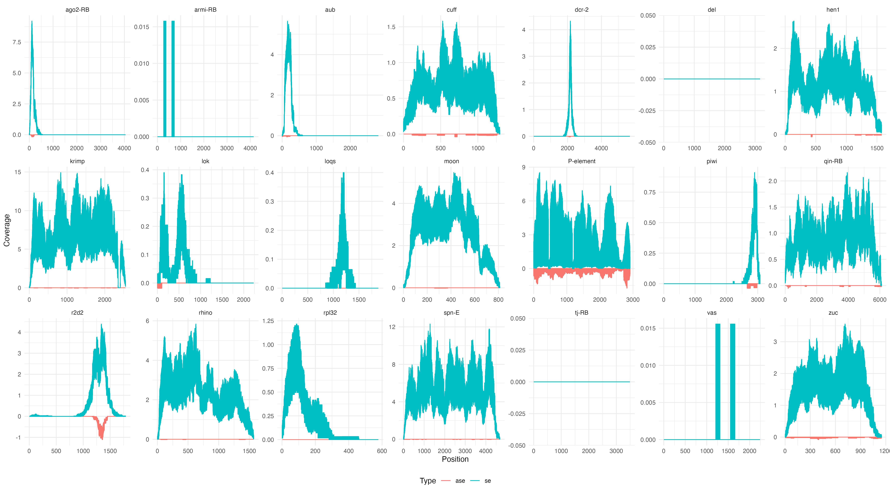
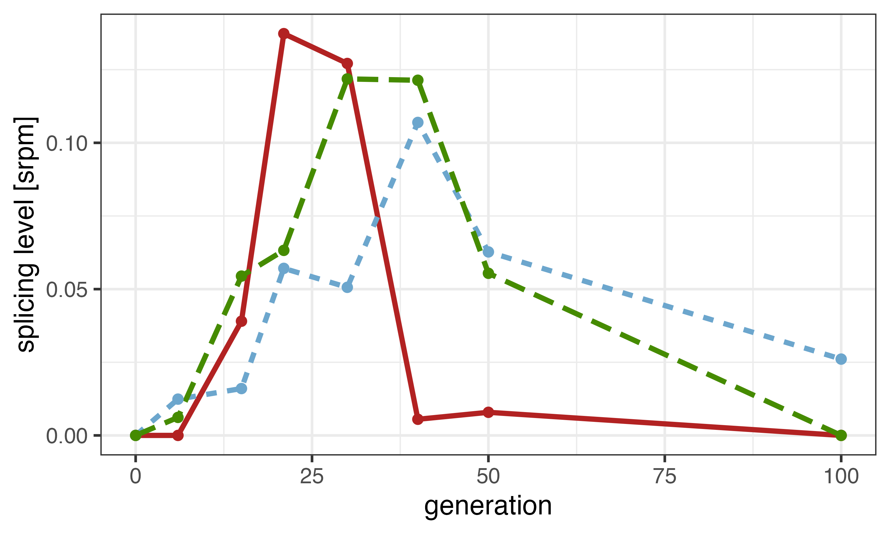

```{bash, eval=FALSE}
knitr::opts_chunk$set(echo = TRUE)
```

We obtained the following mRNA reads: 

```{bash}
cd /Volumes/Data/Projects/dmelR2_p-ele/rna/run1/raw
ls *.fastq.gz

cd /Volumes/Data/Projects/dmelR2_p-ele/rna/run2/raw
ls *.fastq.gz

```
We then ran fastQC on all files to assess their quality.

``` {bash eval=FALSE}
fastqc --outdir /Volumes/Data/Projects/dmelR2_p-ele/rna/raw/run1/fastQC /Volumes/Data/Projects/dmelR2_p-ele/rna/run1/raw/*fastq.gz
fastqc --outdir /Volumes/Data/Projects/dmelR2_p-ele/rna/raw/run2/fastQC /Volumes/Data/Projects/dmelR2_p-ele/rna/run2/raw/*fastq.gz

```

``` {bash}
cd /Volumes/Data/Projects/dmelR2_p-ele/rna/run1/fastQC/
ls

cd /Volumes/Data/Projects/dmelR2_p-ele/rna/run2/fastQC/
ls

```

After this, we then realised that there was significant proportion of the 3' read ends (~10-30%) which were adapter sequences. To alleviate this, we decided to trim all of the 150bp reads down to 100bp, using the following for loop. 

``` {bash eval=FALSE}
for file in *gz; do
    gzip -cd "$file" | cut -c-100 | awk 'NR%4==2 && length($0)>=100{print prev; print $0; getline; print $0; getline; print $0} {prev=$0}' | gzip -c > "trimmed/${file}"
done

```

# Reference genome - preparation

First, we obtained the reference D. mel fasta file from flybase, then run the following command to revove everything but the Flybase ID from the identifier line, while also attaching "_mRNA" for downstream analysis.

``` {bash eval=FALSE}
less dmel-all-transcript-r6.52.fasta | cut -f1 -d";" | gsed 's/ type=/_/' > dmel-transcriptome-r6.52.fasta

```

We then merged it with the list of consensus D. mel TEs and indexed it.

``` {bash}
cd /Volumes/Data/Tools/RefGenomes/dmel/rna/dmel_TEs
ls

```

Then we used bwa to map the forward and reverse reads to the reference.

``` {bash eval=FALSE}
nohup zsh dmel_RNA_mapping_bwamem.sh > ../logs/dmel_rna_map.log

```

dmel_RNA_mapping_bwamem.sh - 

``` {bash eval=FALSE}
ref="/Volumes/Data/Tools/RefGenomes/dmel/rna/dmel_TEs/dmel-transcriptome-r6.52-TEs.fasta"
if="/Volumes/Data/Projects/dmelR2_p-ele/rna/raw/run2/trimmed"
of="/Volumes/Data/Projects/dmelR2_p-ele/rna/raw/run2/map-bwamem"

bwa mem -t 12 $ref $if/dmel_rna_R1_G6_run2_R1.fastq.gz $if/dmel_rna_R1_G6_run2_R2.fastq.gz | samtools sort -m 2G --output-fmt BAM --threads 2 -o $of/dmel_R1G6_run2.sort.bam
bwa mem -t 12 $ref $if/dmel_rna_R2_G6_run2_R1.fastq.gz $if/dmel_rna_R2_G6_run2_R2.fastq.gz | samtools sort -m 2G --output-fmt BAM --threads 2 -o $of/dmel_R2G6_run2.sort.bam
bwa mem -t 12 $ref $if/dmel_rna_R3_G6_run2_R1.fastq.gz $if/dmel_rna_R3_G6_run2_R2.fastq.gz | samtools sort -m 2G --output-fmt BAM --threads 2 -o $of/dmel_R3G6_run2.sort.bam

bwa mem -t 12 $ref $if/dmel_rna_R1_G15_run2_R1.fastq.gz $if/dmel_rna_R1_G15_run2_R2.fastq.gz | samtools sort -m 2G --output-fmt BAM --threads 2 -o $of/dmel_R1G15_run2.sort.bam
bwa mem -t 12 $ref $if/dmel_rna_R2_G15_run2_R1.fastq.gz $if/dmel_rna_R2_G15_run2_R2.fastq.gz | samtools sort -m 2G --output-fmt BAM --threads 2 -o $of/dmel_R2G15_run2.sort.bam
bwa mem -t 12 $ref $if/dmel_rna_R3_G15_run2_R1.fastq.gz $if/dmel_rna_R3_G15_run2_R2.fastq.gz | samtools sort -m 2G --output-fmt BAM --threads 2 -o $of/dmel_R3G15_run2.sort.bam

bwa mem -t 12 $ref $if/dmel_rna_R1_G21_run2_R1.fastq.gz $if/dmel_rna_R1_G21_run2_R2.fastq.gz | samtools sort -m 2G --output-fmt BAM --threads 2 -o $of/dmel_R1G21_run2.sort.bam
bwa mem -t 12 $ref $if/dmel_rna_R2_G21_run2_R1.fastq.gz $if/dmel_rna_R2_G21_run2_R2.fastq.gz | samtools sort -m 2G --output-fmt BAM --threads 2 -o $of/dmel_R2G21_run2.sort.bam
bwa mem -t 12 $ref $if/dmel_rna_R3_G21_run2_R1.fastq.gz $if/dmel_rna_R3_G21_run2_R2.fastq.gz | samtools sort -m 2G --output-fmt BAM --threads 2 -o $of/dmel_R3G21_run2.sort.bam

bwa mem -t 12 $ref $if/dmel_rna_R1_G30_run2_R1.fastq.gz $if/dmel_rna_R1_G30_run2_R2.fastq.gz | samtools sort -m 2G --output-fmt BAM --threads 2 -o $of/dmel_R1G30_run2.sort.bam
bwa mem -t 12 $ref $if/dmel_rna_R2_G30_run2_R1.fastq.gz $if/dmel_rna_R2_G30_run2_R2.fastq.gz | samtools sort -m 2G --output-fmt BAM --threads 2 -o $of/dmel_R2G30_run2.sort.bam
bwa mem -t 12 $ref $if/dmel_rna_R3_G30_run2_R1.fastq.gz $if/dmel_rna_R3_G30_run2_R2.fastq.gz | samtools sort -m 2G --output-fmt BAM --threads 2 -o $of/dmel_R3G30_run2.sort.bam

bwa mem -t 12 $ref $if/dmel_rna_R1_G40_run2_R1.fastq.gz $if/dmel_rna_R1_G40_run2_R2.fastq.gz | samtools sort -m 2G --output-fmt BAM --threads 2 -o $of/dmel_R1G40_run2.sort.bam
bwa mem -t 12 $ref $if/dmel_rna_R2_G40_run2_R1.fastq.gz $if/dmel_rna_R2_G40_run2_R2.fastq.gz | samtools sort -m 2G --output-fmt BAM --threads 2 -o $of/dmel_R2G40_run2.sort.bam
bwa mem -t 12 $ref $if/dmel_rna_R3_G40_run2_R1.fastq.gz $if/dmel_rna_R3_G40_run2_R2.fastq.gz | samtools sort -m 2G --output-fmt BAM --threads 2 -o $of/dmel_R3G40_run2.sort.bam

```

# GSNAP

Run on Vetgrid06

To map via GMAP, we first need to create the database with the reference genome.

Then we need to build the database

``` {bash eval=FALSE}
gmap_build -D . -d mel-transcriptome /Volumes/Temp2/Matt/rna/refgenomes/dmel/dmel_TEs/dmel-transcriptome-r6.52-TEs.fasta

```

Then we run the following script for alignment, while assessing for novel spicing events.

``` {bash eval=FALSE}
#!/bin/bash

refdir="/Volumes/Temp2/Matt/rna/refgenomes/GMAP/mel-transcriptome"
refname="mel-transcriptome"

input_dir="/Volumes/Temp2/Matt/rna/trimmed/trimmed"
output_dir="/Volumes/Temp2/Matt/rna/map_GSNAP/output"

gsnap -D "$refdir" -d "$refname" -t 12 -N 1 --format=sam --gunzip "$input_dir/dmel_rna_R1_G6_run2_R1.fastq.gz" "$input_dir/dmel_rna_R1_G6_run2_R2.fastq.gz" | samtools sort -m 2G --output-fmt BAM --threads 2 -o "$output_dir/gt_R1G6.sort.bam"
gsnap -D "$refdir" -d "$refname" -t 12 -N 1 --format=sam --gunzip "$input_dir/dmel_rna_R2_G6_run2_R1.fastq.gz" "$input_dir/dmel_rna_R2_G6_run2_R2.fastq.gz" | samtools sort -m 2G --output-fmt BAM --threads 2 -o "$output_dir/gt_R2G6.sort.bam"
gsnap -D "$refdir" -d "$refname" -t 12 -N 1 --format=sam --gunzip "$input_dir/dmel_rna_R3_G6_run2_R1.fastq.gz" "$input_dir/dmel_rna_R3_G6_run2_R2.fastq.gz" | samtools sort -m 2G --output-fmt BAM --threads 2 -o "$output_dir/gt_R3G6.sort.bam"

gsnap -D "$refdir" -d "$refname" -t 12 -N 1 --format=sam --gunzip "$input_dir/dmel_rna_R1_G15_run2_R1.fastq.gz" "$input_dir/dmel_rna_R1_G15_run2_R2.fastq.gz" | samtools sort -m 2G --output-fmt BAM --threads 2 -o "$output_dir/gt_R1G15.sort.bam"
gsnap -D "$refdir" -d "$refname" -t 12 -N 1 --format=sam --gunzip "$input_dir/dmel_rna_R2_G15_run2_R1.fastq.gz" "$input_dir/dmel_rna_R2_G15_run2_R2.fastq.gz" | samtools sort -m 2G --output-fmt BAM --threads 2 -o "$output_dir/gt_R2G15.sort.bam"
gsnap -D "$refdir" -d "$refname" -t 12 -N 1 --format=sam --gunzip "$input_dir/dmel_rna_R3_G15_run2_R1.fastq.gz" "$input_dir/dmel_rna_R3_G15_run2_R2.fastq.gz" | samtools sort -m 2G --output-fmt BAM --threads 2 -o "$output_dir/gt_R3G15.sort.bam"

gsnap -D "$refdir" -d "$refname" -t 12 -N 1 --format=sam --gunzip "$input_dir/dmel_rna_R1_G21_run2_R1.fastq.gz" "$input_dir/dmel_rna_R1_G21_run2_R2.fastq.gz" | samtools sort -m 2G --output-fmt BAM --threads 2 -o "$output_dir/gt_R1G21.sort.bam"
gsnap -D "$refdir" -d "$refname" -t 12 -N 1 --format=sam --gunzip "$input_dir/dmel_rna_R2_G21_run2_R1.fastq.gz" "$input_dir/dmel_rna_R2_G21_run2_R2.fastq.gz" | samtools sort -m 2G --output-fmt BAM --threads 2 -o "$output_dir/gt_R2G21.sort.bam"
gsnap -D "$refdir" -d "$refname" -t 12 -N 1 --format=sam --gunzip "$input_dir/dmel_rna_R3_G21_run2_R1.fastq.gz" "$input_dir/dmel_rna_R3_G21_run2_R2.fastq.gz" | samtools sort -m 2G --output-fmt BAM --threads 2 -o "$output_dir/gt_R3G21.sort.bam"

gsnap -D "$refdir" -d "$refname" -t 12 -N 1 --format=sam --gunzip "$input_dir/dmel_rna_R1_G30_run2_R1.fastq.gz" "$input_dir/dmel_rna_R1_G30_run2_R2.fastq.gz" | samtools sort -m 2G --output-fmt BAM --threads 2 -o "$output_dir/gt_R1G30.sort.bam"
gsnap -D "$refdir" -d "$refname" -t 12 -N 1 --format=sam --gunzip "$input_dir/dmel_rna_R2_G30_run2_R1.fastq.gz" "$input_dir/dmel_rna_R2_G30_run2_R2.fastq.gz" | samtools sort -m 2G --output-fmt BAM --threads 2 -o "$output_dir/gt_R2G30.sort.bam"
gsnap -D "$refdir" -d "$refname" -t 12 -N 1 --format=sam --gunzip "$input_dir/dmel_rna_R3_G30_run2_R1.fastq.gz" "$input_dir/dmel_rna_R3_G30_run2_R2.fastq.gz" | samtools sort -m 2G --output-fmt BAM --threads 2 -o "$output_dir/gt_R3G30.sort.bam"

gsnap -D "$refdir" -d "$refname" -t 12 -N 1 --format=sam --gunzip "$input_dir/dmel_rna_R1_G40_run2_R1.fastq.gz" "$input_dir/dmel_rna_R1_G40_run2_R2.fastq.gz" | samtools sort -m 2G --output-fmt BAM --threads 2 -o "$output_dir/gt_R1G40.sort.bam"
gsnap -D "$refdir" -d "$refname" -t 12 -N 1 --format=sam --gunzip "$input_dir/dmel_rna_R2_G40_run2_R1.fastq.gz" "$input_dir/dmel_rna_R2_G40_run2_R2.fastq.gz" | samtools sort -m 2G --output-fmt BAM --threads 2 -o "$output_dir/gt_R2G40.sort.bam"
gsnap -D "$refdir" -d "$refname" -t 12 -N 1 --format=sam --gunzip "$input_dir/dmel_rna_R3_G40_run2_R1.fastq.gz" "$input_dir/dmel_rna_R3_G40_run2_R2.fastq.gz" | samtools sort -m 2G --output-fmt BAM --threads 2 -o "$output_dir/gt_R3G40.sort.bam"

```

Which provides the following sorted BAM files.

``` {bash eval=FALSE}
cd /Volumes/Data/Projects/dmelR2_p-ele/rna/run2/map-GMAP/output
ls

```

# Coverage 

We ran the following script to assess coverage of selected genes and the P-element.

``` {bash eval=FALSE}
nohup zsh expression-splicing.sh > ../logs/splicing-expression.log

```

``` {bash eval=FALSE}
#!/bin/bash

fai="/Volumes/Data/Tools/RefGenomes/dmel/rna/dmel_TEs/dmel-transcriptome-r6.52-TEs.fasta.fai"
pyscript="/Volumes/Data/Projects/dmelR2_p-ele/scripts/mRNA-coverage-senseantisense.py"
input_dir="/Volumes/Data/Projects/dmelR2_p-ele/rna/run2/map-bwamem"
output_dir="/Volumes/Data/Projects/dmelR2_p-ele/rna/run2/splicing-expression/raw_expression"

seqs="PPI251,FBtr0083183_mRNA,FBtr0088034_mRNA,FBtr0086904_mRNA,FBtr0087984_mRNA,FBtr0087189_mRNA,FBtr0080497_mRNA,FBtr0079489_mRNA,FBtr0445185_mRNA,FBtr0080316_mRNA,FBtr0075559_mRNA,FBtr0100641_mRNA,FBtr0080165_mRNA,FBtr0081502_mRNA,FBtr0073637_mRNA,FBtr0080166_mRNA,FBtr0301669_mRNA,FBtr0086897_mRNA,FBtr0085594_mRNA,FBtr0329922_mRNA,FBtr0081328_mRNA"

# All transcripts are 'RA' variants unless stated otherwise.

samtools view $input_dir/dmel_R1G6_run2.sort.bam | python $pyscript --sam - --sample-id R1-G6-run2 --seqs $seqs --fai $fai > $output_dir/dmel_R1G6_run2.txt
samtools view $input_dir/dmel_R2G6_run2.sort.bam | python $pyscript --sam - --sample-id R2-G6-run2 --seqs $seqs --fai $fai > $output_dir/dmel_R2G6_run2.txt
samtools view $input_dir/dmel_R3G6_run2.sort.bam | python $pyscript --sam - --sample-id R3-G6-run2 --seqs $seqs --fai $fai > $output_dir/dmel_R3G6_run2.txt

samtools view $input_dir/dmel_R1G15_run2.sort.bam | python $pyscript --sam - --sample-id R1-G15-run2 --seqs $seqs --fai $fai > $output_dir/dmel_R1G15_run2.txt
samtools view $input_dir/dmel_R2G15_run2.sort.bam | python $pyscript --sam - --sample-id R2-G15-run2 --seqs $seqs --fai $fai > $output_dir/dmel_R2G15_run2.txt
samtools view $input_dir/dmel_R3G15_run2.sort.bam | python $pyscript --sam - --sample-id R3-G15-run2 --seqs $seqs --fai $fai > $output_dir/dmel_R3G15_run2.txt

samtools view $input_dir/dmel_R1G21_run2.sort.bam | python $pyscript --sam - --sample-id R1-G21-run2 --seqs $seqs --fai $fai > $output_dir/dmel_R1G21_run2.txt
samtools view $input_dir/dmel_R2G21_run2.sort.bam | python $pyscript --sam - --sample-id R2-G21-run2 --seqs $seqs --fai $fai > $output_dir/dmel_R2G21_run2.txt
samtools view $input_dir/dmel_R3G21_run2.sort.bam | python $pyscript --sam - --sample-id R3-G21-run2 --seqs $seqs --fai $fai > $output_dir/dmel_R3G21_run2.txt

samtools view $input_dir/dmel_R1G30_run2.sort.bam | python $pyscript --sam - --sample-id R1-G30-run2 --seqs $seqs --fai $fai > $output_dir/dmel_R1G30_run2.txt
samtools view $input_dir/dmel_R2G30_run2.sort.bam | python $pyscript --sam - --sample-id R2-G30-run2 --seqs $seqs --fai $fai > $output_dir/dmel_R2G30_run2.txt
samtools view $input_dir/dmel_R3G30_run2.sort.bam | python $pyscript --sam - --sample-id R3-G30-run2 --seqs $seqs --fai $fai > $output_dir/dmel_R3G30_run2.txt

samtools view $input_dir/dmel_R1G40_run2.sort.bam | python $pyscript --sam - --sample-id R1-G40-run2 --seqs $seqs --fai $fai > $output_dir/dmel_R1G40_run2.txt
samtools view $input_dir/dmel_R2G40_run2.sort.bam | python $pyscript --sam - --sample-id R2-G40-run2 --seqs $seqs --fai $fai > $output_dir/dmel_R2G40_run2.txt
samtools view $input_dir/dmel_R3G40_run2.sort.bam | python $pyscript --sam - --sample-id R3-G40-run2 --seqs $seqs --fai $fai > $output_dir/dmel_R3G40_run2.txt

# Combine outputs into single file, separating ID.
# cat *.txt| perl -pe 's/-/\t/'|perl -pe 's/-/\t/' > expr-spli.forr

```

Then visualised it with ggplot2.

```{R}
library(ggplot2)

# Mapping between transcript IDs and gene IDs
transcript_to_gene <- c(
  "PPI251" = "P-element",
  "FBtr0083183_mRNA" = "spn-E",
  "FBtr0088034_mRNA" = "cuff",
  "FBtr0086904_mRNA" = "dcr-2",
  "FBtr0087984_mRNA" = "hen1",
  "FBtr0087189_mRNA" = "krimp",
  "FBtr0080497_mRNA" = "loqs",
  "FBtr0079489_mRNA" = "r2d2",
  "FBtr0445185_mRNA" = "vas",
  "FBtr0080316_mRNA" = "zuc",
  "FBtr0075559_mRNA" = "ago2-RB",
  "FBtr0100641_mRNA" = "armi-RB",
  "FBtr0080165_mRNA" = "aub",
  "FBtr0081502_mRNA" = "del",
  "FBtr0073637_mRNA" = "moon",
  "FBtr0080166_mRNA" = "piwi",
  "FBtr0301669_mRNA" = "tj-RB",
  "FBtr0086897_mRNA" = "rhino",
  "FBtr0085594_mRNA" = "rpl32",
  "FBtr0329922_mRNA" = "qin-RB",
  "FBtr0081328_mRNA" = "lok"
)

data <- read.table("/Volumes/Data/Projects/dmelR2_p-ele/rna/run2/splicing-expression/raw_expression/expr-spli.forr", header = FALSE, sep = "\t")
colnames(data) <- c("Sample", "Time", "Run", "Type", "ID", "Position", "Coverage")

# Invert Coverage values for "ase" data points
data$Coverage[data$Type == "ase"] <- -data$Coverage[data$Type == "ase"]

# Replace ID with gene names in plot titles
data$Gene <- transcript_to_gene[data$ID]

# Calculate maximum values for each gene ID
max_values <- aggregate(Coverage ~ Gene, data, max)

# Create a function to extract the max value for each gene ID
get_max_value <- function(gene) {
  max_values$Coverage[max_values$Gene == gene]
}

cov_plot <- ggplot(data, aes(x = Position, y = Coverage, color = Type)) +
  geom_line() +
  facet_wrap(~ Gene, ncol = 7, scales = "free") +
  labs(x = "Position", y = "Coverage", color = "Type") +
  theme_minimal() +
  scale_y_continuous(expand = c(0, 0), limits = c(-max(data$Coverage), max(data$Coverage))) +
  guides(color = guide_legend(title = "Type")) +
  theme(legend.position = "bottom")

ggsave("figs/mRNA_sense_antisense.png", cov_plot, width = 18, height = 10, bg = "white", dpi = 300)



```

# mRNA overview 

We genrated a list of summary statistics for the mRNA reads.

``` {bash eval=FALSE}
nohup zsh dmel_mRNA_overview.sh > ../logs/dmel_mRNA_overview.log

```

```{bash eval=FALSE}
#!/bin/bash

pyscript="/Volumes/Data/Projects/dmelR2_p-ele/scripts/mRNA-overview.py"
input_dir="/Volumes/Data/Projects/dmelR2_p-ele/rna/run2/map-GMAP/output"
output_dir="/Volumes/Data/Projects/dmelR2_p-ele/rna/run2/mRNA/overview"

samtools view $input_dir/gt_R1G6.sort.bam | python $pyscript --sam - --sample-id R1-G6-wf   > $output_dir/wf_R1G6.txt
samtools view $input_dir/gt_R2G6.sort.bam | python $pyscript --sam - --sample-id R2-G6-wf   > $output_dir/wf_R2G6.txt
samtools view $input_dir/gt_R3G6.sort.bam | python $pyscript --sam - --sample-id R3-G6-wf   > $output_dir/wf_R3G6.txt

samtools view $input_dir/gt_R1G15.sort.bam | python $pyscript --sam - --sample-id R1-G15-wf   > $output_dir/wf_R1G15.txt
samtools view $input_dir/gt_R2G15.sort.bam | python $pyscript --sam - --sample-id R2-G15-wf   > $output_dir/wf_R2G15.txt
samtools view $input_dir/gt_R3G15.sort.bam | python $pyscript --sam - --sample-id R3-G15-wf   > $output_dir/wf_R3G15.txt

samtools view $input_dir/gt_R1G21.sort.bam | python $pyscript --sam - --sample-id R1-G21-wf   > $output_dir/wf_R1G21.txt
samtools view $input_dir/gt_R2G21.sort.bam | python $pyscript --sam - --sample-id R2-G21-wf   > $output_dir/wf_R2G21.txt
samtools view $input_dir/gt_R3G21.sort.bam | python $pyscript --sam - --sample-id R3-G21-wf   > $output_dir/wf_R3G21.txt

samtools view $input_dir/gt_R1G30.sort.bam | python $pyscript --sam - --sample-id R1-G30-wf   > $output_dir/wf_R1G30.txt
samtools view $input_dir/gt_R2G30.sort.bam | python $pyscript --sam - --sample-id R2-G30-wf   > $output_dir/wf_R2G30.txt
samtools view $input_dir/gt_R3G30.sort.bam | python $pyscript --sam - --sample-id R3-G30-wf   > $output_dir/wf_R3G30.txt

samtools view $input_dir/gt_R1G40.sort.bam | python $pyscript --sam - --sample-id R1-G40-wf   > $output_dir/wf_R1G40.txt
samtools view $input_dir/gt_R2G40.sort.bam | python $pyscript --sam - --sample-id R2-G40-wf   > $output_dir/wf_R2G40.txt
samtools view $input_dir/gt_R3G40.sort.bam | python $pyscript --sam - --sample-id R3-G40-wf   > $output_dir/wf_R3G40.txt

# Combine outputs into single file, separating ID.
# cat *.txt|perl -pe 's/-/\t/g'
# cat *.txt|perl -pe 's/-/\t/'|perl -pe 's/-/\t/' > dmel_all.forr 
```

Then visualised the most relevant ones in ggplot2.

```{R eval=FALSE}
library(ggplot2)
library(scales)
library(dplyr)

overview <- read.table("/Volumes/Data/Projects/dmelR2_p-ele/rna/run2/mRNA/overview/dmel_all.forr", 
                       header = FALSE, sep = "\t")
colnames(overview) <- c("Replicate", "Generation", "Tissue", "Reads", "MappedReads", "MappedReadsWithMinMQ", 
                        "SenseGene", "AntisenseGene", "SenseTranscriptExon", "AntisenseTranscriptExon", 
                        "SensePelement", "AntisensePelement")

generation_order <- c("G6", "G15", "G21", "G30", "G40")

overview$Generation <- factor(overview$Generation, levels = generation_order)

overview$AntisenseGene <- -overview$AntisenseGene
overview$AntisensePelement <- -overview$AntisensePelement

mapped_reads_plot <- ggplot(overview, aes(x = Generation)) +
  geom_bar(aes(y = MappedReads, fill = "Mapped reads"), stat = "identity", position = "dodge") +
  geom_bar(aes(y = MappedReadsWithMinMQ, fill = "Mapped reads w/ min mq"), stat = "identity", position = "dodge") +
  facet_wrap(. ~ Replicate, ncol = 1) +
  labs(x = "Generation", y = "Read counts") +
  ggtitle("Mapped reads & mapped reads w/ min mq") +
  scale_fill_manual(values = c("Mapped reads" = "darkseagreen3", "Mapped reads w/ min mq" = "khaki3"),
                    name = NULL,
                    breaks = c("Mapped reads", "Mapped reads w/ min mq"),
                    labels = c("Mapped reads", "Mapped reads w/ min mq"),
                    guide = guide_legend(reverse = TRUE)) +
                    theme_bw() +
                    theme(legend.position = "bottom") +
                    scale_y_continuous(labels = label_number(scale = 1e-6, suffix = "M"))

sense_antisense_gene_plot <- ggplot(overview, aes(x = Generation, y = SenseGene, fill = "Sense")) +
  geom_bar(stat = "identity") +
  geom_bar(aes(y = AntisenseGene, fill = "Antisense"), stat = "identity") +
  facet_wrap(. ~ Replicate, ncol = 1) +
  labs(x = "Generation", y = NULL) +
  ggtitle("Sense/antisense gene read counts") +
  scale_fill_manual(values = c("Sense" = "lightblue", "Antisense" = "darksalmon"),
                    name = NULL,
                    breaks = c("Sense", "Antisense"),
                    labels = c("Sense", "Antisense"),
                    guide = guide_legend(reverse = TRUE)) +
                    theme_bw() +
                    theme(legend.position = "bottom") +
                    scale_y_continuous(labels = label_number(scale = 1e-6, suffix = "M"))

sense_antisense_pelement_plot <- ggplot(overview, aes(x = Generation, y = SensePelement, fill = "Sense")) +
  geom_bar(stat = "identity") +
  geom_bar(aes(y = AntisensePelement, fill = "Antisense"), stat = "identity") +
  facet_wrap(. ~ Replicate, ncol = 1) +
  labs(x = "Generation", y = NULL) +
  ggtitle("Sense/antisense P-element read counts") +
  scale_fill_manual(values = c("Sense" = "lightblue", "Antisense" = "darksalmon"),
                    name = NULL,
                    breaks = c("Sense", "Antisense"),
                    labels = c("Sense", "Antisense"),
                    guide = guide_legend(reverse = TRUE)) +
                    theme_bw() +
                    theme(legend.position = "bottom") +
                    scale_y_continuous(labels = label_number(scale = 1e-3, suffix = "k"))

combined_plot <- cowplot::plot_grid(mapped_reads_plot, sense_antisense_gene_plot, sense_antisense_pelement_plot, ncol = 3)

ggsave("figs/mRNA_sum_stats.png", combined_plot, width = 20, height = 10, dpi = 600)

knitr::include_graphics("figs/mRNA_sum_stats.png")

```

```{R eval=FALSE}
library(ggplot2)
theme_set(theme_bw())

genes<-c("PPI251","FBtr0083183_mRNA","FBtr0088034_mRNA","FBtr0086904_mRNA","FBtr0087984_mRNA","FBtr0087189_mRNA","FBtr0080497_mRNA","FBtr0079489_mRNA","FBtr0445185_mRNA","FBtr0080316_mRNA","FBtr0075559_mRNA","FBtr0100641_mRNA","FBtr0080165_mRNA","FBtr0081502_mRNA","FBtr0073637_mRNA","FBtr0080166_mRNA","FBtr0301669_mRNA","FBtr0086897_mRNA","FBtr0085594_mRNA","FBtr0329922_mRNA","FBtr0081328_mRNA")
sc<-c("p-element","spnE","cuff","dcr-2","hen1","krimp","loqs","r2d2","vas",
      "zuc","ago2-RB","armi-RB","aub","del","moon","piwi","tj-RB","rhino","rpl32","qin-RB","lok")

h<-read.table("/Volumes/Data/Projects/dmelR2_p-ele/rna/run2/splicing-expression/expression/expr_wf.forr")        

names(h)<-c("rep","time","tissue","strand","gene","pos","cov")

for(i in 1:length(genes))
{
  target<-genes[i]
  short<-sc[i]
  
  a<-subset(h,gene==target)
  a$time <- factor(a$time, levels=c("G6", "G15", "G21", "G30","G40"))
  
  s<-subset(a,strand=="se")
  as<-subset(a,strand=="ase")
}
  
mRNA_plot <- ggplot() +
    geom_polygon(data=s,mapping=aes(x=pos, y=cov), fill='lightblue', color='lightblue') +
    geom_polygon(data=as, aes(x=pos, y=-cov), fill='darksalmon', color='darksalmon')+
    facet_grid(time~rep)+
    ylab("coverage")+
    xlab("position")

ggsave("figs/mRNA_overview.png", mRNA_plot, width = 12, height = 6, dpi = 600)

knitr::include_graphics("figs/mRNA_overview.png")

```

```{R}
library(ggplot2)
library(grid)
theme_set(theme_bw())

genes <- c("PPI251", "FBtr0083183_mRNA", "FBtr0088034_mRNA", "FBtr0086904_mRNA", "FBtr0087984_mRNA", "FBtr0087189_mRNA", "FBtr0080497_mRNA", "FBtr0079489_mRNA", "FBtr0445185_mRNA", "FBtr0080316_mRNA", "FBtr0075559_mRNA", "FBtr0100641_mRNA", "FBtr0080165_mRNA", "FBtr0081502_mRNA", "FBtr0073637_mRNA", "FBtr0080166_mRNA", "FBtr0301669_mRNA", "FBtr0086897_mRNA", "FBtr0085594_mRNA", "FBtr0329922_mRNA", "FBtr0081328_mRNA")
sc <- c("p-element", "spnE", "cuff", "dcr-2", "hen1", "krimp", "loqs", "r2d2", "vas", "zuc", "ago2-RB", "armi-RB", "aub", "del", "moon", "piwi", "tj-RB", "rhino", "rpl32", "qin-RB", "lok")

h <- read.table("/Volumes/Data/Projects/dmelR2_p-ele/rna/run2/splicing-expression/expression/expr_wf.forr")
names(h) <- c("rep", "time", "tissue", "strand", "gene", "pos", "cov")

# Calculate the number of genes
num_genes <- length(genes)

# Define the number of columns and rows for the grid
num_cols <- 5
num_rows <- ceiling(num_genes / num_cols)

# Create a new plot with a custom layout
plot_new <- function() {
  grid.newpage()
  pushViewport(viewport(layout = grid.layout(num_rows, num_cols)))
}

# Initialize a counter for the genes
gene_counter <- 1

plot_new()  # Create the initial plot

for (i in 1:num_rows) {
  for (j in 1:num_cols) {
    # Check if there are more genes to plot
    if (gene_counter <= num_genes) {
      target <- genes[gene_counter]
      short <- sc[gene_counter]
      
      a <- subset(h, gene == target)
      a$time <- factor(a$time, levels = c("G6", "G15", "G21", "G30", "G40"))
      
      s <- subset(a, strand == "se")
      as <- subset(a, strand == "ase")
      
      pushViewport(viewport(layout.pos.row = i, layout.pos.col = j))
      
      plot <- ggplot() +
        geom_polygon(data = s, mapping = aes(x = pos, y = cov), fill = 'lightblue', color = 'lightblue') +
        geom_polygon(data = as, aes(x = pos, y = -cov), fill = 'darksalmon', color = 'darksalmon') +
        facet_grid(time ~ rep) +
        ylab("coverage") +
        xlab("position") +
        ggtitle(paste(target, "-", short))
      
      print(plot)
      
      gene_counter <- gene_counter + 1
    }
  }
}

```

## Lok - Wilcoxon Test

```{R}
library(ggplot2)
library(tidyverse)
theme_set(theme_bw())

lok<-read.table("/Volumes/Data/Projects/dmelR2_p-ele/rna/run2/splicing-expression/expression/expr_wf.forr")        

names(lok)<-c("rep","time","tissue","strand","gene","pos","cov")
a<-subset(lok,gene=="FBtr0081328_mRNA" & strand=="se")
mc<-a %>% group_by(rep,time) %>% summarise(mcov=mean(cov))
wilcox.test(subset(mc,rep=="R2")$mcov,subset(mc,rep!="R2")$mcov)

```

# Splicing & expression visualisation

``` {bash eval=FALSE}
#!/bin/bash

fai="/Volumes/Data/Tools/RefGenomes/dmel/rna/dmel_TEs/dmel-transcriptome-r6.52-TEs.fasta.fai"
pyscript="/Volumes/Data/Projects/dmelR2_p-ele/scripts/mRNA-coverage-senseantisense.py"
if="/Volumes/Data/Projects/dmelR2_p-ele/rna/run2/map-GMAP/output"
of="/Volumes/Data/Projects/dmelR2_p-ele/rna/run2/splicing-expression/expression"
seqs="PPI251,FBtr0083183_mRNA,FBtr0088034_mRNA,FBtr0086904_mRNA,FBtr0087984_mRNA,FBtr0087189_mRNA,FBtr0080497_mRNA,FBtr0079489_mRNA,FBtr0445185_mRNA,FBtr0080316_mRNA,FBtr0075559_mRNA,FBtr0100641_mRNA,FBtr0080165_mRNA,FBtr0081502_mRNA,FBtr0073637_mRNA,FBtr0080166_mRNA,FBtr0301669_mRNA,FBtr0086897_mRNA,FBtr0085594_mRNA,FBtr0329922_mRNA,FBtr0081328_mRNA"

# All transcripts are 'RA' variants unless stated otherwise.

samtools view $if/gt_R1G6.sort.bam | python $pyscript --sam - --sample-id R1-G6 --seqs $seqs --fai $fai -a  > $of/R1G6.txt
samtools view $if/gt_R2G6.sort.bam | python $pyscript --sam - --sample-id R2-G6 --seqs $seqs --fai $fai -a  > $of/R2G6.txt
samtools view $if/gt_R3G6.sort.bam | python $pyscript --sam - --sample-id R3-G6 --seqs $seqs --fai $fai -a  > $of/R3G6.txt

samtools view $if/gt_R1G15.sort.bam | python $pyscript --sam - --sample-id R1-G15 --seqs $seqs --fai $fai -a  > $of/R1G15.txt
samtools view $if/gt_R2G15.sort.bam | python $pyscript --sam - --sample-id R2-G15 --seqs $seqs --fai $fai -a  > $of/R2G15.txt
samtools view $if/gt_R3G15.sort.bam | python $pyscript --sam - --sample-id R3-G15 --seqs $seqs --fai $fai -a  > $of/R3G15.txt

samtools view $if/gt_R1G21.sort.bam | python $pyscript --sam - --sample-id R1-G21 --seqs $seqs --fai $fai -a  > $of/R1G21.txt
samtools view $if/gt_R2G21.sort.bam | python $pyscript --sam - --sample-id R2-G21 --seqs $seqs --fai $fai -a  > $of/R2G21.txt
samtools view $if/gt_R3G21.sort.bam | python $pyscript --sam - --sample-id R3-G21 --seqs $seqs --fai $fai -a  > $of/R3G21.txt

samtools view $if/gt_R1G30.sort.bam | python $pyscript --sam - --sample-id R1-G30 --seqs $seqs --fai $fai -a  > $of/R1G30.txt
samtools view $if/gt_R2G30.sort.bam | python $pyscript --sam - --sample-id R2-G30 --seqs $seqs --fai $fai -a  > $of/R2G30.txt
samtools view $if/gt_R3G30.sort.bam | python $pyscript --sam - --sample-id R3-G30 --seqs $seqs --fai $fai -a  > $of/R3G30.txt

samtools view $if/gt_R1G40.sort.bam | python $pyscript --sam - --sample-id R1-G40 --seqs $seqs --fai $fai -a  > $of/R1G40.txt
samtools view $if/gt_R2G40.sort.bam | python $pyscript --sam - --sample-id R2-G40 --seqs $seqs --fai $fai -a  > $of/R2G40.txt
samtools view $if/gt_R3G40.sort.bam | python $pyscript --sam - --sample-id R3-G40 --seqs $seqs --fai $fai -a  > $of/R3G40.txt

# Combine outputs into single file, separating ID.
#cat *.txt| perl -pe 's/-/\t/'|perl -pe 's/-/\t/' > expr.forr 

# Tissue column for 'wf' needed adding back.
#awk 'BEGIN{OFS="\t"}{$2 = $2 "\t" "wf"; print}' expr.forr > expr_wf.forr

```

Then for splicing.

```{bash eval=FALSE}
#!/bin/bash

pyscript="/Volumes/Data/Projects/dmelR2_p-ele/scripts/mRNA-splicing-senseantisense.py"
if="/Volumes/Data/Projects/dmelR2_p-ele/rna/run2/map-GMAP/output"
of="/Volumes/Data/Projects/dmelR2_p-ele/rna/run2/splicing-expression/splicing"
seqs="PPI251,FBtr0083183_mRNA,FBtr0088034_mRNA,FBtr0086904_mRNA,FBtr0087984_mRNA,FBtr0087189_mRNA,FBtr0080497_mRNA,FBtr0079489_mRNA,FBtr0445185_mRNA,FBtr0080316_mRNA,FBtr0075559_mRNA,FBtr0100641_mRNA,FBtr0080165_mRNA,FBtr0081502_mRNA,FBtr0073637_mRNA,FBtr0080166_mRNA,FBtr0301669_mRNA,FBtr0086897_mRNA,FBtr0085594_mRNA,FBtr0329922_mRNA,FBtr0081328_mRNA"

# All transcripts are 'RA' variants unless stated otherwise.

samtools view $if/gt_R1G6.sort.bam | python $pyscript --sam - --sample-id R1-G6-wf --seqs $seqs  > $of/R1G6.txt
samtools view $if/gt_R2G6.sort.bam | python $pyscript --sam - --sample-id R2-G6-wf --seqs $seqs  > $of/R2G6.txt
samtools view $if/gt_R3G6.sort.bam | python $pyscript --sam - --sample-id R3-G6-wf --seqs $seqs  > $of/R3G6.txt

samtools view $if/gt_R1G15.sort.bam | python $pyscript --sam - --sample-id R1-G15-wf --seqs $seqs  > $of/R1G15.txt
samtools view $if/gt_R2G15.sort.bam | python $pyscript --sam - --sample-id R2-G15-wf --seqs $seqs  > $of/R2G15.txt
samtools view $if/gt_R3G15.sort.bam | python $pyscript --sam - --sample-id R3-G15-wf --seqs $seqs  > $of/R3G15.txt

samtools view $if/gt_R1G21.sort.bam | python $pyscript --sam - --sample-id R1-G21-wf --seqs $seqs  > $of/R1G21.txt
samtools view $if/gt_R2G21.sort.bam | python $pyscript --sam - --sample-id R2-G21-wf --seqs $seqs  > $of/R2G21.txt
samtools view $if/gt_R3G21.sort.bam | python $pyscript --sam - --sample-id R3-G21-wf --seqs $seqs  > $of/R3G21.txt

samtools view $if/gt_R1G30.sort.bam | python $pyscript --sam - --sample-id R1-G30-wf --seqs $seqs  > $of/R1G30.txt
samtools view $if/gt_R2G30.sort.bam | python $pyscript --sam - --sample-id R2-G30-wf --seqs $seqs  > $of/R2G30.txt
samtools view $if/gt_R3G30.sort.bam | python $pyscript --sam - --sample-id R3-G30-wf --seqs $seqs  > $of/R3G30.txt

samtools view $if/gt_R1G40.sort.bam | python $pyscript --sam - --sample-id R1-G40-wf --seqs $seqs  > $of/R1G40.txt
samtools view $if/gt_R2G40.sort.bam | python $pyscript --sam - --sample-id R2-G40-wf --seqs $seqs  > $of/R2G40.txt
samtools view $if/gt_R3G40.sort.bam | python $pyscript --sam - --sample-id R3-G40-wf --seqs $seqs  > $of/R3G40.txt

# Combine outputs into single file, separating ID.
# cat *.txt| perl -pe 's/-/\t/'|perl -pe 's/-/\t/' > spli.forr

```

And then we visualised both the P-element expression and the splicing of its' three introns together in ggplot2.

```{R}
library(ggplot2)
theme_set(theme_bw())

target<-"PPI251"
ttissue<-"wf" # target tissue
sminfreq<-0.1

h<-read.table("/Volumes/Data/Projects/dmelR2_p-ele/rna/run2/splicing-expression/expression/expr_wf.forr")
names(h)<-c("rep","time","tissue","strand","gene","pos","cov")

a<-subset(h,gene==target & tissue==ttissue)
a$key<-paste0(a$rep,"_",a$time,"_",a$pos,"_",a$strand)


a$time <- factor(a$time, levels=c("G6", "G15", "G21", "G30", "G40"))
s<-subset(a,strand=="se")
as<-subset(a,strand=="ase")

spli<-read.table("/Volumes/Data/Projects/dmelR2_p-ele/rna/run2/splicing-expression/splicing/spli.forr")

names(spli)<-c("rep","time","tissue","strand","gene","skey","start","end","rawcount","freq")
aspli<-subset(spli,gene==target & freq>sminfreq & tissue==ttissue)
aspli$time <- factor(aspli$time, levels=c("G6", "G15", "G21", "G30", "G40"))
aspli$rep<- as.factor(aspli$rep)
aspli$start<-aspli$start-1 # position inaccuracy, graph is more appealing
aspli$keystart<-paste0(aspli$rep,"_",aspli$time,"_",aspli$start,"_",aspli$strand)
aspli$keyend<-paste0(aspli$rep,"_",aspli$time,"_",aspli$end,"_",aspli$strand)

aspli<-merge(x=aspli,y=a[,c("key","cov")],by.x="keystart",by.y="key")
aspli<-merge(x=aspli,y=a[,c("key","cov")],by.x="keyend",by.y="key")
aspli$size<-log(aspli$freq+1)

a_s<-subset(aspli,strand=="se")
a_as<-subset(aspli,strand=="ase")

expr_spli_plot <- ggplot() +
    geom_polygon(data=s,mapping=aes(x=pos, y=cov), fill='grey', color='grey') +
    geom_polygon(data=as, aes(x=pos, y=-cov), fill='lightgrey', color='lightgrey')+
    geom_curve(data=a_s, mapping=aes(x=start, y=cov.x, xend=end, yend=cov.y,linewidth=size), curvature=-0.2, ncp=10, show.legend=FALSE)+
    geom_curve(data=a_as, mapping=aes(x=start, y=-cov.x, xend=end, yend=-cov.y,linewidth=size), curvature=0.2, ncp=10, show.legend=FALSE)+
    facet_grid(time~rep)+scale_size(range=c(0.2,2))+xlab("position")+ylab("expression level [rpm]")

ggsave("figs/expr_spli.png", expr_spli_plot, width = 14, height = 14)


  
```

# P-element expression

We ran the following script to extract out all expression levels.

``` {bash eval=FALSE}
nohup zsh dmel_pele_expression.sh > ../logs/dmel_pele_expression.log

```

``` {bash eval=FALSE}
#!/bin/bash

fai="/Volumes/Data/Tools/RefGenomes/dmel/rna/dmel_TEs/dmel-transcriptome-r6.52-TEs.fasta.fai"
pyscript="/Volumes/Data/Projects/dmelR2_p-ele/scripts/mRNA-expression.py"
input_dir="/Volumes/Data/Projects/dmelR2_p-ele/rna/run2/map-bwamem"
output_dir="/Volumes/Data/Projects/dmelR2_p-ele/rna/run2/splicing-expression/raw_expression/all-expressionlevel"

samtools view $input_dir/dmel_R1G6_run2.sort.bam | python $pyscript --sam - --sample-id R1-G6-run2 --fai $fai > $output_dir/expr_dmel_R1G6_run2.txt
samtools view $input_dir/dmel_R2G6_run2.sort.bam | python $pyscript --sam - --sample-id R2-G6-run2 --fai $fai > $output_dir/expr_dmel_R2G6_run2.txt
samtools view $input_dir/dmel_R3G6_run2.sort.bam | python $pyscript --sam - --sample-id R3-G6-run2 --fai $fai > $output_dir/expr_dmel_R3G6_run2.txt

samtools view $input_dir/dmel_R1G15_run2.sort.bam | python $pyscript --sam - --sample-id R1-G15-run2 --fai $fai > $output_dir/expr_dmel_R1G15_run2.txt
samtools view $input_dir/dmel_R2G15_run2.sort.bam | python $pyscript --sam - --sample-id R2-G15-run2 --fai $fai > $output_dir/expr_dmel_R2G15_run2.txt
samtools view $input_dir/dmel_R3G15_run2.sort.bam | python $pyscript --sam - --sample-id R3-G15-run2 --fai $fai > $output_dir/expr_dmel_R3G15_run2.txt

samtools view $input_dir/dmel_R1G21_run2.sort.bam | python $pyscript --sam - --sample-id R1-G21-run2 --fai $fai > $output_dir/expr_dmel_R1G21_run2.txt
samtools view $input_dir/dmel_R2G21_run2.sort.bam | python $pyscript --sam - --sample-id R2-G21-run2 --fai $fai > $output_dir/expr_dmel_R2G21_run2.txt
samtools view $input_dir/dmel_R3G21_run2.sort.bam | python $pyscript --sam - --sample-id R3-G21-run2 --fai $fai > $output_dir/expr_dmel_R3G21_run2.txt

samtools view $input_dir/dmel_R1G30_run2.sort.bam | python $pyscript --sam - --sample-id R1-G30-run2 --fai $fai > $output_dir/expr_dmel_R1G30_run2.txt
samtools view $input_dir/dmel_R2G30_run2.sort.bam | python $pyscript --sam - --sample-id R2-G30-run2 --fai $fai > $output_dir/expr_dmel_R2G30_run2.txt
samtools view $input_dir/dmel_R3G30_run2.sort.bam | python $pyscript --sam - --sample-id R3-G30-run2 --fai $fai > $output_dir/expr_dmel_R3G30_run2.txt

samtools view $input_dir/dmel_R1G40_run2.sort.bam | python $pyscript --sam - --sample-id R1-G40-run2 --fai $fai > $output_dir/expr_dmel_R1G40_run2.txt
samtools view $input_dir/dmel_R2G40_run2.sort.bam | python $pyscript --sam - --sample-id R2-G40-run2 --fai $fai > $output_dir/expr_dmel_R2G40_run2.txt
samtools view $input_dir/dmel_R3G40_run2.sort.bam | python $pyscript --sam - --sample-id R3-G40-run2 --fai $fai > $output_dir/expr_dmel_R3G40_run2.txt

# Combine outputs into single file, separating ID.
# cat *.txt| perl -pe 's/-/\t/'|perl -pe 's/-/\t/' > expr.forr

```

Then we visualise it using ggplot.

```{R}
library(tidyverse)
library(RColorBrewer)
theme_set(theme_bw())
tresrep<-c("#e41a1c", "#377eb8", "#4daf4a")

t <- read_delim("/Volumes/Data/Projects/dmelR2_p-ele/rna/run2/splicing-expression/raw_expression/all-expressionlevel/expr.forr", delim = "\t", col_names = FALSE, comment = "#", show_col_types = FALSE)
names(t)<-c("replicate","generation","run","gene","rawse","rawase","genlen","sense","antisense","total")
t<-subset(t,gene=="PPI251")
t$generation<-as.numeric(substring(t$generation, 2))
width <- 16
height <- 12
resolution <- 600

s<-ggplot()+geom_line(data=t,aes(x=generation,y=sense,color=replicate),linewidth=1)+
  geom_point(data=t,aes(x=generation,y=sense,color=replicate))+
  theme(strip.text=element_blank(),legend.position=c(0.1,0.9))+
  ylab("expression [rpkm]")+scale_colour_manual(values=tresrep)+xlim(0,48) +
  xlab("generation")

ggsave("figs/P-ele_expression.png", plot = s, width = 8, height = 5, dpi = 600)

knitr::include_graphics("figs/P-ele_expression.png")

```

## IVS3 

```{R}
library(tidyverse)
library(RColorBrewer)
theme_set(theme_bw())
colrep1<-c("#e41a1c","#377eb8","#4daf4a")

# Annotation
# PPI251	ensembl	exon	153	442	.	+	.	gene_id "pele"; transcript_id "pele1";
# PPI251	ensembl	exon	501	1168	.	+	.	gene_id "pele"; transcript_id "pele1";
# PPI251	ensembl	exon	1222	1947	.	+	.	gene_id "pele"; transcript_id "pele1";
# PPI251	ensembl	exon	2138	2709	.	+	.	gene_id "pele"; transcript_id "pele1";

t<-read.table("/Volumes/Data/Projects/dmelR2_p-ele/rna/run2/splicing-expression/splicing/spli.forr")

# head
# R1	G15	wf	se	PPI251	443-502	443	502	51	0.719474282680966
# R1	G15	wf	se	PPI251	1169-1223	1169	1223	51	0.719474282680966

names<-c("rep","generation","tissue","strand","gene","skey","start","end","rawcount","freq")
names(t)<-names
t<-subset(t,gene=="PPI251" & tissue=="wf" & strand=="se")
t$generation<-as.numeric(substring(t$generation, 2))

t<-subset(t,skey=="1948-2139") # delta23
missingvalues=data.frame(rep=c("R1","R2","R3"),generation=c(0,0,0),tissue=rep("wf",3),
                         strand=rep("se",3),gene=rep("PPI251",3),skey=rep("1948-2139",3),
                         start=rep(0,3),end=rep(0,3),rawcount=rep(0,3),freq=rep(0,3))

t<-rbind(t,missingvalues)

s<-ggplot()+geom_line(data=t,aes(x=generation,y=freq,color=rep),linewidth=1)+
  geom_point(data=t,aes(x=generation,y=freq,color=rep))+
  theme(strip.text=element_blank(),legend.position=c(0.1,0.9))+
  ylab("splicing level IVS3 [srpm]")+scale_colour_manual(values=colrep1)+xlim(0,48) +
  xlab("generation")

ggsave("figs/IVS3.png", plot = s, width = 10, height = 6, dpi = 600)



```

## IVS2

```{R}
library(tidyverse)
library(RColorBrewer)
theme_set(theme_bw())
colrep2<-c("#e41a1c","#377eb8","#4daf4a")

# Annotation
# PPI251	ensembl	exon	153	442	.	+	.	gene_id "pele"; transcript_id "pele1";
# PPI251	ensembl	exon	501	1168	.	+	.	gene_id "pele"; transcript_id "pele1";
# PPI251	ensembl	exon	1222	1947	.	+	.	gene_id "pele"; transcript_id "pele1";
# PPI251	ensembl	exon	2138	2709	.	+	.	gene_id "pele"; transcript_id "pele1";

t<-read.table("/Volumes/Data/Projects/dmelR2_p-ele/rna/run2/splicing-expression/splicing/spli.forr")

# head
# R1	G15	wf	se	PPI251	443-502	443	502	51	0.719474282680966
# R1	G15	wf	se	PPI251	1169-1223	1169	1223	51	0.719474282680966

names<-c("rep","generation","tissue","strand","gene","skey","start","end","rawcount","freq")
names(t)<-names
t<-subset(t,gene=="PPI251" & tissue=="wf" & strand=="se")
t$generation<-as.numeric(substring(t$generation, 2))

t<-subset(t,skey=="1169-1223")
missingvalues=data.frame(rep=c("R1","R2","R3"),generation=c(0,0,0),tissue=rep("wf",3),
                         strand=rep("se",3),gene=rep("PPI251",3),skey=rep("1169-1223",3),
                         start=rep(0,3),end=rep(0,3),rawcount=rep(0,3),freq=rep(0,3))

t<-rbind(t,missingvalues)

s<-ggplot()+geom_line(data=t,aes(x=generation,y=freq,color=rep),linewidth=1) +
  geom_point(data=t,aes(x=generation,y=freq,color=rep)) +
  theme(strip.text=element_blank(),legend.position=c(0.1,0.9)) +
  ylab("splicing level IVS2 [rpm]") +
  scale_colour_manual(values=colrep2)+xlim(0,48) +
  xlab("generation")

ggsave("figs/IVS2.png", plot = s, width = 10, height = 6, dpi = 600)

knitr::include_graphics("figs/IVS2.png")

```

## IVS1

```{R}
library(tidyverse)
library(RColorBrewer)
theme_set(theme_bw())
colrep3<-c("#e41a1c","#377eb8","#4daf4a")

# Annotation
# PPI251	ensembl	exon	153	442	.	+	.	gene_id "pele"; transcript_id "pele1";
# PPI251	ensembl	exon	501	1168	.	+	.	gene_id "pele"; transcript_id "pele1";
# PPI251	ensembl	exon	1222	1947	.	+	.	gene_id "pele"; transcript_id "pele1";
# PPI251	ensembl	exon	2138	2709	.	+	.	gene_id "pele"; transcript_id "pele1";

t<-read.table("/Volumes/Data/Projects/dmelR2_p-ele/rna/run2/splicing-expression/splicing/spli.forr")

# head
# R1	G15	wf	se	PPI251	443-502	443	502	51	0.719474282680966
# R1	G15	wf	se	PPI251	1169-1223	1169	1223	51	0.719474282680966

names<-c("rep","generation","tissue","strand","gene","skey","start","end","rawcount","freq")
names(t)<-names
t<-subset(t,gene=="PPI251" & tissue=="wf" & strand=="se")
t$generation<-as.numeric(substring(t$generation, 2))

t<-subset(t,skey=="443-502")
missingvalues=data.frame(rep=c("R1","R2","R3"),generation=c(0,0,0),tissue=rep("wf",3),
                        strand=rep("se",3),gene=rep("PPI251",3),skey=rep("443-502",3),
                        start=rep(0,3),end=rep(0,3),rawcount=rep(0,3),freq=rep(0,3))

t<-rbind(t,missingvalues)

s<-ggplot()+geom_line(data=t,aes(x=generation,y=freq,color=rep),linewidth=1,lty=1)+
   geom_point(data=t,aes(x=generation,y=freq,color=rep))+
  theme(strip.text=element_blank(),legend.position=c(0.1,0.9))+
  ylab("Splicing level IVS1 [rpm]")+scale_colour_manual(values=colrep3)+xlim(0,48) +
  xlab("Generation")

ggsave("figs/IVS1.png", plot = s, width = 10, height = 6, dpi = 600)

knitr::include_graphics("figs/IVS1.png")

```

# Edge-R

Prepped for addition of naive datasets.

```{R eval=FALSE}
library(tidyverse)
library(RColorBrewer)
library(dplyr)
library(edgeR)
library(data.table)
library(gridExtra)
#library(gridExtra)
theme_set(theme_bw())
palette <- c("darkgrey","orange","red")
colour<-c("grey50","#e41a1c","#377eb8","#4daf4a","#984ea3","#ff7f00","#a65628","#f781bf")
cbbPalette<-colour

d<-read_delim("/Volumes/Data/Projects/dmelR2_p-ele/rna/run2/splicing-expression/raw_expression/all-expressionlevel/expr.forr",delim="\t",col_names=FALSE,comment="#")
names(d)<-c("replicate","generation","run","gene","rawse","rawase","genlen","se","ase","total")


dgeme <- function(cou,gro) {
  y <- DGEList(counts=cou,group=gro)
  keep <- filterByExpr(y)
  y <- y[keep,,keep.lib.sizes=FALSE]
  y <- calcNormFactors(y)
  design <- model.matrix(~gro)
  y <- estimateDisp(y,design)
  #fit <- glmFit(y,design)
  #lrt <- glmLRT(fit,coef=2)
  fit <- glmQLFit(y,design)
  lrt <- glmQLFTest(fit,coef=2)
  return(lrt)
  
}

edgeme <- function(n1,n2,n3,e1,e2) {
  merge<- n1 %>%  inner_join(n2, by = "gene")  %>%  inner_join(n3, by = "gene") %>%  inner_join(e1, by = "gene") %>%  inner_join(e2, by = "gene")
  s<-setDT(merge)
  dm<-data.matrix(s[,2:6])
  rownames(dm)<-merge$gene
  group <- factor(c(1,1,1,2,2))
  lrt<-dgeme(dm,group)
  return(lrt)
}

edgemeext <- function(n1,n2,n3,e5,e1,e2) {
  merge<- n1 %>%  inner_join(n2, by = "gene")  %>%  inner_join(n3, by = "gene") %>% inner_join(e5, by = "gene") %>%  inner_join(e1, by = "gene") %>%  inner_join(e2, by = "gene")
  s<-setDT(merge)
  dm<-data.matrix(s[,2:7])
  rownames(dm)<-merge$gene
  group <- factor(c(1,1,1,1,2,2))
  lrt<-dgeme(dm,group)
  return(lrt)
}

# Need naive data for diff expression.

naive<-subset(d,generation=="naive")
nR1<-subset(naive,replicate=="R1") %>% select(gene,rawse) %>% rename(naiveR1=rawse)
nR2<-subset(naive,replicate=="R2") %>% select(gene,rawse) %>% rename(naiveR2=rawse)
nR3<-subset(naive,replicate=="R3") %>% select(gene,rawse) %>% rename(naiveR3=rawse)


rep1<-subset(d,replicate=="R1")
eg6R1<-subset(rep1,generation=="G6") %>% select(gene,rawse) %>% rename(eg6R1=rawse)
eg15R1<-subset(rep1,generation=="G15") %>% select(gene,rawse) %>% rename(eg15R1=rawse)
eg21R1<-subset(rep1,generation=="G21") %>% select(gene,rawse) %>% rename(eg21R1=rawse)
eg30R1<-subset(rep1,generation=="G30") %>% select(gene,rawse) %>% rename(eg30R1=rawse)
eg40R1<-subset(rep1,generation=="G40") %>% select(gene,rawse) %>% rename(eg40R1=rawse)


rep2<-subset(d,replicate=="R2")
eg6R2<-subset(rep2,generation=="G6") %>% select(gene,rawse) %>% rename(eg6R2=rawse)
eg15R2<-subset(rep2,generation=="G15") %>% select(gene,rawse) %>% rename(eg15R2=rawse)
eg21R2<-subset(rep2,generation=="G21") %>% select(gene,rawse) %>% rename(eg21R2=rawse)
eg30R2<-subset(rep2,generation=="G30") %>% select(gene,rawse) %>% rename(eg30R2=rawse)
eg40R2<-subset(rep2,generation=="G40") %>% select(gene,rawse) %>% rename(eg40R2=rawse)

rep3<-subset(d,replicate=="R3")
eg6R3<-subset(rep3,generation=="G6") %>% select(gene,rawse) %>% rename(eg6R3=rawse)
eg15R3<-subset(rep3,generation=="G15") %>% select(gene,rawse) %>% rename(eg15R3=rawse)
eg21R3<-subset(rep3,generation=="G21") %>% select(gene,rawse) %>% rename(eg21R3=rawse)
eg30R3<-subset(rep3,generation=="G30") %>% select(gene,rawse) %>% rename(eg30R3=rawse)
eg40R3<-subset(rep3,generation=="G40") %>% select(gene,rawse) %>% rename(eg40R3=rawse)

lm1<-edgeme(nR1,nR2,nR3,eg30R1,eg40R1)
lm2<-edgeme(nR1,nR2,nR3,eg30R2,eg40R2)
lm3<-edgeme(nR1,nR2,nR3,eg30R3,eg40R3)
dflm1<-data.frame(gene=rownames(lm1$table),logfc=lm1$table$logFC, pval=lm1$table$PValue, fdr=p.adjust(lm1$table$PValue,method="BH"))
dflm2<-data.frame(gene=rownames(lm2$table),logfc=lm2$table$logFC, pval=lm2$table$PValue, fdr=p.adjust(lm2$table$PValue,method="BH"))
dflm3<-data.frame(gene=rownames(lm3$table),logfc=lm3$table$logFC, pval=lm3$table$PValue, fdr=p.adjust(lm3$table$PValue,method="BH"))

lmvs2<-edgemeext(eg30R1,eg40R1,eg30R2,eg40R2,eg30R3,eg40R3)
dflmvs2<-data.frame(gene=rownames(lmvs2$table),logfc=lmvs2$table$logFC, pval=lmvs2$table$PValue,fdr=p.adjust(as.numeric(lmvs2$table$PValue),method="BH"))

#### Colouring FDR 
fdr<-0.01
fdr2<-0.001

dflm1$col<-0
dflm1[dflm1$fdr<fdr,]$col<-1
dflm1[dflm1$fdr<fdr2,]$col<-2
dflm1$col<-as.factor(dflm1$col)

dflm2$col<-0
dflm2[dflm2$fdr<fdr,]$col<-1
dflm2[dflm2$fdr<fdr2,]$col<-2
dflm2$col<-as.factor(dflm2$col)

dflm3$col<-0
dflm3[dflm3$fdr<fdr,]$col<-1
dflm3[dflm3$fdr<fdr2,]$col<-2
dflm3$col<-as.factor(dflm3$col)

dflmvs2$col<-0
dflmvs2[dflmvs2$fdr<fdr,]$col<-1
#dflmvs2[dflmvs2$fdr<fdr2,]$col<-2
dflmvs2$col<-as.factor(dflmvs2$col)

pvs2<-ggplot(data = dflmvs2, aes(y = -log10(pval), x = logfc,color=col )) +
  geom_point(alpha = 1, size = 2)+scale_colour_manual(values=palete)+theme(legend.position = "none")+
  ylab("-log10(p)")+xlab("log2(fold-change)")

p1<-ggplot(data = dflm1, aes(y = -log10(pval), x = logfc,color=col )) +
  geom_point(alpha = 1, size = 2)+scale_colour_manual(values=palete)+theme(legend.position = "none")+
  ylab("-log10(p)")+xlab("log2(fold-change)")

p2<-ggplot(data = dflm2, aes(y = -log10(pval), x = logfc,color=col )) +
  geom_point(alpha = 1, size = 2)+scale_colour_manual(values=palete)+theme(legend.position = "none")+
  ylab("-log10(p)")+xlab("log2(fold-change)")

p3<-ggplot(data = dflm3, aes(y = -log10(pval), x = logfc,color=col )) +
  geom_point(alpha = 1, size = 2)+scale_colour_manual(values=palete)+theme(legend.position = "none")+
  ylab("-log10(p)")+xlab("log2(fold-change)")

 
#pdf(file="",width=8,height=3)

#grid.arrange(p1, p2, p4, ncol=3)
#dev.off()

#pdf(file="",width=3,height=3)
plot(pvs2)
#dev.off()

```


