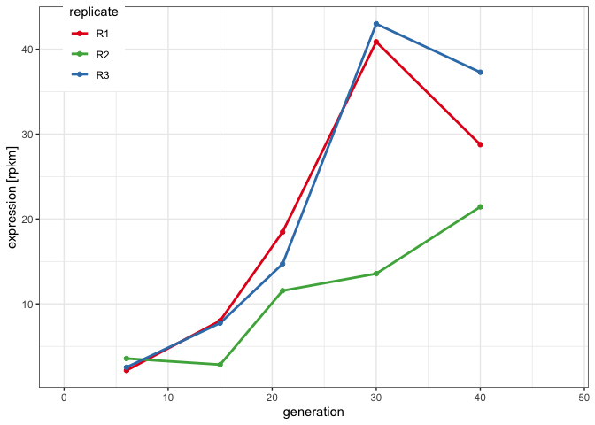

RNA analysis
================
Matthew Beaumont
2023-06-11

``` bash
knitr::opts_chunk$set(echo = TRUE)
```

We obtained the following mRNA reads:

``` bash
cd /Volumes/Data/Projects/dmelR2_p-ele/rna/run1/raw
ls -lh *.fastq.gz

cd /Volumes/Data/Projects/dmelR2_p-ele/rna/run2/raw
ls -lh *.fastq.gz
```

    ## -rw-r--r--  1 mbeaumont  staff   1.1G May 25 15:21 dmel_rna_R1_G15_run1_R1.fastq.gz
    ## -rw-r--r--  1 mbeaumont  staff   1.2G May 25 15:22 dmel_rna_R1_G15_run1_R2.fastq.gz
    ## -rw-r--r--  1 mbeaumont  staff   1.1G May 25 15:22 dmel_rna_R1_G21_run1_R1.fastq.gz
    ## -rw-r--r--  1 mbeaumont  staff   1.1G May 25 15:22 dmel_rna_R1_G21_run1_R2.fastq.gz
    ## -rw-r--r--  1 mbeaumont  staff   1.0G May 25 15:23 dmel_rna_R1_G30_run1_R1.fastq.gz
    ## -rw-r--r--  1 mbeaumont  staff   1.1G May 25 15:23 dmel_rna_R1_G30_run1_R2.fastq.gz
    ## -rw-r--r--  1 mbeaumont  staff   1.1G May 25 15:23 dmel_rna_R1_G40_run1_R1.fastq.gz
    ## -rw-r--r--  1 mbeaumont  staff   1.2G May 25 15:23 dmel_rna_R1_G40_run1_R2.fastq.gz
    ## -rw-r--r--  1 mbeaumont  staff   957M May 25 15:24 dmel_rna_R1_G6_run1_R1.fastq.gz
    ## -rw-r--r--  1 mbeaumont  staff   1.0G May 25 15:24 dmel_rna_R1_G6_run1_R2.fastq.gz
    ## -rw-r--r--  1 mbeaumont  staff   1.1G May 25 15:24 dmel_rna_R2_G15_run1_R1.fastq.gz
    ## -rw-r--r--  1 mbeaumont  staff   1.2G May 25 15:24 dmel_rna_R2_G15_run1_R2.fastq.gz
    ## -rw-r--r--  1 mbeaumont  staff   985M May 25 15:25 dmel_rna_R2_G21_run1_R1.fastq.gz
    ## -rw-r--r--  1 mbeaumont  staff   1.0G May 25 15:25 dmel_rna_R2_G21_run1_R2.fastq.gz
    ## -rw-r--r--  1 mbeaumont  staff   987M May 25 15:25 dmel_rna_R2_G30_run1_R1.fastq.gz
    ## -rw-r--r--  1 mbeaumont  staff   1.0G May 25 15:25 dmel_rna_R2_G30_run1_R2.fastq.gz
    ## -rw-r--r--  1 mbeaumont  staff   1.1G May 25 15:26 dmel_rna_R2_G40_run1_R1.fastq.gz
    ## -rw-r--r--  1 mbeaumont  staff   1.2G May 25 15:26 dmel_rna_R2_G40_run1_R2.fastq.gz
    ## -rw-r--r--  1 mbeaumont  staff   1.0G May 25 15:26 dmel_rna_R2_G6_run1_R1.fastq.gz
    ## -rw-r--r--  1 mbeaumont  staff   1.0G May 25 15:27 dmel_rna_R2_G6_run1_R2.fastq.gz
    ## -rw-r--r--  1 mbeaumont  staff   1.0G May 25 15:27 dmel_rna_R3_G15_run1_R1.fastq.gz
    ## -rw-r--r--  1 mbeaumont  staff   1.0G May 25 15:27 dmel_rna_R3_G15_run1_R2.fastq.gz
    ## -rw-r--r--  1 mbeaumont  staff   1.1G May 25 15:27 dmel_rna_R3_G21_run1_R1.fastq.gz
    ## -rw-r--r--  1 mbeaumont  staff   1.1G May 25 15:28 dmel_rna_R3_G21_run1_R2.fastq.gz
    ## -rw-r--r--  1 mbeaumont  staff   1.1G May 25 15:28 dmel_rna_R3_G30_run1_R1.fastq.gz
    ## -rw-r--r--  1 mbeaumont  staff   1.2G May 25 15:28 dmel_rna_R3_G30_run1_R2.fastq.gz
    ## -rw-r--r--  1 mbeaumont  staff   1.1G May 25 15:29 dmel_rna_R3_G40_run1_R1.fastq.gz
    ## -rw-r--r--  1 mbeaumont  staff   1.2G May 25 15:29 dmel_rna_R3_G40_run1_R2.fastq.gz
    ## -rw-r--r--  1 mbeaumont  staff   1.0G May 25 15:29 dmel_rna_R3_G6_run1_R1.fastq.gz
    ## -rw-r--r--  1 mbeaumont  staff   1.1G May 25 15:30 dmel_rna_R3_G6_run1_R2.fastq.gz
    ## -rw-r--r--  1 mbeaumont  staff   2.1G May 25 15:31 dmel_rna_R1_G15_run2_R1.fastq.gz
    ## -rw-r--r--  1 mbeaumont  staff   2.2G May 25 15:32 dmel_rna_R1_G15_run2_R2.fastq.gz
    ## -rw-r--r--  1 mbeaumont  staff   2.1G May 25 15:32 dmel_rna_R1_G21_run2_R1.fastq.gz
    ## -rw-r--r--  1 mbeaumont  staff   2.2G May 25 15:33 dmel_rna_R1_G21_run2_R2.fastq.gz
    ## -rw-r--r--  1 mbeaumont  staff   1.8G May 25 15:33 dmel_rna_R1_G30_run2_R1.fastq.gz
    ## -rw-r--r--  1 mbeaumont  staff   2.0G May 25 15:34 dmel_rna_R1_G30_run2_R2.fastq.gz
    ## -rw-r--r--  1 mbeaumont  staff   2.1G May 25 15:34 dmel_rna_R1_G40_run2_R1.fastq.gz
    ## -rw-r--r--  1 mbeaumont  staff   2.2G May 25 15:35 dmel_rna_R1_G40_run2_R2.fastq.gz
    ## -rw-r--r--  1 mbeaumont  staff   1.8G May 25 15:35 dmel_rna_R1_G6_run2_R1.fastq.gz
    ## -rw-r--r--  1 mbeaumont  staff   1.9G May 25 15:36 dmel_rna_R1_G6_run2_R2.fastq.gz
    ## -rw-r--r--  1 mbeaumont  staff   2.2G May 25 15:36 dmel_rna_R2_G15_run2_R1.fastq.gz
    ## -rw-r--r--  1 mbeaumont  staff   2.3G May 25 15:37 dmel_rna_R2_G15_run2_R2.fastq.gz
    ## -rw-r--r--  1 mbeaumont  staff   1.9G May 25 15:38 dmel_rna_R2_G21_run2_R1.fastq.gz
    ## -rw-r--r--  1 mbeaumont  staff   2.0G May 25 15:38 dmel_rna_R2_G21_run2_R2.fastq.gz
    ## -rw-r--r--  1 mbeaumont  staff   1.8G May 25 15:38 dmel_rna_R2_G30_run2_R1.fastq.gz
    ## -rw-r--r--  1 mbeaumont  staff   1.9G May 25 15:39 dmel_rna_R2_G30_run2_R2.fastq.gz
    ## -rw-r--r--  1 mbeaumont  staff   2.2G May 25 15:39 dmel_rna_R2_G40_run2_R1.fastq.gz
    ## -rw-r--r--  1 mbeaumont  staff   2.3G May 25 15:40 dmel_rna_R2_G40_run2_R2.fastq.gz
    ## -rw-r--r--  1 mbeaumont  staff   1.9G May 25 15:40 dmel_rna_R2_G6_run2_R1.fastq.gz
    ## -rw-r--r--  1 mbeaumont  staff   2.0G May 25 15:41 dmel_rna_R2_G6_run2_R2.fastq.gz
    ## -rw-r--r--  1 mbeaumont  staff   1.9G May 25 15:41 dmel_rna_R3_G15_run2_R1.fastq.gz
    ## -rw-r--r--  1 mbeaumont  staff   2.0G May 25 15:42 dmel_rna_R3_G15_run2_R2.fastq.gz
    ## -rw-r--r--  1 mbeaumont  staff   2.0G May 25 15:42 dmel_rna_R3_G21_run2_R1.fastq.gz
    ## -rw-r--r--  1 mbeaumont  staff   2.2G May 25 15:43 dmel_rna_R3_G21_run2_R2.fastq.gz
    ## -rw-r--r--  1 mbeaumont  staff   2.2G May 25 15:43 dmel_rna_R3_G30_run2_R1.fastq.gz
    ## -rw-r--r--  1 mbeaumont  staff   2.4G May 25 15:44 dmel_rna_R3_G30_run2_R2.fastq.gz
    ## -rw-r--r--  1 mbeaumont  staff   2.2G May 25 15:45 dmel_rna_R3_G40_run2_R1.fastq.gz
    ## -rw-r--r--  1 mbeaumont  staff   2.4G May 25 15:45 dmel_rna_R3_G40_run2_R2.fastq.gz
    ## -rw-r--r--  1 mbeaumont  staff   1.9G May 25 15:46 dmel_rna_R3_G6_run2_R1.fastq.gz
    ## -rw-r--r--  1 mbeaumont  staff   2.0G May 25 15:46 dmel_rna_R3_G6_run2_R2.fastq.gz

We then ran fastQC on all files to assess their quality.

``` bash
fastqc --outdir /Volumes/Data/Projects/dmelR2_p-ele/rna/raw/run1/fastQC /Volumes/Data/Projects/dmelR2_p-ele/rna/run1/raw/*fastq.gz
fastqc --outdir /Volumes/Data/Projects/dmelR2_p-ele/rna/raw/run2/fastQC /Volumes/Data/Projects/dmelR2_p-ele/rna/run2/raw/*fastq.gz
```

``` bash
cd /Volumes/Data/Projects/dmelR2_p-ele/rna/run1/fastQC/
ls -lh

cd /Volumes/Data/Projects/dmelR2_p-ele/rna/run2/fastQC/
ls -lh 
```

    ## total 80048
    ## -rw-r--r--  1 mbeaumont  staff   708K May 31 13:10 dmel_rna_R1_G15_run1_R1_fastqc.html
    ## -rw-r--r--  1 mbeaumont  staff   624K May 31 13:10 dmel_rna_R1_G15_run1_R1_fastqc.zip
    ## -rw-r--r--  1 mbeaumont  staff   701K May 31 13:12 dmel_rna_R1_G15_run1_R2_fastqc.html
    ## -rw-r--r--  1 mbeaumont  staff   616K May 31 13:12 dmel_rna_R1_G15_run1_R2_fastqc.zip
    ## -rw-r--r--@ 1 mbeaumont  staff   710K May 31 13:15 dmel_rna_R1_G21_run1_R1_fastqc.html
    ## -rw-r--r--  1 mbeaumont  staff   623K May 31 13:15 dmel_rna_R1_G21_run1_R1_fastqc.zip
    ## -rw-r--r--  1 mbeaumont  staff   706K May 31 13:17 dmel_rna_R1_G21_run1_R2_fastqc.html
    ## -rw-r--r--  1 mbeaumont  staff   619K May 31 13:17 dmel_rna_R1_G21_run1_R2_fastqc.zip
    ## -rw-r--r--  1 mbeaumont  staff   705K May 31 13:20 dmel_rna_R1_G30_run1_R1_fastqc.html
    ## -rw-r--r--  1 mbeaumont  staff   616K May 31 13:20 dmel_rna_R1_G30_run1_R1_fastqc.zip
    ## -rw-r--r--  1 mbeaumont  staff   706K May 31 13:22 dmel_rna_R1_G30_run1_R2_fastqc.html
    ## -rw-r--r--  1 mbeaumont  staff   622K May 31 13:22 dmel_rna_R1_G30_run1_R2_fastqc.zip
    ## -rw-r--r--  1 mbeaumont  staff   706K May 31 13:24 dmel_rna_R1_G40_run1_R1_fastqc.html
    ## -rw-r--r--  1 mbeaumont  staff   619K May 31 13:24 dmel_rna_R1_G40_run1_R1_fastqc.zip
    ## -rw-r--r--  1 mbeaumont  staff   702K May 31 13:27 dmel_rna_R1_G40_run1_R2_fastqc.html
    ## -rw-r--r--  1 mbeaumont  staff   620K May 31 13:27 dmel_rna_R1_G40_run1_R2_fastqc.zip
    ## -rw-r--r--@ 1 mbeaumont  staff   705K May 31 13:29 dmel_rna_R1_G6_run1_R1_fastqc.html
    ## -rw-r--r--@ 1 mbeaumont  staff   618K May 31 13:29 dmel_rna_R1_G6_run1_R1_fastqc.zip
    ## -rw-r--r--  1 mbeaumont  staff   704K May 31 13:31 dmel_rna_R1_G6_run1_R2_fastqc.html
    ## -rw-r--r--  1 mbeaumont  staff   617K May 31 13:31 dmel_rna_R1_G6_run1_R2_fastqc.zip
    ## -rw-r--r--  1 mbeaumont  staff   710K May 31 13:34 dmel_rna_R2_G15_run1_R1_fastqc.html
    ## -rw-r--r--  1 mbeaumont  staff   623K May 31 13:34 dmel_rna_R2_G15_run1_R1_fastqc.zip
    ## -rw-r--r--  1 mbeaumont  staff   706K May 31 13:36 dmel_rna_R2_G15_run1_R2_fastqc.html
    ## -rw-r--r--  1 mbeaumont  staff   620K May 31 13:36 dmel_rna_R2_G15_run1_R2_fastqc.zip
    ## -rw-r--r--  1 mbeaumont  staff   707K May 31 13:39 dmel_rna_R2_G21_run1_R1_fastqc.html
    ## -rw-r--r--  1 mbeaumont  staff   617K May 31 13:39 dmel_rna_R2_G21_run1_R1_fastqc.zip
    ## -rw-r--r--  1 mbeaumont  staff   701K May 31 13:41 dmel_rna_R2_G21_run1_R2_fastqc.html
    ## -rw-r--r--  1 mbeaumont  staff   614K May 31 13:41 dmel_rna_R2_G21_run1_R2_fastqc.zip
    ## -rw-r--r--  1 mbeaumont  staff   707K May 31 13:43 dmel_rna_R2_G30_run1_R1_fastqc.html
    ## -rw-r--r--  1 mbeaumont  staff   619K May 31 13:43 dmel_rna_R2_G30_run1_R1_fastqc.zip
    ## -rw-r--r--  1 mbeaumont  staff   703K May 31 13:45 dmel_rna_R2_G30_run1_R2_fastqc.html
    ## -rw-r--r--  1 mbeaumont  staff   616K May 31 13:45 dmel_rna_R2_G30_run1_R2_fastqc.zip
    ## -rw-r--r--  1 mbeaumont  staff   710K May 31 13:48 dmel_rna_R2_G40_run1_R1_fastqc.html
    ## -rw-r--r--  1 mbeaumont  staff   623K May 31 13:48 dmel_rna_R2_G40_run1_R1_fastqc.zip
    ## -rw-r--r--  1 mbeaumont  staff   704K May 31 13:51 dmel_rna_R2_G40_run1_R2_fastqc.html
    ## -rw-r--r--  1 mbeaumont  staff   621K May 31 13:51 dmel_rna_R2_G40_run1_R2_fastqc.zip
    ## -rw-r--r--  1 mbeaumont  staff   706K May 31 13:53 dmel_rna_R2_G6_run1_R1_fastqc.html
    ## -rw-r--r--  1 mbeaumont  staff   618K May 31 13:53 dmel_rna_R2_G6_run1_R1_fastqc.zip
    ## -rw-r--r--  1 mbeaumont  staff   703K May 31 13:55 dmel_rna_R2_G6_run1_R2_fastqc.html
    ## -rw-r--r--  1 mbeaumont  staff   615K May 31 13:55 dmel_rna_R2_G6_run1_R2_fastqc.zip
    ## -rw-r--r--  1 mbeaumont  staff   707K May 31 13:58 dmel_rna_R3_G15_run1_R1_fastqc.html
    ## -rw-r--r--  1 mbeaumont  staff   621K May 31 13:58 dmel_rna_R3_G15_run1_R1_fastqc.zip
    ## -rw-r--r--  1 mbeaumont  staff   703K May 31 14:00 dmel_rna_R3_G15_run1_R2_fastqc.html
    ## -rw-r--r--  1 mbeaumont  staff   617K May 31 14:00 dmel_rna_R3_G15_run1_R2_fastqc.zip
    ## -rw-r--r--  1 mbeaumont  staff   713K May 31 14:02 dmel_rna_R3_G21_run1_R1_fastqc.html
    ## -rw-r--r--  1 mbeaumont  staff   624K May 31 14:02 dmel_rna_R3_G21_run1_R1_fastqc.zip
    ## -rw-r--r--  1 mbeaumont  staff   705K May 31 14:05 dmel_rna_R3_G21_run1_R2_fastqc.html
    ## -rw-r--r--  1 mbeaumont  staff   621K May 31 14:05 dmel_rna_R3_G21_run1_R2_fastqc.zip
    ## -rw-r--r--  1 mbeaumont  staff   707K May 31 14:08 dmel_rna_R3_G30_run1_R1_fastqc.html
    ## -rw-r--r--  1 mbeaumont  staff   623K May 31 14:08 dmel_rna_R3_G30_run1_R1_fastqc.zip
    ## -rw-r--r--  1 mbeaumont  staff   705K May 31 14:10 dmel_rna_R3_G30_run1_R2_fastqc.html
    ## -rw-r--r--  1 mbeaumont  staff   620K May 31 14:10 dmel_rna_R3_G30_run1_R2_fastqc.zip
    ## -rw-r--r--  1 mbeaumont  staff   712K May 31 14:13 dmel_rna_R3_G40_run1_R1_fastqc.html
    ## -rw-r--r--  1 mbeaumont  staff   629K May 31 14:13 dmel_rna_R3_G40_run1_R1_fastqc.zip
    ## -rw-r--r--  1 mbeaumont  staff   706K May 31 14:15 dmel_rna_R3_G40_run1_R2_fastqc.html
    ## -rw-r--r--  1 mbeaumont  staff   625K May 31 14:15 dmel_rna_R3_G40_run1_R2_fastqc.zip
    ## -rw-r--r--  1 mbeaumont  staff   708K May 31 14:17 dmel_rna_R3_G6_run1_R1_fastqc.html
    ## -rw-r--r--  1 mbeaumont  staff   618K May 31 14:17 dmel_rna_R3_G6_run1_R1_fastqc.zip
    ## -rw-r--r--  1 mbeaumont  staff   702K May 31 14:20 dmel_rna_R3_G6_run1_R2_fastqc.html
    ## -rw-r--r--  1 mbeaumont  staff   618K May 31 14:20 dmel_rna_R3_G6_run1_R2_fastqc.zip
    ## total 0
    ## drwxr-xr-x  62 mbeaumont  staff   2.1K Jun  1 18:23 raw
    ## drwxr-xr-x  62 mbeaumont  staff   2.1K Jun  1 19:58 trimmed

After this, we then realised that there was significant proportion of
the 3’ read ends (\~10-30%) which were adapter sequences. To alleviate
this, we decided to trim all of the 150bp reads down to 100bp, using the
following for loop.

``` bash
for file in *gz; do
    gzip -cd "$file" | cut -c-100 | awk 'NR%4==2 && length($0)>=100{print prev; print $0; getline; print $0; getline; print $0} {prev=$0}' | gzip -c > "trimmed/${file}"
done
```

# Mapping

First, we indexed the D. mel + TE fasta file using samtools.

``` bash
samtools faidx dmel_1215.4_rel_6_ISO1_consensusTEs.fasta
```

We then obtained the reference D. mel transcriptome and merged it with
the list of consensus D. mel TEs, then indexed it.

``` bash
cd /Volumes/Data/Tools/RefGenomes/dmel/rna/dmel_TEs
ls -lh
```

    ## total 518704
    ## -rw-r--r--@ 1 mbeaumont  staff    93M May 30 17:15 dmel_1215.4_rel_6_ISO1_consensusTEs.fasta
    ## -rw-r--r--  1 mbeaumont  staff   642B Jun  1 11:13 dmel_1215.4_rel_6_ISO1_consensusTEs.fasta.amb
    ## -rw-r--r--  1 mbeaumont  staff   3.6M Jun  1 11:13 dmel_1215.4_rel_6_ISO1_consensusTEs.fasta.ann
    ## -rw-r--r--  1 mbeaumont  staff    89M Jun  1 11:13 dmel_1215.4_rel_6_ISO1_consensusTEs.fasta.bwt
    ## -rw-r--r--  1 mbeaumont  staff   1.1M Jun  2 17:25 dmel_1215.4_rel_6_ISO1_consensusTEs.fasta.fai
    ## -rw-r--r--  1 mbeaumont  staff    22M Jun  1 11:13 dmel_1215.4_rel_6_ISO1_consensusTEs.fasta.pac
    ## -rw-r--r--  1 mbeaumont  staff    44M Jun  1 11:14 dmel_1215.4_rel_6_ISO1_consensusTEs.fasta.sa

Then we used bwa to map the forward and reverse reads to the reference.

``` bash
nohup zsh dmel_RNA_mapping_bwamem.sh > ../logs/dmel_rna_map.log
```

dmel_RNA_mapping_bwamem.sh -

``` bash
ref="/Volumes/Data/Tools/RefGenomes/dmel/rna/dmel_TEs/dmel_1215.4_rel_6_ISO1_consensusTEs.fasta"
if="/Volumes/Data/Projects/dmelR2_p-ele/rna/raw/run2/trimmed"
of="/Volumes/Data/Projects/dmelR2_p-ele/rna/raw/run2/map-bwamem"

bwa mem -t 12 $ref $if/dmel_rna_R1_G6_run2_R1.fastq.gz $if/dmel_rna_R1_G6_run2_R2.fastq.gz | samtools sort -m 2G --output-fmt BAM --threads 2 -o $of/dmel_R1G6_run2.sort.bam
bwa mem -t 12 $ref $if/dmel_rna_R2_G6_run2_R1.fastq.gz $if/dmel_rna_R2_G6_run2_R2.fastq.gz | samtools sort -m 2G --output-fmt BAM --threads 2 -o $of/dmel_R2G6_run2.sort.bam
bwa mem -t 12 $ref $if/dmel_rna_R3_G6_run2_R1.fastq.gz $if/dmel_rna_R3_G6_run2_R2.fastq.gz | samtools sort -m 2G --output-fmt BAM --threads 2 -o $of/dmel_R3G6_run2.sort.bam

bwa mem -t 12 $ref $if/dmel_rna_R1_G15_run2_R1.fastq.gz $if/dmel_rna_R1_G15_run2_R2.fastq.gz | samtools sort -m 2G --output-fmt BAM --threads 2 -o $of/dmel_R1G15_run2.sort.bam
bwa mem -t 12 $ref $if/dmel_rna_R2_G15_run2_R1.fastq.gz $if/dmel_rna_R2_G15_run2_R2.fastq.gz | samtools sort -m 2G --output-fmt BAM --threads 2 -o $of/dmel_R2G15_run2.sort.bam
bwa mem -t 12 $ref $if/dmel_rna_R3_G15_run2_R1.fastq.gz $if/dmel_rna_R3_G15_run2_R2.fastq.gz | samtools sort -m 2G --output-fmt BAM --threads 2 -o $of/dmel_R3G15_run2.sort.bam

bwa mem -t 12 $ref $if/dmel_rna_R1_G21_run2_R1.fastq.gz $if/dmel_rna_R1_G21_run2_R2.fastq.gz | samtools sort -m 2G --output-fmt BAM --threads 2 -o $of/dmel_R1G21_run2.sort.bam
bwa mem -t 12 $ref $if/dmel_rna_R2_G21_run2_R1.fastq.gz $if/dmel_rna_R2_G21_run2_R2.fastq.gz | samtools sort -m 2G --output-fmt BAM --threads 2 -o $of/dmel_R2G21_run2.sort.bam
bwa mem -t 12 $ref $if/dmel_rna_R3_G21_run2_R1.fastq.gz $if/dmel_rna_R3_G21_run2_R2.fastq.gz | samtools sort -m 2G --output-fmt BAM --threads 2 -o $of/dmel_R3G21_run2.sort.bam

bwa mem -t 12 $ref $if/dmel_rna_R1_G30_run2_R1.fastq.gz $if/dmel_rna_R1_G30_run2_R2.fastq.gz | samtools sort -m 2G --output-fmt BAM --threads 2 -o $of/dmel_R1G30_run2.sort.bam
bwa mem -t 12 $ref $if/dmel_rna_R2_G30_run2_R1.fastq.gz $if/dmel_rna_R2_G30_run2_R2.fastq.gz | samtools sort -m 2G --output-fmt BAM --threads 2 -o $of/dmel_R2G30_run2.sort.bam
bwa mem -t 12 $ref $if/dmel_rna_R3_G30_run2_R1.fastq.gz $if/dmel_rna_R3_G30_run2_R2.fastq.gz | samtools sort -m 2G --output-fmt BAM --threads 2 -o $of/dmel_R3G30_run2.sort.bam

bwa mem -t 12 $ref $if/dmel_rna_R1_G40_run2_R1.fastq.gz $if/dmel_rna_R1_G40_run2_R2.fastq.gz | samtools sort -m 2G --output-fmt BAM --threads 2 -o $of/dmel_R1G40_run2.sort.bam
bwa mem -t 12 $ref $if/dmel_rna_R2_G40_run2_R1.fastq.gz $if/dmel_rna_R2_G40_run2_R2.fastq.gz | samtools sort -m 2G --output-fmt BAM --threads 2 -o $of/dmel_R2G40_run2.sort.bam
bwa mem -t 12 $ref $if/dmel_rna_R3_G40_run2_R1.fastq.gz $if/dmel_rna_R3_G40_run2_R2.fastq.gz | samtools sort -m 2G --output-fmt BAM --threads 2 -o $of/dmel_R3G40_run2.sort.bam
```

# GSNAP

Run on Vetgrid06

To map via GMAP, we first need to create the database with the reference
genome.

Then we need to build the database

``` bash
gmap_build -D . -d mel-transcriptome /Volumes/Temp2/Matt/rna/refgenomes/dmel/dmel_1215.4_rel_6_ISO1_consensusTEs.fasta
```

Then we run the following script to for alignment, while assessing for
novel spicing events.

``` bash
#!/bin/bash

refdir="/Volumes/Temp2/Matt/rna/refgenomes/GMAP/mel_database"
refname="mel_database"

input_dir="/Volumes/Temp2/Matt/rna/trimmed/trimmed"
output_dir="/Volumes/Temp2/Matt/rna/map_GSNAP/output"

gsnap -D "$refdir" -d "$refname" -t 12 -N 1 --format=sam --gunzip "$input_dir/dmel_rna_R1_G6_run2_R1.fastq.gz" "$input_dir/dmel_rna_R1_G6_run2_R2.fastq.gz" | samtools sort -m 2G --output-fmt BAM --threads 2 -o "$output_dir/gt_R1G6.sort.bam"
gsnap -D "$refdir" -d "$refname" -t 12 -N 1 --format=sam --gunzip "$input_dir/dmel_rna_R2_G6_run2_R1.fastq.gz" "$input_dir/dmel_rna_R2_G6_run2_R2.fastq.gz" | samtools sort -m 2G --output-fmt BAM --threads 2 -o "$output_dir/gt_R2G6.sort.bam"
gsnap -D "$refdir" -d "$refname" -t 12 -N 1 --format=sam --gunzip "$input_dir/dmel_rna_R3_G6_run2_R1.fastq.gz" "$input_dir/dmel_rna_R3_G6_run2_R2.fastq.gz" | samtools sort -m 2G --output-fmt BAM --threads 2 -o "$output_dir/gt_R3G6.sort.bam"

gsnap -D "$refdir" -d "$refname" -t 12 -N 1 --format=sam --gunzip "$input_dir/dmel_rna_R1_G15_run2_R1.fastq.gz" "$input_dir/dmel_rna_R1_G15_run2_R2.fastq.gz" | samtools sort -m 2G --output-fmt BAM --threads 2 -o "$output_dir/gt_R1G15.sort.bam"
gsnap -D "$refdir" -d "$refname" -t 12 -N 1 --format=sam --gunzip "$input_dir/dmel_rna_R2_G15_run2_R1.fastq.gz" "$input_dir/dmel_rna_R2_G15_run2_R2.fastq.gz" | samtools sort -m 2G --output-fmt BAM --threads 2 -o "$output_dir/gt_R2G15.sort.bam"
gsnap -D "$refdir" -d "$refname" -t 12 -N 1 --format=sam --gunzip "$input_dir/dmel_rna_R3_G15_run2_R1.fastq.gz" "$input_dir/dmel_rna_R3_G15_run2_R2.fastq.gz" | samtools sort -m 2G --output-fmt BAM --threads 2 -o "$output_dir/gt_R3G15.sort.bam"

gsnap -D "$refdir" -d "$refname" -t 12 -N 1 --format=sam --gunzip "$input_dir/dmel_rna_R1_G21_run2_R1.fastq.gz" "$input_dir/dmel_rna_R1_G21_run2_R2.fastq.gz" | samtools sort -m 2G --output-fmt BAM --threads 2 -o "$output_dir/gt_R1G21.sort.bam"
gsnap -D "$refdir" -d "$refname" -t 12 -N 1 --format=sam --gunzip "$input_dir/dmel_rna_R2_G21_run2_R1.fastq.gz" "$input_dir/dmel_rna_R2_G21_run2_R2.fastq.gz" | samtools sort -m 2G --output-fmt BAM --threads 2 -o "$output_dir/gt_R2G21.sort.bam"
gsnap -D "$refdir" -d "$refname" -t 12 -N 1 --format=sam --gunzip "$input_dir/dmel_rna_R3_G21_run2_R1.fastq.gz" "$input_dir/dmel_rna_R3_G21_run2_R2.fastq.gz" | samtools sort -m 2G --output-fmt BAM --threads 2 -o "$output_dir/gt_R3G21.sort.bam"

gsnap -D "$refdir" -d "$refname" -t 12 -N 1 --format=sam --gunzip "$input_dir/dmel_rna_R1_G30_run2_R1.fastq.gz" "$input_dir/dmel_rna_R1_G30_run2_R2.fastq.gz" | samtools sort -m 2G --output-fmt BAM --threads 2 -o "$output_dir/gt_R1G30.sort.bam"
gsnap -D "$refdir" -d "$refname" -t 12 -N 1 --format=sam --gunzip "$input_dir/dmel_rna_R2_G30_run2_R1.fastq.gz" "$input_dir/dmel_rna_R2_G30_run2_R2.fastq.gz" | samtools sort -m 2G --output-fmt BAM --threads 2 -o "$output_dir/gt_R2G30.sort.bam"
gsnap -D "$refdir" -d "$refname" -t 12 -N 1 --format=sam --gunzip "$input_dir/dmel_rna_R3_G30_run2_R1.fastq.gz" "$input_dir/dmel_rna_R3_G30_run2_R2.fastq.gz" | samtools sort -m 2G --output-fmt BAM --threads 2 -o "$output_dir/gt_R3G30.sort.bam"

gsnap -D "$refdir" -d "$refname" -t 12 -N 1 --format=sam --gunzip "$input_dir/dmel_rna_R1_G40_run2_R1.fastq.gz" "$input_dir/dmel_rna_R1_G40_run2_R2.fastq.gz" | samtools sort -m 2G --output-fmt BAM --threads 2 -o "$output_dir/gt_R1G40.sort.bam"
gsnap -D "$refdir" -d "$refname" -t 12 -N 1 --format=sam --gunzip "$input_dir/dmel_rna_R2_G40_run2_R1.fastq.gz" "$input_dir/dmel_rna_R2_G40_run2_R2.fastq.gz" | samtools sort -m 2G --output-fmt BAM --threads 2 -o "$output_dir/gt_R2G40.sort.bam"
gsnap -D "$refdir" -d "$refname" -t 12 -N 1 --format=sam --gunzip "$input_dir/dmel_rna_R3_G40_run2_R1.fastq.gz" "$input_dir/dmel_rna_R3_G40_run2_R2.fastq.gz" | samtools sort -m 2G --output-fmt BAM --threads 2 -o "$output_dir/gt_R3G40.sort.bam"
```

Which provides the following sorted BAM files.

# STAR

To use STAR, we first need our input (indexed) genome fasta file, plus
PPI251. We also have access to the gene annotation file, providing
greater accuracy for alignment.

We then need to generate STAR index files, using the following command.

``` bash
STAR --runMode genomeGenerate --genomeDir /Volumes/Data/Projects/dmelR2_p-ele/rna/run2/map-star/index --genomeFastaFiles /Volumes/Data/Tools/RefGenomes/dmel/dna/dmel_consensus_TEs/dmel_consensus_TEs.fasta --runThreadN 8 --genomeSAindexNbases 12
```

After this is done, we then use the following script to align the fastq
reads with STAR.

``` bash
#!/bin/bash

genome_dir="/Volumes/Data/Projects/dmelR2_p-ele/rna/run2/map-star/index"  # STAR genome index files
gtf_file="/Volumes/Data/Tools/RefGenomes/dmel/dna/GCF_000001215.4_Release_6_plus_ISO1_MT_genomic.gtf"  # Path to GTF file
input_dir="/Volumes/Data/Projects/dmelR2_p-ele/rna/run2/trimmed"  # Forward and reverse FASTQ read files
output_dir="/Volumes/Data/Projects/dmelR2_p-ele/rna/run2/map-star"  

# Aligning reads and generating BAMs
for file in "$input_dir"/*_R1.fastq.gz; do
    base_name="${file##*/}" 
    base_name="${base_name%_R1.fastq.gz}"  
    
    STAR --runThreadN 12 \
         --genomeDir "$genome_dir" \
         --sjdbGTFfile "$gtf_file" \
         --readFilesIn "$input_dir/$base_name"_R1.fastq.gz "$input_dir/$base_name"_R2.fastq.gz \
         --outFileNamePrefix "$output_dir/$base_name"_  
done

# Convert SAMs to sorted BAMs
for sam_file in "$output_dir"/*.sam; do
    base_name="${sam_file%.*}"
    bam_file="$base_name.bam"
    samtools sort -@ 2 -o "$bam_file" "$sam_file"
    samtools index "$bam_file"
    rm "$sam_file"
done
```

# Coverage

We ran the following script to assess coverage.

``` bash
nohup zsh expression-splicing.sh > ../logs/splicing-expression.log
```

``` bash
#!/bin/bash

fai="/Volumes/Data/Tools/RefGenomes/dmel/rna/dmel_TEs/dmel_1215.4_rel_6_ISO1_consensusTEs.fasta.fai"
pyscript="/Volumes/Data/Projects/dmelR2_p-ele/scripts/mRNA-coverage-senseantisense.py"
input_dir="/Volumes/Data/Projects/dmelR2_p-ele/rna/run2/map-bwamem"
output_dir="/Volumes/Data/Projects/dmelR2_p-ele/rna/run2/splicing-expression/raw_expression"
seqs="PPI251,FBtr0141238_mRNA,FBtr0141090_mRNA,FBtr0132023_mRNA,FBtr0137012_mRNA,FBtr0140282_mRNA,FBtr0141095_mRNA,FBtr0142660_mRNA,FBtr0140302_mRNA,FBtr0142342_mRNA,FBtr0143902_mRNA,FBtr0130551_mRNA,FBtr0145198_mRNA,FBtr0130342_mRNA,FBtr0135961_mRNA,FBtr0135197_mRNA,FBtr0130390_mRNA,FBtr0141576_mRNA,FBtr0139614_mRNA,FBtr0130391_mRNA,FBtr0143034_mRNA"

samtools view $input_dir/dmel_R1G6_run2.sort.bam | python $pyscript --sam - --sample-id R1-G6-run2 --seqs $seqs --fai $fai > $output_dir/dmel_R1G6_run2.txt
samtools view $input_dir/dmel_R2G6_run2.sort.bam | python $pyscript --sam - --sample-id R2-G6-run2 --seqs $seqs --fai $fai > $output_dir/dmel_R2G6_run2.txt
samtools view $input_dir/dmel_R3G6_run2.sort.bam | python $pyscript --sam - --sample-id R3-G6-run2 --seqs $seqs --fai $fai > $output_dir/dmel_R3G6_run2.txt

samtools view $input_dir/dmel_R1G15_run2.sort.bam | python $pyscript --sam - --sample-id R1-G15-run2 --seqs $seqs --fai $fai > $output_dir/dmel_R1G15_run2.txt
samtools view $input_dir/dmel_R2G15_run2.sort.bam | python $pyscript --sam - --sample-id R2-G15-run2 --seqs $seqs --fai $fai > $output_dir/dmel_R2G15_run2.txt
samtools view $input_dir/dmel_R3G15_run2.sort.bam | python $pyscript --sam - --sample-id R3-G15-run2 --seqs $seqs --fai $fai > $output_dir/dmel_R3G15_run2.txt

samtools view $input_dir/dmel_R1G21_run2.sort.bam | python $pyscript --sam - --sample-id R1-G21-run2 --seqs $seqs --fai $fai > $output_dir/dmel_R1G21_run2.txt
samtools view $input_dir/dmel_R2G21_run2.sort.bam | python $pyscript --sam - --sample-id R2-G21-run2 --seqs $seqs --fai $fai > $output_dir/dmel_R2G21_run2.txt
samtools view $input_dir/dmel_R3G21_run2.sort.bam | python $pyscript --sam - --sample-id R3-G21-run2 --seqs $seqs --fai $fai > $output_dir/dmel_R3G21_run2.txt

samtools view $input_dir/dmel_R1G30_run2.sort.bam | python $pyscript --sam - --sample-id R1-G30-run2 --seqs $seqs --fai $fai > $output_dir/dmel_R1G30_run2.txt
samtools view $input_dir/dmel_R2G30_run2.sort.bam | python $pyscript --sam - --sample-id R2-G30-run2 --seqs $seqs --fai $fai > $output_dir/dmel_R2G30_run2.txt
samtools view $input_dir/dmel_R3G30_run2.sort.bam | python $pyscript --sam - --sample-id R3-G30-run2 --seqs $seqs --fai $fai > $output_dir/dmel_R3G30_run2.txt

samtools view $input_dir/dmel_R1G40_run2.sort.bam | python $pyscript --sam - --sample-id R1-G40-run2 --seqs $seqs --fai $fai > $output_dir/dmel_R1G40_run2.txt
samtools view $input_dir/dmel_R2G40_run2.sort.bam | python $pyscript --sam - --sample-id R2-G40-run2 --seqs $seqs --fai $fai > $output_dir/dmel_R2G40_run2.txt
samtools view $input_dir/dmel_R3G40_run2.sort.bam | python $pyscript --sam - --sample-id R3-G40-run2 --seqs $seqs --fai $fai > $output_dir/dmel_R3G40_run2.txt

cat *.txt| perl -pe 's/-/\t/'|perl -pe 's/-/\t/' > expr-spli.forr
```

# P-element expression

We ran the following script to extract out all expression levels.

``` bash
nohup zsh /Volumes/Data/Projects/dmelR2_p-ele/scripts/dmel_pele_expression.sh > ../../../../../logs/pele-expression.log
```

``` bash
#!/bin/bash

fai="/Volumes/Data/Tools/RefGenomes/dmel/rna/dmel_TEs/dmel_1215.4_rel_6_ISO1_consensusTEs.fasta.fai"
pyscript="/Volumes/Data/Projects/dmelR2_p-ele/scripts/mRNA-expression.py"
input_dir="/Volumes/Data/Projects/dmelR2_p-ele/rna/run2/map-bwamem"
output_dir="/Volumes/Data/Projects/dmelR2_p-ele/rna/run2/splicing-expression/raw_expression/all-expressionlevel"

samtools view $input_dir/dmel_R1G6_run2.sort.bam | python $pyscript --sam - --sample-id R1-G6-run2 --fai $fai > $output_dir/expr_dmel_R1G6_run2.txt
samtools view $input_dir/dmel_R2G6_run2.sort.bam | python $pyscript --sam - --sample-id R2-G6-run2 --fai $fai > $output_dir/expr_dmel_R2G6_run2.txt
samtools view $input_dir/dmel_R3G6_run2.sort.bam | python $pyscript --sam - --sample-id R3-G6-run2 --fai $fai > $output_dir/expr_dmel_R3G6_run2.txt

samtools view $input_dir/dmel_R1G15_run2.sort.bam | python $pyscript --sam - --sample-id R1-G15-run2 --fai $fai > $output_dir/expr_dmel_R1G15_run2.txt
samtools view $input_dir/dmel_R2G15_run2.sort.bam | python $pyscript --sam - --sample-id R2-G15-run2 --fai $fai > $output_dir/expr_dmel_R2G15_run2.txt
samtools view $input_dir/dmel_R3G15_run2.sort.bam | python $pyscript --sam - --sample-id R3-G15-run2 --fai $fai > $output_dir/expr_dmel_R3G15_run2.txt

samtools view $input_dir/dmel_R1G21_run2.sort.bam | python $pyscript --sam - --sample-id R1-G21-run2 --fai $fai > $output_dir/expr_dmel_R1G21_run2.txt
samtools view $input_dir/dmel_R2G21_run2.sort.bam | python $pyscript --sam - --sample-id R2-G21-run2 --fai $fai > $output_dir/expr_dmel_R2G21_run2.txt
samtools view $input_dir/dmel_R3G21_run2.sort.bam | python $pyscript --sam - --sample-id R3-G21-run2 --fai $fai > $output_dir/expr_dmel_R3G21_run2.txt

samtools view $input_dir/dmel_R1G30_run2.sort.bam | python $pyscript --sam - --sample-id R1-G30-run2 --fai $fai > $output_dir/expr_dmel_R1G30_run2.txt
samtools view $input_dir/dmel_R2G30_run2.sort.bam | python $pyscript --sam - --sample-id R2-G30-run2 --fai $fai > $output_dir/expr_dmel_R2G30_run2.txt
samtools view $input_dir/dmel_R3G30_run2.sort.bam | python $pyscript --sam - --sample-id R3-G30-run2 --fai $fai > $output_dir/expr_dmel_R3G30_run2.txt

samtools view $input_dir/dmel_R1G40_run2.sort.bam | python $pyscript --sam - --sample-id R1-G40-run2 --fai $fai > $output_dir/expr_dmel_R1G40_run2.txt
samtools view $input_dir/dmel_R2G40_run2.sort.bam | python $pyscript --sam - --sample-id R2-G40-run2 --fai $fai > $output_dir/expr_dmel_R2G40_run2.txt
samtools view $input_dir/dmel_R3G40_run2.sort.bam | python $pyscript --sam - --sample-id R3-G40-run2 --fai $fai > $output_dir/expr_dmel_R3G40_run2.txt

cat *.txt| perl -pe 's/-/\t/'|perl -pe 's/-/\t/' > expr.forr
```

Then we visualise it using ggplot.

``` r
library(tidyverse)
```

    ## ── Attaching core tidyverse packages ──────────────────────── tidyverse 2.0.0 ──
    ## ✔ dplyr     1.1.2     ✔ readr     2.1.4
    ## ✔ forcats   1.0.0     ✔ stringr   1.5.0
    ## ✔ ggplot2   3.4.2     ✔ tibble    3.2.1
    ## ✔ lubridate 1.9.2     ✔ tidyr     1.3.0
    ## ✔ purrr     1.0.1     
    ## ── Conflicts ────────────────────────────────────────── tidyverse_conflicts() ──
    ## ✖ dplyr::filter() masks stats::filter()
    ## ✖ dplyr::lag()    masks stats::lag()
    ## ℹ Use the conflicted package (<http://conflicted.r-lib.org/>) to force all conflicts to become errors

``` r
library(RColorBrewer)
theme_set(theme_bw())
tresrep<-c("#e41a1c","#4daf4a","#377eb8")

t=read_delim("/Volumes/Data/Projects/dmelR2_p-ele/rna/run2/splicing-expression/raw_expression/all-expressionlevel/expr.forr",delim="\t",col_names=FALSE,comment="#")
```

    ## Rows: 303364 Columns: 10
    ## ── Column specification ────────────────────────────────────────────────────────
    ## Delimiter: "\t"
    ## chr (4): X1, X2, X3, X4
    ## dbl (6): X5, X6, X7, X8, X9, X10
    ## 
    ## ℹ Use `spec()` to retrieve the full column specification for this data.
    ## ℹ Specify the column types or set `show_col_types = FALSE` to quiet this message.

``` r
names(t)<-c("replicate","generation","run","gene","rawse","rawase","genlen","sense","antisense","total")
t<-subset(t,gene=="PPI251")
t$generation<-as.numeric(substring(t$generation, 2))
width <- 16
height <- 12
resolution <- 600

s<-ggplot()+geom_line(data=t,aes(x=generation,y=sense,color=replicate),linewidth=1)+
  geom_point(data=t,aes(x=generation,y=sense,color=replicate))+
  theme(strip.text=element_blank(),legend.position=c(0.1,0.9))+
  ylab("expression [rpkm]")+scale_colour_manual(values=tresrep)+xlim(0,48)

plot(s)
```

<!-- -->

``` r
ggsave("P-ele_expression.png", plot = s, width = 16, height = 12, dpi = 600)
```

# edge-R

Prepped for addition of naive datasets.

``` r
library(tidyverse)
library(RColorBrewer)
library(dplyr)
library(edgeR)
library(data.table)
library(gridExtra)
#library(gridExtra)
theme_set(theme_bw())
palette <- c("darkgrey","orange","red")
colour<-c("grey50","#e41a1c","#377eb8","#4daf4a","#984ea3","#ff7f00","#a65628","#f781bf")
cbbPalette<-colour

d<-read_delim("/Volumes/Data/Projects/dmelR2_p-ele/rna/run2/splicing-expression/raw_expression/all-expressionlevel/expr.forr",delim="\t",col_names=FALSE,comment="#")
names(d)<-c("replicate","generation","run","gene","rawse","rawase","genlen","se","ase","total")


dgeme <- function(cou,gro) {
  y <- DGEList(counts=cou,group=gro)
  keep <- filterByExpr(y)
  y <- y[keep,,keep.lib.sizes=FALSE]
  y <- calcNormFactors(y)
  design <- model.matrix(~gro)
  y <- estimateDisp(y,design)
  #fit <- glmFit(y,design)
  #lrt <- glmLRT(fit,coef=2)
  fit <- glmQLFit(y,design)
  lrt <- glmQLFTest(fit,coef=2)
  return(lrt)
  
}

edgeme <- function(n1,n2,n3,e1,e2) {
  merge<- n1 %>%  inner_join(n2, by = "gene")  %>%  inner_join(n3, by = "gene") %>%  inner_join(e1, by = "gene") %>%  inner_join(e2, by = "gene")
  s<-setDT(merge)
  dm<-data.matrix(s[,2:6])
  rownames(dm)<-merge$gene
  group <- factor(c(1,1,1,2,2))
  lrt<-dgeme(dm,group)
  return(lrt)
}

edgemeext <- function(n1,n2,n3,e5,e1,e2) {
  merge<- n1 %>%  inner_join(n2, by = "gene")  %>%  inner_join(n3, by = "gene") %>% inner_join(e5, by = "gene") %>%  inner_join(e1, by = "gene") %>%  inner_join(e2, by = "gene")
  s<-setDT(merge)
  dm<-data.matrix(s[,2:7])
  rownames(dm)<-merge$gene
  group <- factor(c(1,1,1,1,2,2))
  lrt<-dgeme(dm,group)
  return(lrt)
}

# Need naive data for diff expression.

naive<-subset(d,generation=="naive")
nR1<-subset(naive,replicate=="R1") %>% select(gene,rawse) %>% rename(naiveR1=rawse)
nR2<-subset(naive,replicate=="R2") %>% select(gene,rawse) %>% rename(naiveR2=rawse)
nR3<-subset(naive,replicate=="R3") %>% select(gene,rawse) %>% rename(naiveR3=rawse)


rep1<-subset(d,replicate=="R1")
eg6R1<-subset(rep1,generation=="G6") %>% select(gene,rawse) %>% rename(eg6R1=rawse)
eg15R1<-subset(rep1,generation=="G15") %>% select(gene,rawse) %>% rename(eg15R1=rawse)
eg21R1<-subset(rep1,generation=="G21") %>% select(gene,rawse) %>% rename(eg21R1=rawse)
eg30R1<-subset(rep1,generation=="G30") %>% select(gene,rawse) %>% rename(eg30R1=rawse)
eg40R1<-subset(rep1,generation=="G40") %>% select(gene,rawse) %>% rename(eg40R1=rawse)


rep2<-subset(d,replicate=="R2")
eg6R2<-subset(rep2,generation=="G6") %>% select(gene,rawse) %>% rename(eg6R2=rawse)
eg15R2<-subset(rep2,generation=="G15") %>% select(gene,rawse) %>% rename(eg15R2=rawse)
eg21R2<-subset(rep2,generation=="G21") %>% select(gene,rawse) %>% rename(eg21R2=rawse)
eg30R2<-subset(rep2,generation=="G30") %>% select(gene,rawse) %>% rename(eg30R2=rawse)
eg40R2<-subset(rep2,generation=="G40") %>% select(gene,rawse) %>% rename(eg40R2=rawse)

rep3<-subset(d,replicate=="R3")
eg6R3<-subset(rep3,generation=="G6") %>% select(gene,rawse) %>% rename(eg6R3=rawse)
eg15R3<-subset(rep3,generation=="G15") %>% select(gene,rawse) %>% rename(eg15R3=rawse)
eg21R3<-subset(rep3,generation=="G21") %>% select(gene,rawse) %>% rename(eg21R3=rawse)
eg30R3<-subset(rep3,generation=="G30") %>% select(gene,rawse) %>% rename(eg30R3=rawse)
eg40R3<-subset(rep3,generation=="G40") %>% select(gene,rawse) %>% rename(eg40R3=rawse)

lm1<-edgeme(nR1,nR2,nR3,eg30R1,eg40R1)
lm2<-edgeme(nR1,nR2,nR3,eg30R2,eg40R2)
lm3<-edgeme(nR1,nR2,nR3,eg30R3,eg40R3)
dflm1<-data.frame(gene=rownames(lm1$table),logfc=lm1$table$logFC, pval=lm1$table$PValue, fdr=p.adjust(lm1$table$PValue,method="BH"))
dflm2<-data.frame(gene=rownames(lm2$table),logfc=lm2$table$logFC, pval=lm2$table$PValue, fdr=p.adjust(lm2$table$PValue,method="BH"))
dflm3<-data.frame(gene=rownames(lm3$table),logfc=lm3$table$logFC, pval=lm3$table$PValue, fdr=p.adjust(lm3$table$PValue,method="BH"))

lmvs2<-edgemeext(eg30R1,eg40R1,eg30R2,eg40R2,eg30R3,eg40R3)
dflmvs2<-data.frame(gene=rownames(lmvs2$table),logfc=lmvs2$table$logFC, pval=lmvs2$table$PValue,fdr=p.adjust(as.numeric(lmvs2$table$PValue),method="BH"))

#### Coloring FDR 
fdr<-0.01
fdr2<-0.001

dflm1$col<-0
dflm1[dflm1$fdr<fdr,]$col<-1
dflm1[dflm1$fdr<fdr2,]$col<-2
dflm1$col<-as.factor(dflm1$col)

dflm2$col<-0
dflm2[dflm2$fdr<fdr,]$col<-1
dflm2[dflm2$fdr<fdr2,]$col<-2
dflm2$col<-as.factor(dflm2$col)

dflm3$col<-0
dflm3[dflm3$fdr<fdr,]$col<-1
dflm3[dflm3$fdr<fdr2,]$col<-2
dflm3$col<-as.factor(dflm3$col)

dflmvs2$col<-0
dflmvs2[dflmvs2$fdr<fdr,]$col<-1
#dflmvs2[dflmvs2$fdr<fdr2,]$col<-2
dflmvs2$col<-as.factor(dflmvs2$col)

pvs2<-ggplot(data = dflmvs2, aes(y = -log10(pval), x = logfc,color=col )) +
  geom_point(alpha = 1, size = 2)+scale_colour_manual(values=palete)+theme(legend.position = "none")+
  ylab("-log10(p)")+xlab("log2(fold-change)")

p1<-ggplot(data = dflm1, aes(y = -log10(pval), x = logfc,color=col )) +
  geom_point(alpha = 1, size = 2)+scale_colour_manual(values=palete)+theme(legend.position = "none")+
  ylab("-log10(p)")+xlab("log2(fold-change)")

p2<-ggplot(data = dflm2, aes(y = -log10(pval), x = logfc,color=col )) +
  geom_point(alpha = 1, size = 2)+scale_colour_manual(values=palete)+theme(legend.position = "none")+
  ylab("-log10(p)")+xlab("log2(fold-change)")

p3<-ggplot(data = dflm3, aes(y = -log10(pval), x = logfc,color=col )) +
  geom_point(alpha = 1, size = 2)+scale_colour_manual(values=palete)+theme(legend.position = "none")+
  ylab("-log10(p)")+xlab("log2(fold-change)")

 
#pdf(file="",width=8,height=3)

#grid.arrange(p1, p2, p4, ncol=3)
#dev.off()

#pdf(file="",width=3,height=3)
plot(pvs2)
#dev.off()
```
